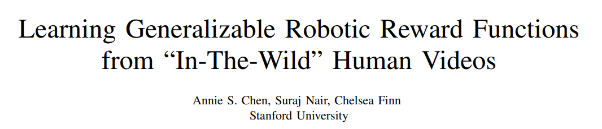

[toc]

# Advanced Topics in RL related fileds

## Model-based RL

#### Dyna-style RL algorithm

In Reinforcement Learning (RL), the term "Dyna-style" algorithms refer to a family of learning methods that integrate direct experience (obtained by interacting with the environment) with learning from simulated experiences generated by a model of the environment. The concept originates from the Dyna architecture proposed by Richard Sutton, a key figure in the development of modern reinforcement learning.

**Dyna-style algorithms generally involve two key components:**

1. **Direct Learning from Real Experience**: The agent learns from actual interactions with the environment, which is typical in standard reinforcement learning approaches. This involves observing states, taking actions, and receiving rewards.
2. **Planning by Learning from Simulated Experience**: In addition to learning from real encounters, the agent also uses a learned model of the environment to simulate experiences. The agent repeatedly queries the model to generate synthetic state transitions and rewards, essentially 'imagining' various scenarios based on past observed data. Learning from this simulated data helps improve the policy or value function without additional real-world interactions.

**The main steps in a Dyna-style algorithm (like Dyna-Q) can be summarized as:**

- **Step 1:** Execute an action in the real environment to obtain a new state and reward.
- **Step 2:** Update the model with the new state, action, and reward information.
- **Step 3:** Update the value function or policy based on the real experience (Direct RL update).
- **Step 4:** Conduct multiple planning steps where the model is used to generate hypothetical next states and rewards for previously taken actions. Update the value function or policy based on these simulated experiences.

**Purpose and Benefits:**

- **Efficiency**: By using simulated experiences, Dyna-style algorithms can potentially learn more efficiently, resulting in faster convergence to an optimal policy or value function with fewer interactions with the actual environment.
- **Balanced Learning**: It balances learning from actual and simulated experiences, leveraging the strengths of both approaches.

Dyna-style learning thus serves as a bridge between purely model-free methods (which do not use an environmental model) and model-based methods (which rely heavily on accurate environmental models), aiming to use the best of both strategies to accelerate learning. This approach is particularly beneficial in environments where actual interactions are costly or limited, allowing the agent to "think" through possible scenarios to improve its decision-making capabilities.

#### why is Dyna style called dyna?

> The term "Dyna" in the context of Dyna-style algorithms in Reinforcement Learning (RL) comes from the Greek root "dyna," which means "power" or "energy." This naming reflects the powerful, dynamic nature of the Dyna architecture in synthesizing both direct experiences from the actual environment and simulated experiences from a model. Richard Sutton, who introduced the Dyna framework, chose this name to emphasize the robustness and effectiveness of combining direct reinforcement learning with planning abilities through simulation, potentially amplifying the learning capabilities of the agent.

>  This framework dynamically integrates the learning from real interactions and hypothetical scenarios generated through the model, which in turn energizes and powers up the learning process more efficiently than relying solely on real-world data or simulations alone. Hence, the name "Dyna" aptly captures the essence of its dual sources of learning and its energetic approach to solving reinforcement learning tasks

In the context of Reinforcement Learning (RL), Model Predictive Control (MPC) is a control strategy that involves using a model of the environment to optimize a sequence of actions over a finite time horizon. Here are the key aspects of Model Predictive Control in RL:

### MPC in RL:

1. **Model-Based Approach**:
   - MPC in RL relies on having a model of the environment dynamics that captures the transition dynamics of the system, enabling prediction of state transitions in response to actions.
2. **Optimization at Each Time Step**:
   - At each time step, MPC formulates an optimization problem to select the optimal sequence of actions by considering a horizon of future states.
3. **Prediction Horizon**:
   - MPC considers a finite prediction horizon within which it plans the sequence of actions, incorporating the model's predictions to optimize a performance criterion.
4. **Iterative Optimization**:
   - MPC typically solves the optimization problem at each time step, executes the first action of the optimal sequence, and then re-plans at the next time step based on the updated state information.
5. **Balance between Exploration and Exploitation**:
   - MPC optimizes action sequences to balance exploration (discovering new information) and exploitation (leveraging known information) to maximize a defined performance metric or reward.
6. **Risk-Sensitive Control**:
   - MPC can incorporate constraints, costs, and uncertainties to enable risk-sensitive control, ensuring stability and safety in control decisions.

#### Advantages of MPC in RL:

1. **Model Utilization**:
   - Enables the exploitation of learned or known models of system dynamics to perform long-term planning and decision-making.
2. **Optimal Control**:
   - Provides a framework for real-time optimization, allowing for the computation of optimal control actions based on a model of the system.
3. **Adaptability**:
   - MPC can adapt to changes in the environment or system dynamics by re-optimizing the control strategy at each time step.
4. **Explicit Handling of Constraints**:
   - MPC naturally handles constraints on system states and control inputs, making it suitable for applications with constraints.

#### Applications of MPC in RL:

1. **Robotics**:
   - Path planning, trajectory optimization, and control of robotic systems to achieve desired tasks.
2. **Process Control**:
   - Control of industrial processes, such as chemical plants or power systems, to optimize performance while adhering to constraints.
3. **Autonomous Systems**:
   - Navigation and control of autonomous vehicles, drones, or agents for safe and efficient operation.
4. **Energy Management**:
   - Optimal scheduling and control of energy resources in smart grids or energy systems.

MPC in RL provides a powerful framework for tackling control tasks where a model of the environment dynamics is available, enabling informed decision-making and strategic planning to achieve desired control objectives over time.

## Imitation Learning

### Intro

Learning from demonstrations:

1. IL: learn from positive demonstrations, using IL

   methods:

   ​	Behavior cloning. 

   IL is kind of very old topic, recently gaining much attentions.

   However, in most cases, IL does not work. SOTA: Aloha unleashed, Google Deep mind. You need very much data. 

   Obstacles: 

   a. robustness: small error of approximation accumulates. **accumulated error**. 

   b. generalization issue a.k.a. **covariate shift** ,  distribution shift if too much will be catastrophically. 

   Improvements of IL:

   a. better data, better representation, better loss function/training algorithm.

2. Penalize negative demonstrations and encourage good date: offline RL

3. …

Goal of IL: maximize the similarity between $\pi_\theta(a_t|o_t)$ and the gold demonstrations

very similar to supervised learning: classification, regression tasks with labels. 

differences:

BC: behavior cloning

directly minimize predicted actions and demonstrated actions.

### Improvements to IL

#### Improve data quality

Classical method: dagger (dataset aggregation)   20 years ago. human labeling of data generated by the policy learnt.  Online labeling: use a human teacher to supervise the learning process. Well this methods relies on humans’ judgement.

#### Dataset resampling/reweighting

##### put more weights on the rarer data.

##### Data augmentation

be careful: not all technique from Computer Vision can be used in IL. Like in IL/robotics you gonna consider a lot about whether these augmentations are feasible in the physical world. Like we normally don’t use image rotation in IL data augmentation.

Like: you can also use diffusion model to augment data.

##### Collection of data:

DexCap from Feifei Stanford. 

UMI from Shuran Lab Stanford. 

3D-point clouds collect data from human hands.

##### Incorporating history 

multiple stacks of images feed together to the transformer and output a feature  extract embedding.

or you can also concatenate not the images but their differences and input them to the neural net. 

Some problems: directly stacking historical information could omit the causal relation, which could cause confusion to the robot, like it takes the effect as cause. 

fighting copycat agents

#### 3D 

Look,  if you use image inputs, then things are partially observable. in robots, you add multiple cameras to augment a better 3D vision input. 

##### Representations

use pre-trained models to extract representations, very much used in visual RL. Representation learning 

Like Temporal contrastive 

pre-trained vision models.

universal visual representation.

**R3M**

Pre-train a neural net to extract feature first. then accelerate the downstream tasks. Warning: this process might not actually be useful. We still do not whether pretraining works. [This is a good direction]

Pre-training for visual-motor control

#### Pretrain an Inverse Dynamics model

dynamics model: transition     $s_{t+1}\sim P(\cdot|s_t,a_t)$

inverse dynamics model:       given state $s_{t}$ and the next state $s_{t+1}$, predict the previous action.     $a_t \leftarrow f(s_t,s_{t+1})$

We use Inverse dynamics model to automatically infer and label actions from other people’s demonstrations. 

VPT : you train a small inverse model on a small dataset, then use this inverse model on a huge video dataset to infer the actions from observations. Using this labeled huge date set, you do IL/BC. 

Watching unlabeled videos. (Vision pretraining).

3d diffusion policy IL. + diffusion policy. 

Look, currently data but not the methods is the bottleneck. 

#### Multi-modality-aware training

Look, human behaviors are multimodal(meaning: multiple modes 多个众数 多峰分布) 而非多模态

人类的许多行为是多峰分布的 在机器人领域这些现象很多  50% go left, 50% go right.

Select the correct loss function:

if use MSE loss, then it is regression work, then it will tell you to go straight forward. This is not right, since direct regression

if use Cross Entropy Loss,  we will not merge the two modes. classification first (coarse) then regression (fine)

#### Diffusion models

Diffusion can capture the multi-modal behavior in the dataset instead of modeling a single peak distribution, so that’s why you generate various pictures. You can also use diff.

#### Demonstrations in RL 

If online interactions are allowed you can add DRL to IL.

Deep Q-learning from demonstrations. RL from demonstrations.

DQfD: expert demonstrations in the replay buffer. 

#### More imitation learning and demonstrations

like learn rom videos : only observations but no actions. 

model-based IL. 

How to use suboptimal demonstrations: filter them out… or do offline RL. 

learn from instructions but not demonstrations.

#### Reward engineering

Use VLM/LLM to automatically and iteratively evolutionary design RL rewards, try them out in simulations and preserve the good ones.

#### Inverse RL

(when we do not now the reward)

infer the reward function from demonstrations. then use the learnt reward to train an RL agent. 

Eureka 

#### How to collect data from IL

Human teleoperation 

Deep Mind现在是雇佣了大量的清洁工在一栋大楼里带传感器采集清洁数据喂给机器人

或者实验室的博士生使用多种不同的擦盘子技术扩展数据的多样性

Better things： generate more data from a small dataset. strong simulator. 

MimicGen: humans collect small amount of data from human-teleoperated demonstrations.

#### IL很大的一个问题是

重度依赖高精度多样性的大量数据  如果数据不够就泛化不了 如果没有高质量数据做都做不了。 the demonstrations can be extremely costly and time-consuming to collect

所以考虑可以直接制造数据： Mimic Gen就是在做generation

Or decodes actions from observations like use massive amount of videos. 

## Sim2real robotics

### Why sim2real

1. unreliable sensors, light condition

2. reward is difficult to extract
3. hardware is not robust: RL policy on real robot: trial error breaks hardware

4. dexterous manipulation breaks all existing control-theory based algorithms. You must you RL/IL. 

#### Advantages

Cheap, fast, scalable, safe(if something bad happens, reset), labeled(you can add tags or automatically label the objects, depth-map, semantic segmentation, …), controllable(we can up–sample the less frequent corner cases, like we create those scarce samples rarely seen in real-world)

#### Shortcomings

Sim2real gap

visual gap

physical gap

we need computer graphics

where does sim2real gap come from:

photorealistic simulations needs very long times to render （渲染）

even if you have all the physical laws, you need lot of samples. 

difficult to model: non-convex surfaces, continuous time, non-rigid bodies, frictions

1. error accumulation

neural networks tends to overfit in the simulator’s random noises and deteriorates when deployed to real world. 

#### Computer graphics frameworks

Taichi languaage 

Methods

1. Model-based RL
2. Imitation learning
3. Offline RL

Data

1. Collect data: flawed sensor, high cost, little amount 

   like RT robot transformer 17months 130k episodes. 

2. Synthesize data: 

​	Most RL algorithms are tested and debugged in simulators. 

### Domain adaptation

Cheap domain labeled data ==> generate synthetic images (naive)

sample from real environment to correct the generative models output to make them real anad add labels. 

Visual domains  action domains 

align with real scenarios. 

### Domain randomization

The real world is just an expensive simulator.

create simulator worlds –> perturb(light, angles, background)

train agent in various crazy different worlds 

force the agent to be very robust.  This is domain randomization. 

highly-precise modeling of important features, then add very great noise to others to

force generalization: randomized everything that should be ignored. 

OpenAI’s first robot project 5 years ago. 

a lot of perturbations. They use domain randomization and PPO.

Highly engineering: randomize everything

• Automatic Domain Randomization • Physical parameters • Noise to policy inputs • Sensor dropout • Physics discretization steps • Backlash • Force • Visual appearance

## Inverse Reinforcement Learning

### General

Using LQR or traditional controllers(optimizers): Inverse optimal control, inverse optimal planning

* High-level idea

The high-level idea of inverse reinforcement learning (IRL) is to learn an agent's objectives, values, or rewards by observing its behavior

IRL algorithms aim to find a reward function that not only explains the demonstrations well, but also has other desirable properties like being simple or robus

* Note: the contents in this lecture is out-of-date. But the idea is great. 

* Classical papers: maximum entropy inverse RL. 

  Give your past trajectories, guess where you want to go. 

  Predict the destination of the enemy’s army in military. 

* Applications: 

  Human-robot interaction, key requirement is you train the robot to know what human wants. That is to learn the human’s preferences, such as your preference, which is the reward, so as to make humans comfortable. Work done by Prof. Anca Dragan in UC Berkeley last year. 

### IRL

IRL vs BC

IRL learns the true reward $R^{\star}$. If you can specify a complete reward function, plan under complete reward.

BC/IL: is more popular to learn a policy $\pi^\star$. 

When it is more easier to obtain $R^\star$ it is better to use IRL, like if you learn from a video it is difficult to learn the action series of the man’s arms, but inferring the goal (like this man is trying to pick up a bottle) is more easier to implement. 

#### Math Foundation of IRL

#### Max margin

How to define the true reward: if R is the true reward, since the expert demonstration is planned under this reward, it must be true that 
$$
\mathbb{E}^{\pi^\star}\sum_{t=0}^{\infty}\gamma^t R^\star
\geq 
\mathbb{E}^{\pi}\sum_{t=0}^{\infty}\gamma^t R^\star, \quad \forall \pi.
$$

Shortcomings:

1. reward ambiguity, there could be multiple solutions. 
2. This method heavily relies on your expert demonstration and the assumption that your expert is truly optimal. However in practice this may not be true. 
3. It is difficult to implement RHS, as it is difficult to enumerate all policies. 

Solutions: 

#### Feature expectation matching (from classical ML)

So we learn the reward function as a linear functional. Assume that there exists some non-linear feature $\phi(\cdot):S\to \R$ such that
$$
R(s)=\omega^\top \phi(s), \forall s \\
R^\star(s)={\omega^{\star}}^\top \phi(s), \forall s \\
$$
Denote $\sum \gamma^t r$by $\mu(\pi^\star)$, you do not need to play with policy but just the dataset by finding

##### Solve ambiguity: very similar to SVM. 

For policies that are very different from $\pi\star$ (measured by some metrics like 1-norm error, KL -divergence, etc.)

the performance margin between $\pi$ and $\pi^\star$ should also be very different (measured by abs())

We introduce a constraint set
$$
\min_{\omega} \norm{\omega}_2^2\\
s.t. w^\top \mu(\pi^\star) \geq w^\top \mu(\pi)+m(\pi^\star||\pi)
$$
you can also introduce slack variable (like SVM, from convex analysis.)

why slack variable: this can help tackle with the actual suboptimality of the expert. 

If the expert is suboptimal(smaller), then it may not satisfy the hard constraint presented above, only to satisfy a weaker margin like
$$
w^\top \mu(\pi^{\text{expert}}) \geq w^\top \mu(\pi)+m(\pi^\star||\pi) -\zeta
$$
So this constrain incorporates actual suboptimal expert demonstration so our optimization will not be carried on in an empty set. 

Then we wish to minimizer $\omega$ (but not the fixed) this $\zeta$ so that the expert is going to be stronger, as the real optimal one has zero $\zeta=0$. 

So we get a slacked version
$$
\min_{\omega} \norm{\omega}_2^2+C\zeta
\\
s.t. w^\top \mu(\pi^{\text{expert}}) \geq w^\top \mu(\pi)+m(\pi^\star||\pi)-\zeta
$$
This is very classical ML techniques. 

#### Feature matching (new in RL)

Apprenticeship learning (no body works on it today but popular back in 2004)

These stuff are too old.

#### IRL in high-dimensional space (function approximators)

Learn from videos. 

Use a neural net to learn to discriminate task demonstrations. use a shared embedding for human and robot videos, to make the neural net forget to distinguish between man and robot, but there behavior in the essence. 

If human and robot are doing the same task we tag the pair as a positive sample.

In they are not, then we take it as a negative sample. 

This is cross-embodiment (human and robot embodiment) learning. But in fact it is not yet generalizable. 

like contrastive learning

IRL is beginning to be less important

When do we need IRL; when we do not have reward function and only have expert demonstration. 

If we cannot trust RL (sample inefficient) how to trust IRL

Although reward function is general, after getting reward you need to do RL to find the best solution but the latter is not generalizable. 

Maybe IRL can be used something for Human-robot interaction to learn the human

s preferences. 

##### Today inverse RL is a good concept but difficult to implement today as a large-scale working platform. 

> Imitation learning holds tremendous promise in learning policies efficiently for complex decision making problems. Current state-of-the-art algorithms often use inverse reinforcement learning (IRL), where given a set of expert demonstrations, an agent alternatively infers a reward function and the associated optimal policy. However, such IRL approaches often require substantial online interactions for complex control problems. In this work, we present Regularized Optimal Transport (ROT), a new imitation learning algorithm that builds on recent advances in optimal transport based trajectory-matching. Our key technical insight is that adaptively combining trajectory-matching rewards with behavior cloning can significantly accelerate imitation even with only a few demonstrations. Our experiments on 20 visual control tasks across the DeepMind Control Suite, the OpenAI Robotics Suite, and the Meta-World Benchmark demonstrate an average of 7.8× faster imitation to reach 90% of expert performance compared to prior state-of-the-art methods. On real-world robotic manipulation, with just one demonstration and an hour of online training, ROT achieves an average success rate of 90.1% across 14 tasks.

### Learning reward from videos

diffusion reward

2312.14134

The problem of video data: they do not have action labels, so it cannot be directly used for supervised learning. 

IRL could be used to tag the video. 

## Offline RL

## Guest Lecture: Simulator for RL

## Guest Lecture: Building a robotics startup

