[toc]

# Popular research direction in model DRL

1. Representation learning

how to find the correct representation of physical signals to feature space
$$
\text{Physical signals} \to \text{feature map  } \phi
$$

2. Exploration


# DRL

**Pytorch: best for academiaresearch**

**Tensorflow: better in edge devices, better hardware-compatibility, in the industry.**


**MOjOCO hates windows, some other RL platforms also dislikes Windows. They prefer Linux or Mac.**
Use WSL, Virtual machine


**Save the codes, save the weights, save the models.**

**Commit each line of you version of your code to Github.**

**Make your results reproducible.**


**Colab research.google Pytorch:**

Sim-to-real transfer

Policy Evaluation

on policy, save complexity for $A$(no max)

no max, result in pure linear system. 


RL v.s. MDP:

the transition kernels and **rewards** may be unknown.


## Model-free estimation

#### Monte-Carlo learning

Direct evaluation: 

Monte-Carlo policy evaluation, calculate the value-function using sampled trajectories drawn from the policy. 


$\pi \rightarrow \text{samples} \rightarrow \text{evaluate }V^{\pi}$​

Empirical return 
$$
G_t= \sum_{\tau=t+1}^{T} 
\gamma^{\tau-(t+1)} R_{\tau}
$$
<u>**The MC target is an unbiased estimator of the value function, but the long summation makes the variance rather high(the downside of all Monte-Carlo methods)**</u>

<u>**Initial-value insensitive, converge better. But slower and higher variance.**</u> 

**<u>MC is used in Alpha -go but it is very sample-hungry.</u>**


You directly collect future rewards and average it to get the empirical value functions.


**<u>Downsides</u>**

high sample complexity

high variance

restricted to episodic setting(all episodes must terminate)

no bootstrapping(exact solution)

does not exploit Bellman equation Markov property.


#### Temporal Difference Learning

Learn $v^{\pi}$ online from 

locally update values on a per-action basis.

TD(0):
$$
V(S_t) \leftarrow
V(S_t)
+
\alpha
\underbrace{
(
\overbrace{
R_{t+1}+\gamma V(S_{t+1})
}^{\text{TD target
}}
-V(S_{t})
)}
_{\text{TD error } \delta_t}
$$
TD target:
$$
R_{t+1}+\gamma V(S_{t+1})
$$
TD error
$$
\delta_t:= \text{TD\_target}-V(S_t)
$$
Learning rate
$$
\alpha
$$


TD target is a biased estimator

The True TD target 
$$
R_{t+1}+\gamma \cdot v^{\pi}(S_{t+1})
$$
is the unbiased estimator of the true value functions. 

<u>**Each update in TD only  involves several terms, so TD has lower variance compared to MC.**</u>

**<u>TD is very sensitive to initial value, but converge faster.</u>**


Bootstrapping

A guess from a guess. 左脚踩右脚


TD-lambda $TD(\lambda)$

If initialization is bad ,use MC. Else, use TD to reduce variance.

The best–of-both-worlds 


TD  ====== TD$(-\lambda)$​  ====MC


TD: single-step learning, online.

$TD(\lambda)$: still offline have to wait until end of episode(episodic). 

Eligibility trace: make TD\lambda online again.


$\lambda-$​return as a weighted reward-to-go
$$
G_t^{(n)}=r_{t}+\gamma r_{t+1} + \ldots + \gamma^{n}r_{t+n}
$$

$$
G_t^\lambda:=(1-\lambda)\sum_{n=1}^{\infty} \lambda^{n-1} G_{t}^{(n)}
$$


$$
V^*(s)=\max _a Q^*(s, a)
$$
In deep learning there is no such implementation of $\max$. There is only gradients. 

A continuous implementation(approximation) of $\max$ is ``softmax‘’

Softmax is a softened version of the $\max$ operator, and hence the name. 


### Q-learning

$$
Q(s, a) \leftarrow Q(s, a)+\alpha\left(R(s)+\gamma \max _{a^{\prime}} Q\left(s^{\prime}, a^{\prime}\right)-Q(s, a)\right)
$$

Off-policy stochastic iteration


### SARSA

On-policy version of Q-learning. 


Note that the $\arg\max$ operator in Q-learning makes it impossible to directly scale to large spaces. 


#### Temporal difference (TD) v.s. Q-learning

Temporal Difference (TD) learning and Q-learning are two fundamental concepts within the realm of reinforcement learning, each with its unique approach and applications. Understanding their relationship requires a brief overview of both concepts.

Temporal Difference (TD) Learning is a method in reinforcement learning that allows an agent to learn from an experience via a combination of both Monte Carlo methods and dynamic programming ideas. TD learning directly learns the value function of a given policy from episodes of experience without requiring a model of the environment. It updates estimates based in part on other learned estimates, without waiting for a final outcome (hence "temporal difference").

Q-learning, on the other hand, is a specific type of off-policy TD learning that focuses on learning the action-value function, known as the Q-function. The Q-function gives the value of performing an action in a given state, and then following a certain policy. Unlike some TD learning methods that may evaluate the state value function under a certain policy, Q-learning aims to find the optimal policy by learning the optimal Q-values for each state-action pair and thus does not need a model of the environment or a policy to learn from.

To directly address your question: It wouldn't be entirely accurate to say TD learning is a special case of Q-learning with an action space equal to 1. Rather, Q-learning is a specific type of TD learning that focuses on learning the Q-value function. TD learning is more general, with applications that cover a broader range of value function learning, not just the action-value function. In environments where action space is 1, effectively making actions inconsequential to the state transitions, the distinction between learning a state-value function (V) and an action-value function (Q) becomes less meaningful, but the frameworks of TD learning and Q-learning still retain their unique characteristics. 

In simpler terms, Q-learning could be considered a special case of TD learning focused on learning the optimal policy by estimating Q-values, whereas the umbrella term TD learning encompasses a variety of techniques for learning value functions, including those that might not explicitly involve learning about actions.


## How to scale: function approximation

#### Gradient-free:

1-layer Neural Net: linear combination of features. For better explainability and better safty in Quant research: explian to your investor why you lose. **<u>Linear function approximation == 1 layer Neural net.</u>**

decision tree:	good for small amount of data

nearest neighbor:	

Cluster of gaussian functions:	

Fourier/wavelet bases

#### Gradient-based(incremental methods)

Overparameterized Neural Nets
$$
\text{minimize}\ \ J(\mathbf{w}) = \mathbb{E}^{\pi}\left[
(v^{\pi}(S)-v^{\pi}(S;\mathbf{w}))^2
\right]
$$
this is by close-form, direct gradient descent. 

Use samples to replace the $\mathbb{E}$ and we get stochastic gradient descent. 

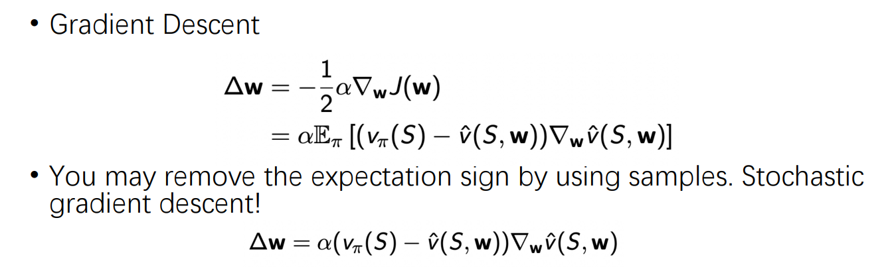


#### Feature vector(representation topic)

examples: 3D GS, point-cloud, high-dimensional sensory information


## Deep Q-network

### Vanilla DQN

Nature 2015: Human level control of deep reinforcement learning

Non-linear function 

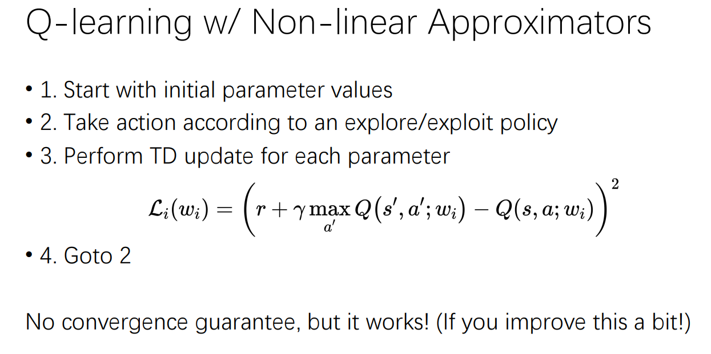

Deep Q-nets

the state is the image. 

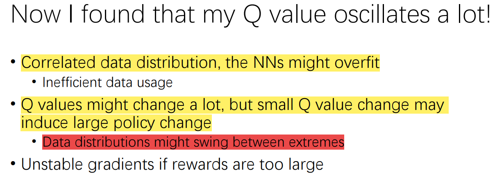


 Unstable gradients if rewards are too large

High reward may incur large gradient 

if the loss is huge, 

like LSTM: there is a gradient clip line under 10 or 2 Because when training LSTM the gradient is large, too large gradient will cause the network to become unstable.


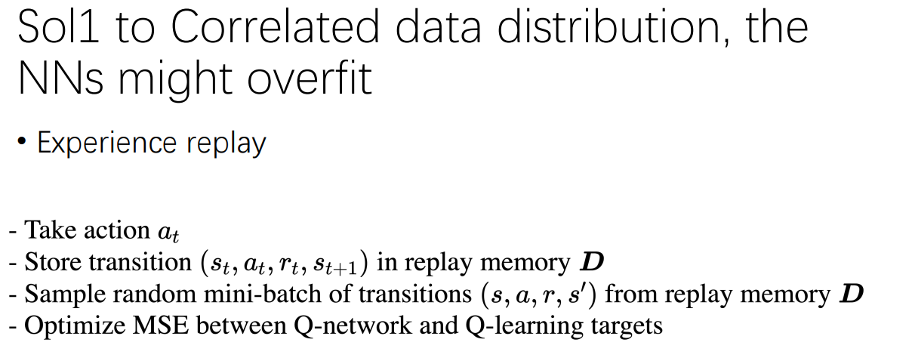

The date used in optimization  is a mixture of the old but high-quality data and the newly-explored data which could be of low quality(local minima)

This helps to converge.


Another technical trick is 

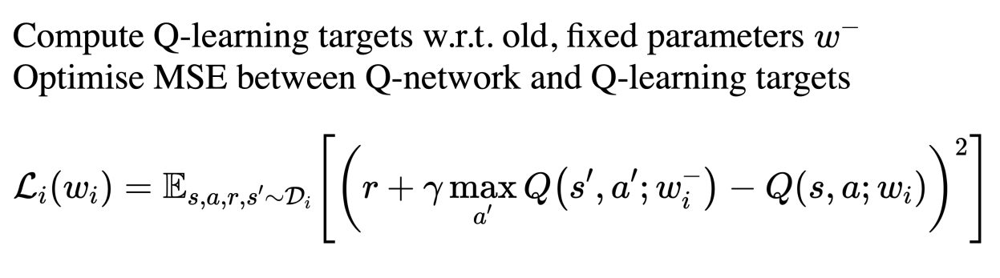

To fix one $w$ target as  $w^{-}$ is the old parameter, which only leaves one free parameter. 

reduce to supervised for a minibatch)

We update $w_i^{-}$  periodically (large batch)  resume to RL once for a while.

This helps stabilize the network(reduce online part).


### Advanced DQN

Few tricks

Experience replay, target network, reward clipping


DQN==> DDQN==> DDPG ==>…


##### 1. DDQN

is used to Improve the maximization bias. 


$$
\begin{gathered}
E(\max (X 1, X 2, \ldots)) \geq \max (E(X 1), E(X 2), \ldots) \\
\mathcal{L}_i\left(w_i\right)=\left(r+\gamma \max _{a^{\prime}} Q\left(s^{\prime}, a^{\prime} ; w_i\right)-Q\left(s, a ; w_i\right)\right)^2
\end{gathered}
$$

- For each update, you take max first and then average them with multiple samples, so you actually get LHS. 

- However, the true objective you want to optimize is RHS, indeed, 
  $$
  \text{Objective}=\max \mathbb{E}R_H
  $$
  So Q-learning has an over-estimation bias, which is  due to the concavity of Q value from \max, this is so-called maximization bias: if you always pick $\max()$, things tends to be overly estimated, however what you want is RHS. So pick two Q values that are mismatched helps to alleviate this bias(but not canceling.

One method is: 

use the new Q-net $w$ to choose action

use the old Q-net $w-$ to evaluate. 

This is used to alleviate over-estimation of Q value,
$$
I=\left(r+\gamma Q\left(s^{\prime}, \underset{a^{\prime}}{\operatorname{argmax}} Q\left(s^{\prime}, a^{\prime}, \mathbf{w}\right), \mathbf{w}^{-}\right)-Q(s, a, \mathbf{w})\right)^2
$$
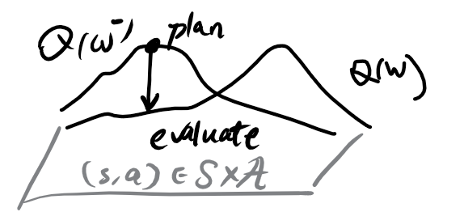


##### 2. Improve the replay-buffer techniques

most instances in the replay-buffer are not very high quality, going to wait these samples in the buffer by some priority. In the paper they chose TD error as the weight, the higher the TD error , the less exploited these samples are, so put more weights on them and make these samples to be sampled next with higher probability. 
$$
\left|r+\gamma \max _{a^{\prime}} Q\left(s^{\prime}, a^{\prime}, \mathbf{w}^{-}\right)-Q(s, a, w)\right|
$$

$$
P(i)=\frac{p_i^\alpha}{\sum_k p_k^\alpha}
$$

this is a kind of offline exploration methods. 

##### 3. Dueling DQN

 Improve the network architecture of DQN,  Introduce the advantage function. 

Dueling net

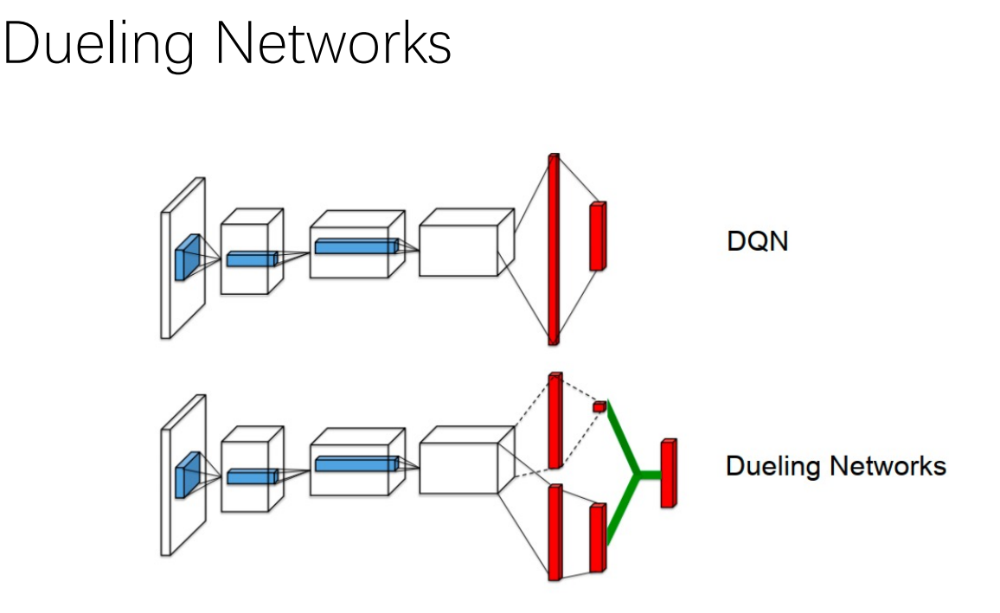


Advantage function network: only pay attention to the abrupt changes that may bring great changes from decision making:as to avoid collisions

 The value stream learns to pay attention to the road


##### 4. Adopt n-step return but not just one-step

$$
\begin{gathered}
R_t^{(n)}=\sum_{k=0}^{n-1} \gamma_t^{(k)} R_{t+k+1} \\
I=\left(R_t^{(n)}+\gamma_t^{(n)} \max _{a^{\prime}} Q\left(S_{t+n}, a^{\prime}, \mathbf{w}\right)-Q(s, a, \mathbf{w})\right)^2
\end{gathered}
$$

With more samples, you get smaller bias at the cost of high variance. 

The increase of sampled rewards makes the Q-learning scheme with less bias. 


##### 5. Noisy-DQN

This is not very important. 

When the action space is continuous or sufficiently large, uniform sampling often incurs meaningless actions. We instead add a gaussian noise perturbation to the old actions or the parameters of the old neural net parameters.

Add perturbation in action space

Add perturbation in the parameter space.   E.g. Diffusion model in the parameter space. 

Methods to generate gaussian noises:

a. i.i.d. gaussian noises on each dimension of the parameters.  Downsides: too slow, too many random samplers.

b. accelerate this method: factorized gaussian noise.


##### 6. Distributional DQN(C51)

*Remark: here distributional does not indicate distributional SGD, but it means we do not compute the exact value of a realization of Q-function,  but we view Q as a random variable as well. This method discretizes the distribution of Q-function.

We try to take off a layer of $\mathbb{E}$, make deterministic value stochastic.

We try to construct unbiased estimator $Z$ of the Q-function 
$$
Q^{\pi}(s,a)=\mathbb{E}Z^{\pi}(s,a)=\mathbb{E}\sum_{t=0}^{\infty}\gamma^t~r(s,a)
$$
since $\mathbb{E}$ is linear, it is exchangeable with the Bellman operator. From the bellman equations of Q function we also obtain the Bellman equation of $Z^{\pi}$, which involves more stochasticity. 

In the implementation we discretize the distribution space of the $Z^{\pi}$. The precision is a hyper parameter from extensive experiments. To estimate $Z^{\pi}$ it is equivalent to do a multi-array decision, using cross entropy. 

Another problem is that in RL, as time goes, the baseline shifts, since $r$ in$[0,1]$ in step 1, then in step 2 it should shift to $[1, 1+\gamma]$ , so as time goes the distribution axis shifts. (this time evolution is characteristic of RL.)

In fact the greatest contribution of this paper is the technique to discretize the values of the Q-functions. 

In RL, we usually do not care about the exact but the relative size.

**The discretization works simply because Atari games is discrete, with little degree-of-freedom, and Q-value actually takes little possible value. So discretizing seems to help locate the feasible values of Q. However in continuous-control tasks this method may fail, since the possible values can be taken by Q-values will become very dense.**


##### 7. Rainbow

combine every improvement to DQN, we see great improvement

and hence the name. 

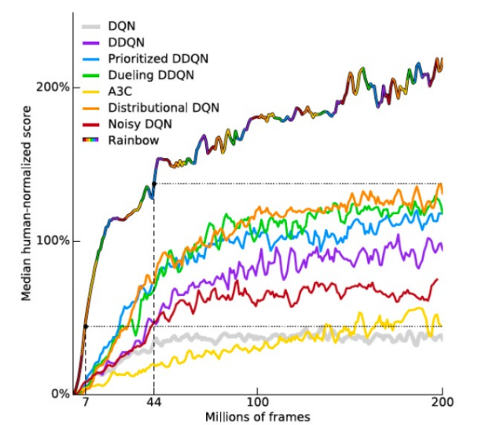


Multi-step return and distributional are very important. 


## Policy Gradient

### Basics

$$
J_{a v R}(\theta)=\sum_s d^{\pi_\theta}(s) \sum_a \pi_\theta(s, a) \mathcal{R}_s^a
$$

$$
\text { Where } d^{\pi_\theta}(s) \text { is stationary distribution of Markov chain for } \pi_\theta
$$

The reason we introduce $\theta$ is that the policy is some functional that may not be easy to take gradients. 

To introduce gradient descents, we introduce a series of 

In fact we want to make the world smooth and differentiable. 

This is difficult if there is abrupt change.


$\textcolor{red}{\text{Mid-term test:}}$​

The main trick is that
$$
\begin{equation}
\begin{aligned}
\nabla_{\theta}~p(x)
=&\nabla_{\theta}~e^{\ln p(x)}=e^{\ln p(x)}\cdot \nabla_{\theta} \ln p(x)
=p(x) \nabla_{\theta}~\ln p(x)\\
\Rightarrow ~\nabla_{\theta}~\prod_{i=1}^{t}~p_i(x)=& p(x) \sum_{i=1}^{t} \nabla_{\theta} \ln p_i(x), \text{where }p(x):=\prod_{i=1}^{t}~p_i(x).
\end{aligned}
\end{equation}
$$
REINFORCE:
$$
\begin{equation}
\begin{aligned}
\nabla_{\theta}~V^{\pi_{\theta}}
=&\nabla_{\theta}~\mathbb{E}_{\tau\sim \mathbb{P}^{\pi^\theta}_{\mathcal{M}}}
R(\tau)
\\=&\nabla_{\theta}~ \int\limits_{\mathcal{T}_H}P^{\pi_{\theta}}_{\mathcal{M}}(d\tau)R(\tau)
\\=&\int\limits_{\mathcal{T}_H}
P^{\pi_{\theta}}_{\mathcal{M}}(\tau)
~	\nabla_{\theta}~ \ln P^{\pi_{\theta}}_{\mathcal{M}}(d\tau)
R(\tau)
\\=&
\mathbb{E}_{\tau}\left[
R(\tau)
\nabla_{\theta}\left(\ln \mu(s_0)+\ln\prod_{t=0}^{H}\mathbb{T}_{t}(s_{t+1}|s_t, a_t)+\ln \prod_{t=0}^{H}\pi^{\theta}_t(a_t|s_t)\right)\right]
\\=&
\sum_{t=0}^{H}
\mathbb{E}_{\tau\sim \mathbb{P}^{\pi^\theta}_{\mathcal{M}}(\cdot)}\left[
R(\tau)
\nabla_{\theta} \ln \pi^{\theta}_t(a_t|s_t)\right]
\end{aligned}
\end{equation}
$$
Notice again that
$$
\begin{equation}
\begin{aligned}
\mathbb{E}_{\tau\sim \mathbb{P}^{\pi^\theta}_{\mathcal{M}}(\cdot)}
\left[B(s)\nabla_{\theta}\ln \pi_t^{\theta}(a_t|s_t)\right]
=&
\int\limits_{\mathcal{A}}da_t~\cancel{\pi^{\theta}_{t}(a_t|s_t)}
\left[B(s)\frac{1}{\cancel{\pi_t^{\theta}(a_t|s_t)}}
\nabla_{\theta}\pi_t^{\theta}(a_t|s_t)\right]
\\=&
B(s_t)\nabla_{\theta}
\underbrace{\int\limits_{\mathcal{A}}da_t~\pi^{\theta}_t(a_t|s_t)}_{=1}
=0
\end{aligned}
\end{equation}
$$


Pick $B(s)=V^{\pi^\theta}(s)$ and we conclude…
$$
\nabla_{\theta}~V^{\pi^\theta} = 
$$
**Taking mean reduces variance**

The reason why we need to subtract the baseline: zero-mean helps to decrease variance
$$
X_i \overset{\text{i.i.d}}{\sim } p(\cdot), \text{with variance }\sigma^2
$$
The
$$
\overline{X}=\frac{1}{N}\sum_{i=1}^{N} \left(X_i-\mathbb{E}[X_i]\right)
$$
have variance of 
$$
\text{Var}[\overline{X}]=\frac{1}{N^2} \sum_{i=1}^{N}\text{Var}[X_i]=\frac{1}{N^2}~ N \sigma^2=\frac{1}{N}\sigma^2
$$
so increase the number of samples you linearly reduce the variance.


To compute policy gradient,  we have 

Softmax policy class $\textcolor{red}{\text{is outdated. Nobody uses them}}$

Softmax Policy
- Weight actions using linear combination of features $\phi(s, a)^{\top} \theta$
- Probability of action is proportional to exponentiated weight
$$
\pi_\theta(s, a) \propto e^{\phi(s, a)^{\top} \theta}
$$
- The score function is

$$
\nabla_\theta \log \pi_\theta(s, a)=\phi(s, a)-\mathbb{E}_{\pi_\theta}[\phi(s, \cdot)]
$$


### Shortcomings of policy gradient

1. On-policy is inconvenient  (this is way we need off-policy gradient)

since it is on-policy, you cannot integrate offline or off-policy experience

You cannot borrow the experience from other researchers, other agents and the previously collected policies and **existing data**.

You can only use online-training for vanilla PG.


2. Very sample-inefficient

   on-policy cannot re-use trajectories, once you have sampled a trajectory and computed the gradient, then it is useless. 

​	However, in Q-learning you’ve got replay-buffer and you can use then to save more samples.

​	One way is to design very efficient simulators to quickly give you vast amount of data samples to brutally feed the hungry policy gradient network. 


3. High variance (this is why we need Actor-Critic


4. Baseline in policy gradient:

   $\textcolor{red}{\text{In fact, subtracting the baseline will not reduce variance, but reduce the aggressiveness of the updates}}$


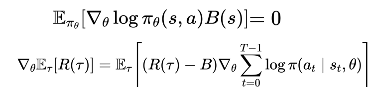

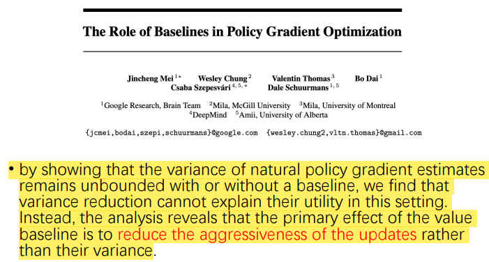


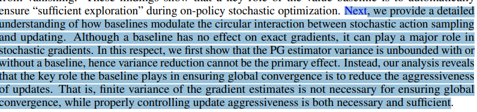


**Here aggressiveness could mean being similar to delta function**


Another way to reduce variance
$$
\begin{aligned}
\nabla_\theta J(\theta)&=
\mathbb{E}\left[\sum_{t=1}^T \nabla_\theta \log \pi_\theta(\mathbf{a_t|s_t})
\sum_{h=1}^Tr(\mathbf{s_h,a_h})\right]
\\& \approx \frac{1}{N} \sum_{i=1}^N\left(\sum_{t=1}^T \nabla_\theta \log \pi_\theta\left(\mathbf{a}_{i, t} \mid \mathbf{s}_{i, t}\right)\right)\left(\sum_{t=1}^T r\left(\mathbf{s}_{i, t}, \mathbf{a}_{i, t}\right)\right)
\\&\quad \text{Monte-Carlo Simulation, $\mathbf{s_{i,t}, a_{i,t}}$ are the $i$-th  samples.}
\\&=
\frac{1}{N} \sum_{i=1}^N \sum_{t=1}^T\left[\nabla_\theta \log \pi_\theta\left(a_{i, t} \mid s_{i, t}\right) \sum_{t^{\prime}=1}^T r\left(s_{i, t^{\prime}}, a_{i, t^{\prime}}\right)\right] \\
& =\frac{1}{N} \sum_{i=1}^N \sum_{t=1}^T\left[\nabla_\theta \log \pi_\theta\left(a_{i, t} \mid s_{i, t}\right) \sum_{t^{\prime}=t}^T r\left(s_{i, t^{\prime}}, a_{i, t^{\prime}}\right)\right]
\end{aligned}
$$
First step:
$$
\sum_{t} a_t \sum_{\tau} b_\tau=\sum_t \left(a_t \sum_\tau b_{\tau} \right)
$$
Second step: notice that $i$ is taken as ensemble mean
$$
\mathbb{E}_{\pi_{\theta}(\cdot|s_t)}
\nabla_{\theta} \log \pi_\theta(a_{t}|s_t) f(s_{1:t-1},a_{1:t-1})=
\sum_{a_t}\cancel{\pi_{\theta}(a_t|s_t)}\frac{\nabla_{\theta}\pi_\theta(a_t|s_t)}{\cancel{{\pi_\theta(a_t|s_t)}}} f(s_{1:t-1},a_{1:t-1})
\\=
f(s_{1:t-1},a_{1:t-1}) \nabla_\theta \sum_{a_t} \pi_\theta(a_t|s_t) = 0
$$
Markov property helps us make this happen: given $s_t$, future $a_t$ and the past $s_{1:t-1}, a_{1:t-1}$ are independent.

So we have:
$$
\frac{1}{N} \sum_{i=1}^N \sum_{t=1}^T\left[\nabla_\theta \log \pi_\theta\left(a_{i, t} \mid s_{i, t}\right) \sum_{t^{\prime}\lt t}^T r\left(s_{i, t^{\prime}}, a_{i, t^{\prime}}\right)\right] \equiv 0
$$
which then implies the second step.


#### Off-policy PG

==use importance sampling to prevent error accumulation (self-breeding)

Recall that IS means
$$
E_{\pi}f(X) = E_{\pi_\beta} \frac{\pi_{\theta}}{\pi_\beta}f(X)
$$
then we have 
$$
\nabla_\theta J(\theta) \approx 
\frac{1}{N}\sum_{i=1}^N 
{\color{darkblue}{\sum_{k=1}^T \frac{\pi_\theta(a_t^i|s_t^i)}{\pi_\beta(a_t^i|s_t^i)}}}
\cdot
\sum_{t=1}^T \nabla \log \pi_{\theta}(a_{t}^i|s_t^i)
\cdot 
\sum_{{\color{red}{h=t}}}^T r_{h}(s_h^i, a_h^i)
$$
Blue: importance sampling

Red: truncate past by Markov property to reduce variance.


Notice that these steps reduces the product terms, and thus reduces variance directly. 


Important RL methods:

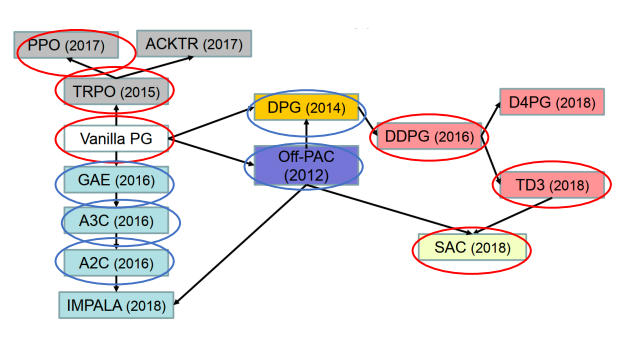

# Actor-Critic

##### Synchronous Offline AC

Batch Actor-Critic Algorithm

1. sample $\left\{\mathbf{s}_i, \mathbf{a}_i\right\}$ from $\pi_\theta(\mathbf{a} \mid \mathbf{s})$ (run it on the offline dataset)
2. fit $\hat{V}_\phi^\pi(\mathbf{s})$ to sampled reward sums   [Monte Carlo]
3. evaluate $\hat{A}^\pi\left(\mathbf{s}_i, \mathbf{a}_i\right)=r\left(\mathbf{s}_i, \mathbf{a}_i\right)+\hat{V}_\phi^\pi\left(\mathbf{s}_i^{\prime}\right)-\hat{V}_\phi^\pi\left(\mathbf{s}_i\right)$
4. $\nabla_\theta J(\theta) \approx \sum_i \nabla_\theta \log \pi_\theta\left(\mathbf{a}_i \mid \mathbf{s}_i\right) \hat{A}^\pi\left(\mathbf{s}_i, \mathbf{a}_i\right)$
5. $\theta \leftarrow \theta+\alpha \nabla_\theta J(\theta)$

##### Synchronous Online AC

Online Actor-Critic

1. take action $\mathbf{a} \sim \pi_\theta(\mathbf{a} \mid \mathbf{s})$, get $\left(\mathbf{s}, \mathbf{a}, \mathbf{s}^{\prime}, r\right)$
2. update $\hat{V}_\phi^\pi$ using target $r+\gamma \hat{V}_\phi^\pi\left(\mathbf{s}^{\prime}\right)$  [TD learning]
3. evaluate $\hat{A}^\pi(\mathbf{s}, \mathbf{a})=r(\mathbf{s}, \mathbf{a})+\gamma \hat{V}_\phi^\pi\left(\mathbf{s}^{\prime}\right)-\hat{V}_\phi^\pi(\mathbf{s})$
4. $\nabla_\theta J(\theta) \approx \nabla_\theta \log \pi_\theta(\mathbf{a} \mid \mathbf{s}) \hat{A}^\pi(\mathbf{s}, \mathbf{a})$
5. $\theta \leftarrow \theta+\alpha \nabla_\theta J(\theta)$


##### Asynchronous Actor Critic

To collect multiple samples but not just one. improving Synchronous


Problem of Deep RL Algorithms


**Efficient and stable Deep-RL methods for continuous high dimensional spaces**


1. **Extremely high sample complexity**

   * On-policy algorithms, like PPO. TRPO  A3C

     are largely sample inefficient, since new samples need to be collected for each gradient step.

   * Off policy methods like Q-learning use past experience to solve this issue

​              however the $\max(\cdot)$ step is not scalable, and if we use an actor network to perform this max()

​	      it cannot harness continuous spaces.

Some improvement DDPG: provides for sample-efficient learning but is notoriously challenging to use due to its extreme brittleness and hyperparameter sensitivity

2. **Brittleness, very sensitive to hyperparameter**


We compare our method to **deep deterministic policy gradient (DDPG) (Lillicrap et al., 2015)**, an algorithm that is regarded as one of the **more efficient off-policy deep RL** methods (Duan et al., 2016); proximal **Policy optimization (PPO) (Schulman et al., 2017b), a stable and effective on-policy policy gradient algorithm;**


We additionally compare to **twin delayed deep deterministic policy gradient algorithm (TD3)**


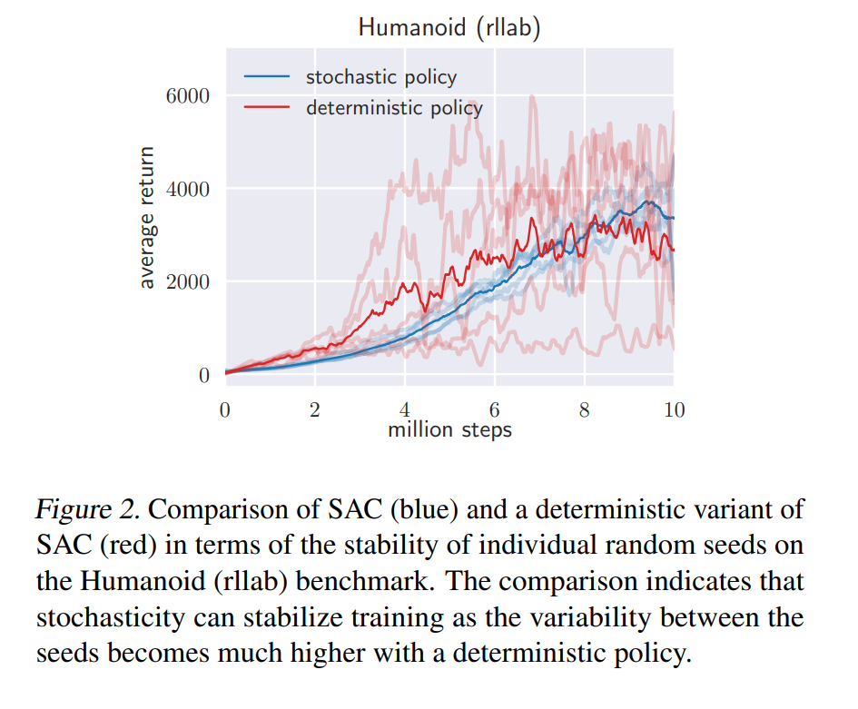

### Value-based DRL

#### DDPG= Deep Deterministic Policy Gradient

DDPG is the  DQN for continuous action space $\mathcal{A} =\R^d$

In continuous action space you cannot directly implement $\arg\max$. 

So we will use a network to fit this argmax operator. 

Sample direct gradient ascents, approximate the value function maximizer $\arg\max$ and we propose $\mu_\theta$. 

Problems: 

1. Over-estimate Q-value. 

   Because taking expectation + max() will favor cause a bias. (Problem of all Q-learning).

   $\mathbb{E}\max \geq \max \mathbb{E}$ 

   So we use to nets.   If some nets overestimate, the other is less likely to also overestimate Q at the same (s,a) pairs. So we use double Q-learning. 

    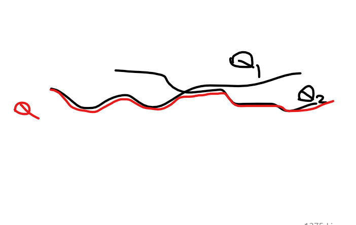

2. High variance. 


#### TD3: Twin Delayed DDPG

Improving DDPG

Improvement 1: Reduce over-estimation by Clipped Double Q Learning

- Toward addressing overestimation
- We have two Qs. And we calculate min of them as my Q.

$$
y\left(r, s^{\prime}, d\right)=r+\gamma\min _{i=1,2} Q_{\phi_{i, \text { arg }}}\left(s^{\prime}, a_{\mathrm{TD} 3}\left(s^{\prime}\right)\right) \cdot (1-\text{terminate}) 
$$

Improvement 2: Stabilize policies by Delayed Policy Updates
- Toward addressing unstable critics
- Lower the frequency of actor updates.

In DDPG, we update actor and critic at a 1:1 ratio iteratively. In TD3, we update the critic multiple times until convergence with the same actor, then we update the critic and for once and then update policies. 

low actor update will stable training. 


Improvement 2: Make Value functions smooth by noise injections

Add noises to policy update to smooth the landscape of value function.

$\mu_\theta$ is the deterministic greedy policy. If the Q-function is perfect then it suffices. However, since Q-function is not accurate, constantly changing during iterations. Moreover, injecting noise helps to smooth the topology, helping to escape local minima.

$\epsilon$ is a gaussian or uniform distribution noise, which is then clipped by upper and lower bounds. 
$$
a_{\mathrm{TD} 3}\left(s^{\prime}\right)=\operatorname{clip}\left(\mu_{\theta, \operatorname{targ}}\left(s^{\prime}\right)+\operatorname{clip}(\epsilon,-c, c), a_{\mathrm{low}}, a_{\mathrm{high}}\right)
$$


Ways to add noise: 

1. add noise to the parameter space (perturbation). Be careful: could be dramatic.

2. add noise to action space  (like TD3)
3. add noise to state spaces


#### SAC=Soft Actor Critic

Further advancing from TD3

Introduce another term of entropy bonus to the objective function. We control the magnitude of this bonus term with a small constant $\alpha$. So we want to optimize rewards but also encourage the randomness. 

Then we defined a new set of value/Q functions. The major difference is that the new Q-function involves an additional term of $-\alpha \log \pi(\cdot|s_{t})$. We call these new functions ‘’soft Q-functions’’. 

Why “Soft”:

We consider Boltzman policies

Energy:$\mathcal{\epsilon}(s_t,a_t)=e^{-\frac{1}{\alpha} Q_{soft}(s_t,a_t)}$
$$
\pi(a_t|s_t)=
$$
here we subtract a term of $V()$ to stabilize. 


The soft in SAC is different from Softmax function in supervised learning. 

$softmax \approx  \arg\max$   $softmax(v)=\frac{e^{v}}{\sum e^{v_i}}$

$Softmax\approx max$  $Softmax(f(a))=\log \int da ~e^{f(a)}$


**MCMC: fit any distribution from samples.**

**Diffusion model in imitation learning diffusion policy**

**Look, SAC’s bug is that you cannot generate a real Boltz man policy(multi peaks)**

**What is target network.** 


Previously we consider Gaussian policies, but it is difficult to be fitted to Q_functions with multiple peaks. However 


• Large step → bad policy • Next batch is generated from current bad policy → collect bad samples • Bad samples → worse policy • (compare to supervised learning: the correct label and data in the  following batches may correct it) •

If step size is too small: the learning process is slow  

 We may not always want stochastic policies.

Distributed training


### Policy-based DRL

#### PPO

Why do we need TRPO/PPO constraint optimization methods == the shortcoming of policy-based methods: frickticiousness

What is the shortcomings of policy-based methods?

On-policy updates, if there is no constraint, since data comes from the previous policy, errors will quickly accumulated

- We almost addressed on-policy issues by importance sampling
- What else?
- Unstable updates!
- If step size is too large: Large step $\rightarrow$ bad policy, Next batch is generated from current bad policy $\rightarrow$ collect bad samples, Bad samples $\rightarrow$ worse policy.
- Also, updating your policy within a range may guarantee improvement in performance (theoretically). We might touch this later.


PPO is actually simplified from TRPO

Two ways to introduce PPO

NPG==> TRPO ==> PPO  (very math-heavy)

Policy Gradient ==> PPO (heuristics)


PPO: significantly and still is the best (test of time) performance

​	most importantly, it is simpler and easier to tune (this is very very important for Deep RL)


PPO uses very recent history and regarded on-policy, but there is some off-policy favor. It is “on-policy-ish”
$$
\underset{\theta}{\operatorname{maximize}} \hat{\mathbb{E}}_t\left[\frac{\pi_\theta\left(a_t \mid s_t\right)}{\pi_{\theta_{\text {old }}}\left(a_t \mid s_t\right)} \hat{A}_t\right]-\beta \hat{\mathbb{E}}_t\left[\mathrm{KL}\left[\pi_{\theta_{\text {old }}}\left(\cdot \mid s_t\right), \pi_\theta\left(\cdot \mid s_t\right)\right]\right]
$$
About KL-divergence:

mode seeking and mode covering are two ways to minimize the distribution difference. 

mode seeking: try to distinguish different distributions. 

mode covering: try to cover all the supports of the distributions.

Adaptive KL penalty :

If we fix the penalty weight $\beta$ we find it very difficult to tune. So Schuman invented an autonomous $\beta$ tuning mechanism. 

-  We first measure the one-step improvement of the last update.

  $d=\hat{\mathbb{E}}_t\left[\operatorname{KL}\left[\pi_{\theta_{\text {old }}}\left(\cdot \mid s_t\right), \pi_\theta\left(\cdot \mid s_t\right)\right]\right]$

- If $d<d_{\text {targ }} / 1.5, \beta \leftarrow \beta / 2$  If too near, we relax the constraint, go further. 

- If $d>d_{\mathrm{targ}} \times 1.5, \beta \leftarrow \beta \times 2$  If too far, we tighten the constraint and go nearer.

Look, KL is a soft penalty so it still cannot eliminate the fluctuations, especially because there is a ratio which can oscillate between$(0,\infty)$​


So we introduce the clipping of the policy ratio. We compare the ratio and its clipped version, choose the minimum one. 
$$
\underset{\theta}{\operatorname{maximize}} \hat{\mathbb{E}}_t\left[\frac{\pi_\theta\left(a_t \mid s_t\right)}{\pi_{\theta_{\text {old }}}\left(a_t \mid s_t\right)} \hat{A}_t\right] \quad r_t(\theta)=\frac{\pi_\theta\left(a_t \mid s_t\right)}{\pi_{\theta_{\text {old }}}\left(a_t \mid s_t\right)}
$$
- Since we only have a soft constraints on the KL divergence.
- Fluctuation happens when the ratio is too large.

$$
L^{C L I P}(\theta)=\hat{\mathbb{E}}_t\left[\min \left(r_t(\theta) \hat{A}_t, \operatorname{clip}\left(r_t(\theta), 1-\epsilon, 1+\epsilon\right) \hat{A}_t\right)\right] 
$$

where the clipping threshold is a hyperparameter. 


Further improvement that makes PPO practical:

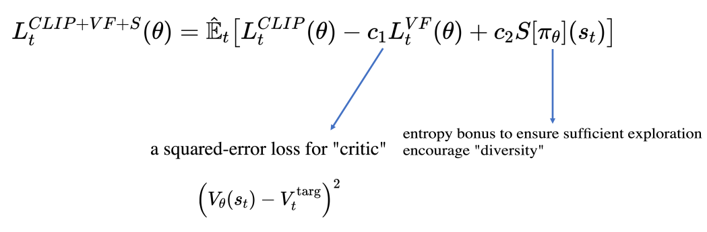

How to calculate the squared loss difference: by supervise learning : MC target nets or TD roll out. 

We also add an entropy bonus for exploration.


As long as there is a strong simulator (as long as you don’t care about sample complexity) use PPO for real stuff. But if you implement TRPO, it may take you weeks to really work out.

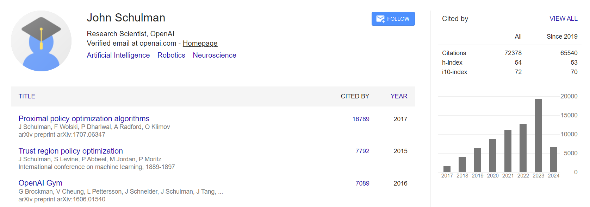


Philosophy:

Policy Gradient is the continuous version of policy iteration.

policy improvement ==> gradient ascent

policy evaluation ==> compute value by MC/TD

Why advantage function is called advantage: the increase of choosing this action w.r.t. the average effect of all the actions
$$
\begin{equation}
\begin{aligned}
A(s,a)
=&Q(s,a)-V(s)=Q(s,a)
\\=&Q(s,a)-\mathbb{E}_{\tilde{a}\sim \pi(\cdot|s)}Q(s,\tilde{a})
\end{aligned}
\end{equation}
$$
Moreover, advantage function is directly related with the suboptimality
$$
J(\theta)=E_{\tau \sim p_\theta(\tau)}\left[\sum_t \gamma^t r\left(\mathbf{s}_t, \mathbf{a}_t\right)\right]
$$

$$
\begin{aligned}
J\left(\theta^{\prime}\right)-J(\theta) & =J\left(\theta^{\prime}\right)-E_{\mathbf{s}_0 \sim p\left(\mathbf{s}_0\right)}\left[V^{\pi_\theta}\left(\mathbf{s}_0\right)\right] \\
& =J\left(\theta^{\prime}\right)-E_{\tau \sim p_{\theta^{\prime}}(\tau)}\left[V^{\pi_\theta}\left(\mathbf{s}_0\right)\right] \\
& =J\left(\theta^{\prime}\right)-E_{\tau \sim p_{\theta^{\prime}}(\tau)}\left[\sum_{t=0}^{\infty} \gamma^t V^{\pi_\theta}\left(\mathbf{s}_t\right)-\sum_{t=1}^{\infty} \gamma^t V^{\pi_\theta}\left(\mathbf{s}_t\right)\right] \\
& =J\left(\theta^{\prime}\right)+E_{\tau \sim p_{\theta^{\prime}}(\tau)}\left[\sum_{t=0}^{\infty} \gamma^t\left(\gamma V^{\pi_\theta}\left(\mathbf{s}_{t+1}\right)-V^{\pi_\theta}\left(\mathbf{s}_t\right)\right)\right] \\
& =E_{\tau \sim p_{\theta^{\prime}}(\tau)}\left[\sum_{t=0}^{\infty} \gamma^t r\left(\mathbf{s}_t, \mathbf{a}_t\right)\right]+E_{\tau \sim p_{\theta^{\prime}}(\tau)}\left[\sum_{t=0}^{\infty} \gamma^t\left(\gamma V^{\pi_\theta}\left(\mathbf{s}_{t+1}\right)-V^{\pi_\theta}\left(\mathbf{s}_t\right)\right)\right] \\
= & E_{\tau \sim p_{\theta^{\prime}}(\tau)}\left[\sum_{t=0}^{\infty} \gamma^t\left(r\left(\mathbf{s}_t, \mathbf{a}_t\right)+\gamma V^{\pi_\theta}\left(\mathbf{s}_{t+1}\right)-V^{\pi_\theta}\left(\mathbf{s}_t\right)\right)\right]
\\=&E_{\tau \sim p_{\theta^{\prime}}(\tau)}\left[\sum_{t=0}^{\infty} \gamma^t A^{\pi_\theta}\left(\mathbf{s}_t, \mathbf{a}_t\right)\right]
\end{aligned}
$$
Then we write this expression using IS:
$$
=\sum_t E_{\mathbf{s}_t \sim p_{\theta^{\prime}}\left(\mathbf{s}_t\right)}\left[E_{\mathbf{a}_t \sim \pi_\theta\left(\mathbf{a}_t \mid \mathbf{s}_t\right)}\left[\frac{\pi_{\theta^{\prime}}\left(\mathbf{a}_t \mid \mathbf{s}_t\right)}{\pi_\theta\left(\mathbf{a}_t \mid \mathbf{s}_t\right)} \gamma^t A^{\pi_\theta}\left(\mathbf{s}_t, \mathbf{a}_t\right)\right]\right]
$$
The reason we use importance sampling is because we can only generate online data from the previous (not updated) policy $\theta$ instead of $\theta^\prime$. So to makes the policy gradient algorithm more practical we need this Importance sampling, and then we will approximate the terms in the expectations. 

This is the reason why we maximize advantage in policy gradient. 

Since we do not know the updated $\theta^\prime$ during the program, we consider using another approximation: to use the already known parameter$\theta$. 
$$
\sum_t E_{\mathbf{s}_t \sim p_{\theta^{\prime}}\left(\mathbf{s}_t\right)}\left[E_{\mathbf{a}_t \sim \pi_\theta\left(\mathbf{a}_t \mid \mathbf{s}_t\right)}\left[\frac{\pi_{\theta^{\prime}}\left(\mathbf{a}_t \mid \mathbf{s}_t\right)}{\pi_\theta\left(\mathbf{a}_t \mid \mathbf{s}_t\right)} \gamma^t A^{\pi_\theta}\left(\mathbf{s}_t, \mathbf{a}_t\right)\right]\right]
\\
\approx \sum_t E_{\mathbf{s}_t \sim p_\theta\left(\mathbf{s}_t\right)}\left[E_{\mathbf{a}_t \sim \pi_\theta\left(\mathbf{a}_t \mid \mathbf{s}_t\right)}\left[\frac{\pi_{\theta^{\prime}}\left(\mathbf{a}_t \mid \mathbf{s}_t\right)}{\pi_\theta\left(\mathbf{a}_t \mid \mathbf{s}_t\right)} \gamma^t A^{\pi_\theta}\left(\mathbf{s}_t, \mathbf{a}_t\right)\right]\right]
$$
Theoretically speaking we can use the KL-constraint to bound the error of this approximation step. 


However, it is difficult to calculate KL. We wonder whether we can use the parameter.   
$$
\begin{align}[\text{Non-Euclidean Geometry}]
D_{\mathrm{KL}}\left(\pi_{\theta^{\prime}}\left(\mathbf{a}_t \mid \mathbf{s}_t\right) \| \pi_\theta\left(\mathbf{a}_t \mid \mathbf{s}_t\right)\right) \leq \epsilon \\
[\text{Euclidean Geometry: NPG}]\quad 
\left\|\theta-\theta^{\prime}\right\|^2 \leq \epsilon
\end{align}
$$
So the introduction of KL constraint is to twist the geometry. 


#### TRPO

In practice we do not compute the Fisher information in closed-form. We estimate it by samples.


**John Schulman 在Berkeley读博的时候写了TRPO但是当时自己数学过不去，于是请了Michael Jordan组里的人帮忙推导数学**

**后来去了Open AI然后他就不用管数学了，于是发明了PPO大火至今。因为比TRPO而言没有什么math improvements但是加了很多engineering tricks.** 


# Coding: Pytorch Implementation

Deep RL algorithm anatomy(Sergey Levine)

run the policy + generate samples

replace buffer

fit a model

improve the policy

source: Colab


Packages: 

gymnasium 


```python
env=gym.make("")
env.reset()
```


env.render()

渲染当时环境，让人来看


训练刚开始的时候使用$\epsilon-$greedy 其中$\epsilon$ 是random explore的概率。随着迭代次数增加， 会将$\epsilon$ decay to low values. 


DRL里面为了避免纯online的不稳定，使用了一个target network，是对之前的Q-net的stable copy，它是只在隔一段时间之后才会更新，对应Bellman equation里面的$w^{-}$. 


policy_net(state.max(1){1}.view(1,1))


0 维是batch size， 1维是action

max会返回两个值， 因此[1]选的是argmax项目


transition: 在DRL里面指一个四元组data $(s,a,r,s')$

注意DRL里面会特殊处理最后一步因为其实没有$s_{H+1}$.

non_final_mask

non_final_next_state


policy_net() 会直接输出batch\times action矩阵

.gather是pytorch函数


注意：target network 不能有梯度

因此对target时候要提前加入

with torch no grad


最后引入了in-place gradient clipping

防止梯度过大导致不稳定


env.step()代表agent play with the environment

返回值中有

terminate: agent进入死角再做就会返回zero-reward 

truncated: agent太强了一直不死强制终止

注意这里在terminate的时候不能加入next-state value因为terminate的next-state本应给zero reward因为是很差的结果

但是truncated的时候本来policy表现很好因此此时要保持最后一步的high reward.

```python
if terminated:
    	next_state=None
    else:
        next_state=torch.tensor()....
```


evaluate 的时候不用$\epsilon-greedy$就用你学的最好的情况

但是train的时候$\epsilon$ greedy

目前来讲DRL的训练明显比监督学习要high-noise 


DQN for discrete action space $\arg\max$


DQN for continuous action space $TD3$, DDPG

连续控制问题


DQN image input:

encode raw pixels to tensors by CNN


### Project Management

Mange huge amount of hyper parameters:
Hydra

!config yaml 文件来制定超参数

并且在命令行可以改变使用的超参数


