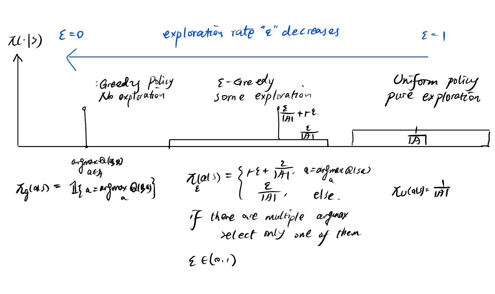

[toc]


# Deep Reinforcement Learning Notes(revised version)

Tonghe Zhang


## MDP

### Exact Solution: DP (Dynamic Programming)

Value iteration and policy iteration are MDP solutions that **assumes full knowledge of the transitions**(which makes it not an RL method).

These methods are also exact solutions and they **cannot scale to large or continuous spaces** due to the operators $\max_{a\in \mathcal{S}}$ and $\mathbb{E}_{s'\sim ...}$​, as well as this methods requires updating all the entries of the value functions.


#### Value Iteration

##### Algorithm description

$$
\begin{equation}
\begin{aligned}
(\text{Value Iteration})\\
&\text{Repeat \textbf{*until value function converges*}:}
\\&\text{Initialize the value function \textbf{*only once*}.}
\\&v(\cdot)=0
\\&\text{Bellman optimality updates over an infinite horizon:}
\\&\quad \text{Repeat  until value function converges:}
\\&\quad v(s)= \max_{a\in \mathcal{A}}~r(s,a)+\gamma\ \sum_{s'\in \mathcal{S}}~P(s'|s,a) v(s')\times (1-\text{d})
\\
&\text{Output greedy policy of the }
\\&\quad\quad \pi(a|s)\leftarrow \arg\max_{a\in \mathcal{A}}~
r(s,a)+\gamma \sum_{s'\in \mathcal{S}}~P(s'|s,a)v(s')\times (1-\text{d})
\end{aligned}
\end{equation}
$$

##### Python Implementation

```python
def value_iteration(P, nS, nA, gamma=0.9, eps=1e-3):  
    value_function = np.zeros(nS)
    policy = np.zeros(nS, dtype=int)
    next_value_function=np.zeros(nS)
    Q_function=np.zeros((nS,nA))
    while True:
      value_function=next_value_function
      for s in range(nS):
          for a in range(nA):
             # compute Q[s][a]
             Q_function[s][a]=0
             for i in range(len(P[s][a])):
                p,ss,r,terminal=P[s][a][i]
                Q_function[s][a]=\
                Q_function[s][a]+p*(r+gamma*value_function[ss]*(1-terminal))
                #*(1-terminal) is a must! 
      next_value_function=np.max(Q_function, axis=1)
      policy=np.argmax(Q_function,axis=1)
      if np.max(np.abs(next_value_function-value_function)) < eps:
         break
    return value_function, policy
```


#### Policy Iteration

##### Why policy iteration

In policy iteration we test whether the algorithm converges by the convergence of the policy, not the value function. Under certain conditions this criteria allows the algorithm converge faster, while theoretically policy iteration also yields the optimal policy just like value iteration. 


##### Algorithm description:

$$
\begin{equation}
\begin{aligned}
(\text{Policy Iteration})\\
&\text{Repeat \textbf{*until policy converges*}:}
\\&\quad\text{Policy evaluation}
\\&\quad\quad \text{Re-initialize the value function \textbf{*each time*}}
\\&\quad\quad v(\cdot)=0
\\&\quad\quad \text{Evaluate the current policy by Bellman updates.}
\\&\quad\qquad \text{Repeat  until value function converges:}
\\&\quad\qquad v(s)= r(s,\pi(s))+\gamma\ \sum_{s'\in \mathcal{S}}~P(s'|s,\pi(s)) v(s')\times (1-\text{d})
\\
&\quad\text{Policy improvement}
\\&\quad\quad \pi(a|s)\leftarrow \arg\max_{a\in \mathcal{A}}~
r(s,a)+\gamma \sum_{s'\in \mathcal{S}}~P(s'|s,a)v(s')\times (1-\text{d})
\end{aligned}
\end{equation}
$$

How to test whether policy converges:

> Just compare $\pi_{\text{current}}(\cdot|s)==\pi_{\text{previous}}(\cdot|s)$

How to check whether value function converges:

> You can use 1-norm or infinity norm. like $\norm{v_{\text{current}}(s)-v_{\text{previous}}(s)}_{\infty}\geq \epsilon$

If the reward is dependent on the next state, we should write in this way:

$\sum_{s'\in \mathcal{S}}~P(s'|s,\pi(s)) [r(s,\pi(s), s')+\gamma\ v(s')\times (1-\text{d})]$ 


##### Python Implementation

```python
"""   
For policy_evaluation, policy_improvement, policy_iteration and value_iteration,
the parameters P, nS, nA, gamma are defined as follows:

P: nested dictionary
    From gym.core.Environment
    For each pair of states in [0, nS - 1] and actions in [0, nA - 1], P[state][action] is a list of
    tuple of the form (p_trans, next_state, reward, terminal) where
        - p_trans: float
            the transition probability of transitioning from "state" to "next_state" with "action"
            P[s][a][ss_id][0]
        - next_state: int
            denotes the state we transition to (in range [0, nS - 1])
            P[s][a][ss_id][1]
        - reward: int
            either 0 or 1, the reward for transitioning from "state" to	"next_state" with "action"
            P[s][a][ss_id][2]
        - terminal: bool
          True when "next_state" is a terminal state (hole or goal), False otherwise
                P[s][a][ss_id][3]
	nS: int
		number of states in the environment
	nA: int
		number of actions in the environment
	gamma: float
		Discount factor. Number in range [0, 1)
"""
def policy_evaluation(P, nS, nA, policy, gamma=0.9, eps=1e-3):
    """Evaluate the value function from a given policy.
    Parameters
    ----------
    P, nS, nA, gamma:
      defined at beginning of file
    policy: np.array[nS]
      The policy to evaluate. Maps states to actions.
    eps: float
      Terminate policy evaluation when
        max |value_function(s) - next_value_function(s)| < eps
    Returns
    -------
    value_function: np.ndarray[nS]
      The value function of the given policy, where value_function[s] is
      the value of state s
    """
    
    value_function = np.zeros(nS)

    next_value_function=np.zeros(nS)
    k=0
    while True:
       k=k+1
       value_function = next_value_function
       next_value_function=np.zeros(nS)
        # this is where the bug is!!!!!!
        # we must initialize the value function again before new iterataion begins.
       for s in range(nS):
          a=policy[s]
          for trans in P[s][a]:
              p,ss,r,terminal=trans
              next_value_function[s]+=p*(r+gamma*value_function[ss]*(1-terminal))
       if (np.max(np.fabs(value_function-next_value_function)) < eps):
           break

    return value_function

def policy_improvement(P, nS, nA, value_from_policy, policy, gamma=0.9): 
    '''
    Given the value function from policy, improve the policy.
    Parameters
    ----------
    P, nS, nA, gamma:
      defined at beginning of file
    value_from_policy: np.ndarray
      The value calculated from evaluating the policy
    policy: np.array
      The previous policy.
    Returns
    -------
    new_policy: np.ndarray[nS]
      An array of integers. Each integer is the optimal action to take
      in that state according to the environment dynamics and the
      given value function.
    '''
    new_policy = np.zeros(nS, dtype=int)

    for s in range(nS):
        Q_s=np.zeros(nA)
        for a in range(nA):
            for p,ss,r,terminal in P[s][a]:
              Q_s[a]+=p*(r+gamma*value_from_policy[ss]*(1-terminal))
        new_policy[s]=np.argmax(Q_s)
    return new_policy

def policy_iteration(P, nS, nA, gamma=0.9, eps=10e-3):
    value_function = np.zeros(nS)
    
    previous_value=np.zeros(nS) 

    improved_policy = np.zeros(nS, dtype=int)

    k=0
    while True:
        k=k+1
        previous_policy=improved_policy
        
        previous_value= policy_evaluation(P,nS,nA,previous_policy,gamma,eps)

        improved_policy =\
        policy_improvement(P,nS,nA,previous_value,previous_policy,gamma)
        
        value_function=previous_value
        
        if (np.all(previous_policy==improved_policy)):
            break
    return value_function, improved_policy
```


### Approximate Solutions

#### MC (Monte Carlo) learning


#### TD (Temporal Difference) learning

##### Intuition:

1. TD can be viewed as a stochastic approximation to the fixed-point Bellman equation. 

2. You can view the TD error as a measure of the accurateness of your fitted value function, so it is a kind of functional error. If the fitted value function strictly confides with the Bellman equation, then the TD error should be zero:
   $$
   \begin{equation}
   \begin{aligned}
   &(\text{true value}):\quad 
   \\& v^{\pi}(S)=\mathbb{E}\left[\sum_{t=0}^{\infty}\gamma^t~r(S_t,A_t)|S_0=S\right]\\
   &(\text{true value's expected TD error}):\quad 
   \\& \mathbb{E}_{A_t\sim \pi(\cdot|S_t), S_{t+1}\sim P(\cdot|S_t,A_t)}
   r(S_t,A_t)+\gamma ~v^{\pi}(S_{t+1})-v^{\pi}(S_{t})
   \\=&\mathbb{E}
   \left[r(S_t,A_t)+\sum_{k=0}^{\infty}\gamma^{k+1}r(S_k,A_k)\bigg|S_t,A_t\big|S_t\right]-v^{\pi}(S_t)
   \\=&
   \mathbb{E}
   \left[\sum_{k=0}^{\infty}\gamma^{k}r(S_k,A_k)\big| S_t\right]-v^{\pi}(S_t)=0
   \end{aligned}
   \end{equation}
   $$


However since we use neural nets to approximate value function and we cannot compute the exact expectation using finite samples, the approximate value function may not allows for strictly zero TD error. Since having zero TD error is equivalent to obeying the Bellman’s equation, to iteratively approximate the true value function it suffices to minimize the TD error in each step. When the TD error diminishes, our algorithm should converge to $v^{\pi}$ 


2. Q-learning is a type of TD that replaces $V$ with $Q$ function estimate and select actions greedily instead of taking expectation w.r.t the unknown optimal policy $\pi^\star$.   

| True value         | Approximation            |
| ------------------ | ------------------------ |
| $\pi^\star$        | $\pi^k$                  |
| $v^{\pi}, q_{\pi}$ | $V^{\pi_k}$, $Q^{\pi_k}$ |


##### TD(0)

TD$(0)$ only involves one-step update. It is an iterative approximate algorithm used to find the approximation to the unknown value function of some policy $\pi$ by drawing samples from the environment. TD$(0)$​ is only used for policy evaluation, but not policy improvement.


Procedure:

Input policy $\pi$ which we wish to evaluate(we will keep it fixed throughout the TD(0)). 

Repeat until value converges:

​	For all $s$

​		sample $a\sim \pi(\cdot|s)$ and $s^\prime \sim P(\cdot|s,a)$.

​		Update value function on that state. 

​		$ V(s) \leftarrow V(s) + \alpha [R + \gamma V(s') - V(s)] $

Return the value function under policy $\pi$     $V^{\pi}\leftarrow V$


##### TD(\lambda)

##### Why do we need Q-learning if we have TD(0)?

> While **TD(0)** is useful for estimating the value function of a particular policy (predictive purposes), **Q-learning** aims at finding the optimal policy directly. **TD(0)** updates the state value based on the successor state which might follow a given, possibly suboptimal, policy. In contrast, **Q-learning** updates the action values based on the optimal choice at the next state, regardless of the policy being followed to generate the data. This quality makes Q-learning particularly powerful for control problems, where the goal is to determine the best action to take rather than merely evaluating a predetermined policy.

##### Q-learning: off-policy TD learning

$$
\begin{equation}
\begin{aligned}
(\text{Q-learning})
\\
&\text{Initialize policy and Q-function}\\
&\text{Repeat until convergence:} \\
&\text{If use asynchronized update}\\
&\quad \text{For all $s$, take action $\hat{a}\sim \pi_{\epsilon_k}(\cdot|s)$ using the epislon-annealing greedy policy. }
\\&\quad \text{Only update} (s,\hat{a}) \text{ and keep the Q-value on the rest of $(s,\cdot)$ untouched. }
\\&\quad 
Q(s,a)\leftarrow Q(s,a)+\alpha \left(r(s,a)+\gamma \max_{a^\prime\in \mathcal{A}}Q(\boldsymbol{s^\prime}, a^\prime)-Q(s,a)\right)\cdot \mathbb{1}\{a=\hat{a}\}
\\&\quad \text{ where }s^\prime \sim P(\cdot|s,a)
\\&\text{If use synchronized update}\\
&\quad 
Q(s,a)\leftarrow Q(s,a)+\alpha \left(r(s,a)+\gamma \max_{a^\prime\in \mathcal{A}}Q(\boldsymbol{s^\prime}, a^\prime)-Q(s,a)\right)
\\&\quad \text{ where }s^\prime \sim P(\cdot|s,a)
\\
&\text{Output: }\\
&\pi(a|s)\leftarrow\arg\max_{a\in \mathcal{A}}~Q(s,a)
\end{aligned}
\end{equation}
$$

Several remarks on Q-learning

> 1. Why this works, as well as why TD works: stochastic approximation.
>
> 2. $\alpha$​ is the learning rate.
>
> 3. The Q-function update is point-wise, meaning that we traverse the entire $\mathcal{S\times A}$ to update each entry of the $Q$-value, which makes it impossible to directly scale Q-learning to continuous setting. Synchronized update requires at least $S\times A$​ calls to the simulator/buffer per iteration, and asynchronized needs at least $\mathcal{S}$ calls. 
>
> 4. In practice, we add the multiplier of $(1-\text{terminal})$ to the second term in the TD target:
>    $$
>    \text{TD}_{\text{target}}=r(s_i,a_i)+\gamma \max_{a\in \mathcal{A}}Q(s'_i,a)\times (1-\text{terminal})
>    $$
>    because the term $\gamma \max_{a\in \mathcal{A}}Q(s'_i,a)$ literarily means the future rewards predicted by the current Q-function. If state $s_i$ is already the terminal state $(\text{terminal==1})$ then there will be no future rewards so we should set the second term as zero.  If $s_i$ is truncated then we do not need to nullify the future Q value because in fact there is still future returns.  We truncate the episode not because the agent is dead (terminate) but because it performs too well (never dies). We actually should reward this behavior by keeping a high value of Q-value during the TD update. 

> 5. $\boldsymbol{s^\prime}$ is the random sample of the next state: $s^\prime \sim P(\cdot|s,a)$, so this update rule also involves randomness. 
> 6. Q-learning is off-policy

```python
def Q_learning_step(\
    Q_function, state, action, reward, next_state, terminal,\
    alpha, gamma):
    '''
    Update the Q function through Q learning algorithm.
    Parameters
    ----------
    state, action, reward, next_state, terminal, alpha: defined at the beginning of the file
    Q_function: np.array[nS][nA]
        The current Q value for the given state and action
    Returns
    -------
    next_Q_function: np.array[nS][nA]
        The updated Q value through one step Q learning.
    '''
    next_Q_function = np.zeros(Q_function.shape)
    
    '''Asynchronous Q-learning: we only update one sample.'''
    next_Q_function=Q_function
    next_Q_function[state][action]=\
    next_Q_function[state][action]+alpha*(\
    reward+gamma* np.max(Q_function[next_state,:]*(1-terminal))
        \-Q_function[state][action])

    return next_Q_function
```

```python
# annal the epsilon to estimate a GLIE policy
    eps_annaling = 1 / episodes

    # loop for training episodes
    for episode in range(episodes):
        state, _ = env.reset()
        terminal, truncated = False, False

        while True:
            policy =epsilon_greedy_policy(
                nS, nA, Q_function, eps=1 - episode * eps_annaling)

            action = sample_action(policy, state)

            next_state, reward, terminal, truncated, _ = env.step(action)  

            Q_function = Q_step(\
                Q_function, state, action, reward, next_state, \
                                       terminal, alpha, gamma)
            
            state = next_state # online learning.
            
            if terminal or truncated:
                break

    return Q_function, Q_function.argmax(axis=1)
```


##### SARSA: on-policy TD learning

$$
\begin{equation}
\begin{aligned}
(\text{SARSA})
\\
&\text{Initialize policy $\pi_{\epsilon_k}(\cdot|s)$ as $\epsilon-$ annealing policy}
\\&\text{Initialize Q-function}\\
&\text{Repeat until convergence:} \\
&Q(s,a)\leftarrow Q(s,a)+\alpha \left(r(s,a)+\gamma Q(\boldsymbol{s^\prime},\boldsymbol{a^\prime})\times (1-d_i)-Q(s,a)\right)
\\&\quad \text{ where }s^\prime \sim P(\cdot|s,a), a^\prime \sim \pi_{\epsilon_k}(\cdot|\boldsymbol{s^\prime})
\\
&\text{Output: }\\
&\pi(a|s)\leftarrow\arg\max_{a\in \mathcal{A}}~Q(s,a)
\end{aligned}
\end{equation}
$$

Several remarks on SARSA:

> 1. SARSA is on-policy but we do not update the policy based on samples. Instead we choose a family of exploration policies and samples next-actions from it. A classic implementation is to use the annealing policy, which is an $\epsilon$-greedy policy whose **exploration intensity decays linearly across episodes**: 
>
>    $\epsilon_k = \frac{k}{K}, \forall k\in 0,1,\ldots, K$  so the on-policy we use smoothly change from uniformly at random to the greedy policy, making SARSA a type of GLIE algorithm.
>
> 2. We can also use a fixed $\epsilon-$greedy policy as our action sampler. 
>
> 3. $d_i$ is the terminal tag. 
>
> 4. We do not update the policy during SARSA because we always use the annealing policy. Our output policy is the greedy policy derived from the last Q-value.

```python
def Sarsa_step(
    Q_function, state, action, reward, next_state, next_action, terminal,
    alpha, gamma):
    """Update the Q function through Sarsa algorithm.
    Parameters
    ----------
    state, action, reward, next_state, terminal, alpha: defined at the beginning of the file
    Q_function: np.array[nS][nA]
        The current Q value for the given state and action
    Returns
    -------
    next_Q_function: np.array[nS][nA]
        The updated Q value through one step Sarsa.
    """
    next_Q_function = np.zeros(Q_function.shape)

    next_Q_function=Q_function
    next_Q_function[state][action]=\
    next_Q_function[state][action]+alpha*(\
        reward+gamma*Q_function[next_state][next_action]*(1-terminal)-Q_function[state][action])

    return next_Q_function
```

```python
# annal the epsilon to estimate a GLIE policy
    eps_annaling = 1 / episodes

    # loop for training episodes
    for episode in range(episodes):
        state, _ = env.reset()
        terminal, truncated = False, False

        while True:
            policy =epsilon_greedy_policy(
                nS, nA, Q_function, eps=1 - episode * eps_annaling)

            action = sample_action(policy, state)

            next_state, reward, terminal, truncated, _ = env.step(action)  
            
            next_action = sample_action(policy, next_state)
            
            Q_function = Sarsa_step(\
                Q_function, state, action, reward, next_state, next_action,\
                                       terminal, alpha, gamma)
            
            state = next_state # online learning.
            
            if terminal or truncated:
                break

    return Q_function, Q_function.argmax(axis=1)
```


#### Comparison between TD and MC

##### MC

• **has high variance**(multiple stochastic terms), **zero bias**(asymptotically)

• Good convergence properties

• Not very sensitive to initial value, because uses many many future terms to suppress the initial fluctuations. 

• Very simple to understand and use


#####  TD

• has low variance(fewer stochastic variables are used), **some bias** (because TD builds the new estimation on the previous guess, which is also inaccurate, so the bias will accumulate. unless in some step the TD target happened to be the true value $v_\pi$​ we cannot say that it is unbiased.)

> - MC return $G_t=R_{t+1}+\gamma R_{t+2}+\ldots+\gamma^{T-1} R_T$ is unbiased estimate of the true value function $v_\pi\left(s_t\right)$
> - True TD target $R_{t+1}+\gamma v_\pi\left(S_{t+1}\right)$ is unbiased estimate of he true value function $v_\pi\left(s_t\right)$
> - TD target $R_{t+1}+\gamma V\left(S_{t+1}\right)$ is **biased** estimate of $v_\pi\left(S_t\right)$, since the previous value function estimate might not be strictly accurate. This fact indicates that the estimation bias accumulates. 


• Usually more efficient than MC, because uses less samples

• TD(0) converges to true value of vπ(s) (but not always with function approximation)

• More sensitive to initial value, because only uses one term. 


#### Calculating TD and MC from samples

Say you collect $N$ trajectories truncated at the terminal states (at most $T$ steps) and you store them in a buffer $\mathcal{D}$. We want to use $\mathcal{D}$ to estimate $V(\cdot):\mathcal{S}\to\R$. 

1. [Monte-Carlo ]

   First you count the visitation frequency at each state $\{N(s)\}_{s\in \mathcal{S}}$. If the Markov chain is stationary, then the frequency’s inverse asymptoticlly converges to the stationary distrbution:

   $\frac{N(s)}{\sum_{s'\in \mathcal{S}}N(s')} \to d_{\mathcal{M}}(s) \approx \mathbb{P}(s_t=s), \forall t$. 

   To evaluate $V(s)$, we calculate the sum of accumulate rewards of the sampled trajectories in $\mathcal{D}$ that starts from state $s$, then we devide this sum by the visitation frequency of s:
   $$
   \widehat{V}_{MC}(s)=\frac{1}{N(s)}\sum_{\tau^k\in \mathcal{D}:\ \tau^k_0=s} \left( \sum_{t=0}^{T}\gamma^{t}r(s^{k}_t, a_t^k)\right)
   $$
   Why this estimator makes sense:

   Assuming stationarity, by WLLN, we have
   $$
   \lim_{\abs{\mathcal{D}}\to \infty}
   \frac{1}{N(s)}\sum_{\tau^k\in \mathcal{D}:\ \tau^k_0=s}
   =
   \lim_{\abs{\mathcal{D}}\to \infty}
   \frac{1}{N(s)/N}\sum_{\tau^k\in \mathcal{D}:\ \tau^k_0=s}\frac{1}{N}
   \to 
   \frac{1}{P(s)}\int_{\tau:s_0=s}d\tau P(\tau)
   \\
   =\int_{\tau}d\tau~P(\tau, s_0=s)\frac{1}{P(s)}
   =\int_{\tau}d\tau~P(\tau|s_0=s)
   =\mathbb{E}\left[\ \ \mid s_0=s\right]
   $$
   which implies 
   $$
   \lim_{\abs{\mathcal{D}}\to \infty}
   \widehat{V}_{MC}(s)=
   \mathbb{E}\left[\sum_{t=0}^{T}\gamma^{t}r(s^{k}_t, a_t^k)\bigg|s_{0}=s\right]=v^{\pi}(s)
   $$
   So our MC estimator is unbiased. 


1. [Temporal Difference]

   For each sample trajectory that starts from s, calculate the immediate reward plus the dampened value function at the next state (we temporarily set $V(s_{t+1})$ as some unkown variable.  Then sum up these TD-targets and divide them by the number of such trajectories. This forms our TD-estimate of $V(s)$, however there are some value functions that remains undetermined. 

   

   Use this method to calculate all the TD estimates for $\{V(s)\}_{s\in\mathcal{S}}$. This forms $\mathcal{S}$ -variable linear equations. Solve this equation, we obtain $[V(s)]_{s\in \mathcal{S}}$. 

​	

​	**We want to stress that assuming stationarity, both TD and MC’s calculation also counts for subtrajectories. For example, if $s_1,s_2,s_6,s_1,s_{10},s_9$ is a trajectory in the buffer, then this chain provides two samples to calculate TD estimate for $V(s_1)$:    $s_1,s_2$ and $s_1,s_{10}$, and it provides two samples to calculate $MC$ estimator for $V(s_1)$: $s_1,s_2,s_6,s_1,s_{10},s_9$ and $s_1,s_{10},s_9$.**


Example problem

5. Suppose there are two states: A and B. You have the following observation from the environment, the number after the state indicates immediate reward and "-" indicates state transition: 

   1. A1 - B0; 

   2. A1; 

   3. B0 - A1; 
   4. B1; 

   The discount factor of this MDP is $\gamma=0.9$. 

   Estimate the value function using TD and MC. 

   

   **MC**

   N(A)=3, N(B)=3

   G(A)=reward(A1-B0)+reward(A1)+reward(A1)=(1+0.9*0)+(1)+(1)=3

   we remark that we can also discover a subtrajectory in $B_0-A_1$ that starts from $A_1$ and terminates. So we add another 1 to $G(A)$. 

   

   G(B)=reward(B0-A1)+reward(B1)=0+0.9*1+1=1.9

   $V_{MC}(A)=\frac{G(A)}{N(A)}=1$ 

   $V_{MC}(B)=\frac{G(B)}{N(B)}=1.9/3=19/30$

   A) the Monte Carlo estimation of A's value is 1.0
   B) the Monte Carlo estimation of B's value is 19/30

   

   TD:

   sub-trajectories starting from A and their TD equations:

   ​	1. A1-B0:    1+0.9*V(B)=V(A)

   ​	2. A1:           1+0.9*0=V(A)

   ​	3. -A1:          1=V(A)

   Taking average we obtain

   $V(A)=\frac{3+0.9V(B)}{3}=1+0.3V(B)$

   

   sub-trajectories starting from B:  

   ​	1. -B0：  0=V(B)

   ​	3. B0-A1:  0+0.9*V(A)=V(B)      

   ​	4. B1:   1=V(B)   

   Taking averagel we obtain

   $V(B)=\frac{1+0.9V(A)}{3}$

   

   Solve the linear equation set

   $V(A)=1+0.3V(B)$

   $V(B)=\frac{1+0.9V(A)}{3}$

   we get

   $V(A)=\frac{110}{91}$

   $V(B)=\frac{190}{273}$

   

   C) the Temporal Difference estimation of A's value is 110/91
   D) the Temporal Difference estimation of B's value is $190/273$​


## Exploration

#### Epsilon-greedy

$\epsilon-$greedy has an exploration rate of $\epsilon \in (0,1)$. 



#### Boltzmann policy

$$
\pi(a|s)=\frac{e^{\frac{1}{T}Q(s,a)}}{\sum_{a'} e^{\frac{1}{T}Q(s,a')}}
$$

The temperature $T$ will control the rate of exploration.

When $T \to \infty$, the temperature is very high, the system is very chaos, so the policy converges to uniform distribution (very random)

When $T\to 0$, the temperature is very low, the system cools down to the stable status, which is the greedy policy. 


## Deep Q Network

### Motivation 

Discrete control.

We’ve learned value iteration style stuff… 

• But sometimes, we don’t have transition functions and reward functions.

 • We decide to use experience to estimate value: MC, TD

• But it seems it still requires transition function if we need the policy: maybe we should use TD to get Q value 

• Even you have Q, you are still passive. You can never know the part you don’t know. You need to explore. 

 • " −greedy for policy to explore 

 • But you find it is hard to calculate complex Q values in real games. You decide to use neural networks to approximate values, and this give the Deep Q-nets

 • Deep learning introduces function approximation error, which exacerbates the training problems of Q-learning:

### Improvements

#### Target Q-network

Instability of training:  introduce target Q-network

Target network:   compute the TD target by target network.  update the target net less frequently, and update the real net every episode.
$$
L(\theta)=\mathbb{\widehat{E}}_{s,a,s',r,d\sim \mathcal{D}}
\bigg[
\frac{1}{N}\sum_{i=1}^N (
\underbrace{r(s_i,a_i)+\gamma \max_{a\in \mathcal{A}} 
Q_{\theta_{\text{target}}}(s_i,a)}_{\text{TD target}}
- Q_{\theta}(s_i,a_i))^2
\bigg]
\\
\theta_{target}=\tau \theta+(1-\tau) \theta_{\text{target}}
$$

```python
self.optimizer = optim.AdamW(self.q_net.parameters(), lr=cfg.lr)
state, action, reward, next_state, done = batch
Q_target = self.get_Q_target(reward, done, next_state)
Q = self.get_Q(state, action)
td_error = torch.abs(Q - Q_target).detach()
loss = torch.mean((Q - Q_target)**2 * weights)
self.optimizer.zero_grad()
loss.backward()
self.optimizer.step()
# Update the target network after some fixed episodes.
if not step % self.target_update_interval:
    self.soft_update(self.target_net, self.q_net)
```


#### Double DQN

##### Overestimation bias

Why would overestimation happen in Deep Q-nets, since it is based on Bellman equations that are mathematically correct:

> Now, while these equations are correct in their recursive definition, the **implementation using neural nets and finite-sample estimations** introduce **approximation error and estimation error**. These newly introduced random noise will only vanish when there are infinite number of data samples and the neural net has infinite representation power. Only under these asymptotic conditions will the DQN implementation completely adhere to the theory of Bellman equations, which is correct and does not involve any bias. However, since we are using a finite-capacity network with finite samples, there is bias and variance during the training process, which can be viewed as stochastic noise. **The max( ) operator in the implementation cannot distinguish noise from signal so it captures and magnifies those stochastic fluctuations.** These errors brought by the approx/estimation error propagates along the horizon and across the episodes, which accumulates to a significant overestimation bias in real DQNs. 
>
> In particular, these errors include: 
>
> 1. **Estimation Errors**: The exact state-action values (Q-values) are not known and are estimated from data. The estimates involve approximations, especially in complex environments. In DQNs, these approximations are done using neural networks, which might not perfectly represent the Q-values. 
> 2. **Sampling Variance**: In practical implementations, transitions (s, a, r, s') are sampled from the environment. Each sample carries inherent noise and variability, and the maximum operation over estimated Q-values (due to the max operator in Bellman's optimality equation) tends to prefer overestimated values due to random fluctuations in the estimates.
> 3. **Function Approximation Error**: The use of function approximators (like neural networks in DQNs) can introduce additional bias and variance. The nonlinear nature and high capacity of neural networks can lead to fitting **noise** instead of the underlying value function, particularly <u>when data is limited</u> or the training episodes are highly variable.
> 4. **Target Network and Moving Targets**: <u>The target net itself contains error and it is dynamically updated, which allows the error to propagate</u>. In DQNs, a target network is used to stabilize learning by keeping a somewhat constant target for a series of updates. However, this target is itself an estimate and is periodically updated. Thus, if the target network's Q-values are overestimated, these errors get propagated through the update cycles.
> 5. **Sparse or Misleading Rewards**: In environments where rewards are sparse or misleading, the estimated values may <u>adapt to these anomalies, causing the learning process to focus incorrectly on infrequent but large rewards.</u> This skew can exacerbate the maximization bias.
>
> They help counteract overestimation by **decoupling the processes of action selection and value estimation**, thus providing a more reliable estimate and closer adherence to the theoretical underpinnings of the Bellman equations.


##### Alleviate the overestimation

Double DQN:  compute the TD target by both the target net and the newest net. Selecting the greedy action based on the newest net, and evaluating the TD target using the target net. 
$$
L(\theta)=\mathbb{\widehat{E}}_{s,a,s',r,d\sim \mathcal{D}}
\bigg[
\frac{1}{N}\sum_{i=1}^N (
\underbrace{r(s_i,a_i)+\gamma Q_{\theta_{\text{target}}}(s_i,\max_{a\in \mathcal{A}}Q_{\theta}(s_i,a)}_{\text{TD target}}
)
- Q_{\theta}(s_i,a_i))^2
\bigg]
$$


$$
Q(s,a;\theta^-) = r(s,a) + \gamma Q(s', \arg\max_{a'}Q(s', a'; \theta) ;\theta^-)
$$

1. Select policy based on the newest network $\theta$, representing the most up-to-date learning result. 

2. Evaluate the policy using the more stable previous network $\theta^-$​.

   Implementation in Pytorch:

```python
Q_target = self.get_Q_target(reward, done, next_state)

Q = self.get_Q(state, action)

if weights is None:
    weights = torch.ones_like(Q).to(self.device)

td_error = torch.abs(Q - Q_target).detach()

if update_debug==True:    
    print(f"Q:{Q.shape}")
    print(f"Q_target:{Q_target.shape}")
    print(f"weights:{weights.shape}")
loss = torch.mean((Q - Q_target)**2 * weights)

self.optimizer.zero_grad()

loss.backward()

self.optimizer.step()
```


Notice: target value (TD target) and target network $\theta^\prime$ (Polyak averaging) are different.


##### Comparison between Target Q, Double Q and TD3

> target Q-network: stability.
>
> use target net to evaluate the TD target, use $\theta$ update Q value per episode. Polyak averaging the target net every few episode. that is less frequent that $\theta$ update.
>
>   
>
> Double Q-network: overestimation
>
> use Q net to select action, use target net to evaluate TD target. 
>
>  
>
> Twin-Delayed-DDPG:
>
> twin Q functions: overestimation. 
>
> evaluate TD target by min of 2 td targets. update value function by same TD target and separate Q value. 
>
> delay: policy gradient and the two target Q-nets update less frequently, for stability reason. 
>
> Kind of like double Q net in the Actor-Critic style and continuous control. 


#### Dueling DQN


**Remember to manually normalize the advantage network and share the input feature between the Value and Advantage nets** 

```python
class DuelingQNetwork(nn.Module):
    def __init__(self, state_size, action_size, hidden_size, activation):
        super(DuelingQNetwork, self).__init__()
        self.feature_layer = nn.Sequential(
            nn.Linear(state_size, hidden_size),
            instantiate(activation),
        )
        self.value_head = nn.Sequential(
            nn.Linear(hidden_size, hidden_size),
            instantiate(activation),
            nn.Linear(hidden_size, 1)
        )
        self.advantage_head = nn.Sequential(
            nn.Linear(hidden_size, hidden_size),
            instantiate(activation),
            nn.Linear(hidden_size, action_size)
        )

    def forward(self, state: torch.Tensor) -> torch.Tensor:
'''
Get the Q value of the current state Q(state,\cdot) using dueling network
shape:
    input:
        state: torch.Size([N,4])
    output:
        Qs:torch.Size([N,2])
Formula:
    Q(s,a; \alpha,\beta, \theta)=
    V(s; \beta)  +
    A(s,a;\alpha)-\frac{1}{\mathcal{A}}\sum_{a'} A(s,a';\alpha)
'''
# Note that we must feed the same feature map to the value and advantage head.
# adopting different feature maps will distablize the training. Besides ,
# a more complex model structure brings an increased risk of overfitting to the training data.
# using a shared feature layer ensures that both streams work from a common understanding of the environment, which can simplify the learning task and improve the efficiency of the network.
        common_feature=self.feature_layer(state)

        # compute V(s; \alpha)
        value_function=self.value_head(common_feature)   # [N,1]    

        # compute A(s,\cdot; \alpha)
        advantage_function=self.advantage_head(common_feature) #[N,2]
# very important step: though by mathematical definition the advantage is zero mean under policy \pi: \mathbb{E}_{a\sim \pi(\cdot|s)} A(s,a) = 0
# it may not necessarily be so by using black-box neural nets. so we have to manually normalize it after inference.
# rigorously speaking, we should use the current policy to normalize the advantage function as a weighted average. 
# however in most PyTorch implementations this methos is a bit too complicated.
# directly subtracting the mean also helps to stabalize training.
        advantage_function=\
    advantage_function-torch.mean(advantage_function, dim=-1, keepdim=True)
    	#[N,2]

        # compute Q(s,\cdot; \alpha)
        Qs=value_function+advantage_function

        return Qs
```

#### N-step Replay buffer

Greedy agent lack farsightedness and wastes samples


When the reward distribution is sparse, single-step reward always meets zero return, while N-step future reward makes each optimization step more likely to obtain effective information from samples. 

When N=1, reduce to TD(0).


#### Prioritized Experience Replay

Correlated data causes overfit.

To de-correlate data, prevent over-fitting ==> experience replay

pay more attention on the badly fitted points ==> priority


We prefer to draw the samples from the replay buffer that was fitted less satisfactorily by the previous network. So the buffer-drawing probability is defined by the TD error, meaning that the bigger the error, the less this data is fitted by our neural nets, the more important that data is for future training, thus this sample deserves more probability $P(i)$ to be selected and fed to the network in the next step:
$$
\begin{gathered}
\delta_i=\left|Q\left(s_i, a_i ; w\right)-Y_i\right| \\
p_i=\left(\delta_i+\epsilon\right)^\alpha
\end{gathered}
$$
$$
P(i)=\frac{p_i}{\sum_j p_j}
$$

(we introduced $\epsilon$ to avoid zero probability). 

However this sampling technique introduces bias to the value function. Because in its essence, we should uniformly draw samples from the buffer, but with PER some are drawn more frequently. To alleviate this bias we put less weight on the TD errors of those more-frequently drawn samples:
$$
w_i=\left(\frac{1}{N} \frac{1}{P(i)}\right)^\beta
$$
where $N$ is the size of the replay buffer and $\beta$ is a hyperparameter that controls the degree of importance sampling. $w_i$ fully compensates for the non-uniform probabilities if $\beta=1$. These weights can be folded into the Q-learning update by using $w_i \delta_i$ instead of $\delta_i$. For stability reasons, we always normalize weights by $\max \left(w_i\right)$.
$$
w_i=\frac{w_i}{\max \left(w_i\right)}
$$

```python
td_error_log = torch.abs(Q - Q_target).detach()

td_error=torch.abs(Q - Q_target)

loss = torch.mean(td_error**2 * weights)

self.optimizer.zero_grad()

loss.backward()

self.optimizer.step()
```


#### Reward Clipping 

High rewards oscillates the gradients


### Other DQN variants [brief] 


#### Noisy DQN

#### Distributional DQN

#### Rainbow


## Policy Gradient

### Vanilla Policy Gradient

#### Policy Gradient for Non-stationary MDP

Fix MDP model. The spaces are continuous. The value function is defined below:
$$
V^{\pi_\theta}=\underset{S_0\sim \mu(\cdot), A_t\sim \pi_\theta(\cdot|S_t), S_{t+1}\sim P(\cdot|S_t, A_t), \forall t\in \Z_{\geq 0}}{\mathbb{E}}\left[\sum_{t=0}^{\infty}\gamma^t~r_t(S_t, A_t)\right]
$$
Denote by $\tau=(s_0, a_0, \ldots, s_t, a_t, \ldots) \in \left(\mathcal{S\times A}\right)^{\infty}$ and $R(\tau):=\sum_{t=0}^{\infty}\gamma^t~r_t(S_t, A_t)\bigg|_{\tau}$, then we have
$$
\begin{equation}
\begin{aligned}
\nabla_{\theta} V^{\pi_\theta}\bigg|_{\theta_t}=&
\nabla_{\theta}\int d\tau ~\mathbb{P}_{\mathcal{M}}^{\pi_\theta}(\tau) \left[\sum_{t=0}^{\infty}\gamma^t~r_t(S_t, A_t)\right]
\bigg|_{\theta_t}
\\=&
\int d\tau ~\nabla_{\theta}e^{\ln \mu(s_0)\prod_{k=0}^{\infty}\pi_\theta(a_t|s_t)P(s_{t+1}|s_t,a_t)}\left[\sum_{t=0}^{\infty}\gamma^t~r_t(S_t, A_t)\right]
\bigg|_{\theta_t}
\\=&
\int d\tau ~
\mathbb{P}_{\mathcal{M}}^{\pi_\theta}(\tau)
\nabla_{\theta} \left(\ln \mu(s_0)+\sum_{k=0}^{\infty}\ln \pi_\theta(a_kt|s_k)+\sum_{k=0}^{\infty}\ln P(s_{k+1}|s_k,a_k)\right)
\left[\sum_{t=0}^{\infty}\gamma^t~r_t(S_t, A_t)\right]
\bigg|_{\theta_t}
\\=&
\int d\tau ~
\mathbb{P}_{\mathcal{M}}^{\pi_\theta}(\tau)
\left(\sum_{k=0}^{\infty}\nabla_{\theta} \ln \pi_\theta(a_k|s_k)\right)
\left[\sum_{t=0}^{\infty}\gamma^t~r_t(S_t, A_t)\right]
\bigg|_{\theta_t}
\\=&
\mathbb{E}_{\mathcal{M}}^{\pi_\theta}
\left(\sum_{k=0}^{\infty}\nabla_{\theta} \ln \pi_\theta(A_k|S_k)\right)
\left[\sum_{t=0}^{\infty}\gamma^t~r_t(S_t, A_t)\right]
\bigg|_{\theta_t}
\\=&
\mathbb{E}_{\mathcal{M}}^{\pi_\theta}
\left[R(\tau)\sum_{k=0}^{\infty}\nabla_{\theta} \ln \pi_\theta(A_k|S_k)\right]
\bigg|_{\theta_t}
\end{aligned}
\end{equation}
$$
This is the REINFORCE algorithm. Directly executing Monte-Carlo estimate of this expression is too complicated and high-variance. We consider further simplifying the expression using the Markovian property of the policy and the MDP chain.

Starting from the penultimate line of the derivation above, using iterated expectation formula, we obtain
$$
\begin{equation}
\begin{aligned}
\nabla_{\theta} V^{\pi_\theta}\bigg|_{\theta_t}
=&
\mathbb{E}_{\mathcal{M}}^{\pi_\theta}
\left(\sum_{k=0}^{\infty}\nabla_{\theta} \ln \pi_\theta(A_k|S_k)\right)
\left[\sum_{t=0}^{\infty}\gamma^t~r_t(S_t, A_t)\right]
\bigg|_{\theta_t}
\\=&
\sum_{k=0}^{\infty}\gamma^k~
\mathbb{E}_{\mathcal{M}}^{\pi_\theta}
\left[
\nabla_{\theta} \ln \pi_\theta(A_k|S_k)
\sum_{t=0}^{\infty}\gamma^{t-k}~r_t(S_t, A_t)
\right]
\bigg|_{\theta_t}
\\=&
\sum_{k=0}^{\infty}\gamma^k~
\mathbb{E}_{\mathcal{M}}^{\pi_\theta}
\mathbb{E}_{\mathcal{M}}^{\pi_\theta}\left[
\nabla_{\theta} \ln \pi_\theta(A_k|S_k)
\sum_{t=0}^{\infty}\gamma^{t-k}~r_t(S_t, A_t)
\bigg|S_k, A_k\right]
\bigg|_{\theta_t}
\\=&
\sum_{k=0}^{\infty}\gamma^k~
\left(\sum_{t=0}^{k-1}
+
\sum_{t=k}^{\infty}\right)
\gamma^{t-k}
\mathbb{E}_{\mathcal{M}}^{\pi_\theta}
\nabla_{\theta} \ln \pi_\theta(A_k|S_k)
\mathbb{E}_{\mathcal{M}}^{\pi_\theta}\left[r_t(S_t, A_t)
\bigg|S_k, A_k\right]
\bigg|_{\theta_t}
\end{aligned}
\end{equation}
$$


We will soon show that
$$
\begin{equation}
\begin{aligned}
\sum_{t=0}^{k-1}
\gamma^{t-k}
\mathbb{E}_{\mathcal{M}}^{\pi_\theta}
\nabla_{\theta} \ln \pi_\theta(A_k|S_k)
\mathbb{E}_{\mathcal{M}}^{\pi_\theta}\left[r_t(S_t, A_t)
\bigg|S_k, A_k\right]
\bigg|_{\theta_t}=0
\end{aligned}
\end{equation}
$$
Indeed, due to **the Markov property of the policy**,  we have
$$
{\color{red}{S_{k\lt t}, A_{k\lt t}} \perp  A_{k} ~|~ S_{k}}
$$

> However this is not the case for $S_{k\geq t}, A_{k\geq t}$, in that they are not only dependent on the historic state $S_k$, but also reliant on the previous action $A_k$, which owns to the fact that the MDP is a **controlled** Markov chain. Precisely speaking, 
>
> $\mathbb{E}_{\mathcal{M}}^{\pi_\theta}\left[r_t(S_t, A_t)\bigg|S_k, A_k\right] = \mathbb{E}_{\mathcal{M}}^{\pi_\theta}\left[r_t(S_t, A_t)\bigg|S_k\right]$ holds only for $0\leq t\lt k$.  

The conditional independence relation enables us to avoid integrating over $\mathcal{S}$ when evaluating the innermost conditional expectation, which paves way for the subsequent normalization trick (with the help of Fubini’s theorem)
$$
\begin{equation}
\begin{aligned}
\forall t\lt k: \quad 
&
\mathbb{E}_{\mathcal{M}}^{\pi_\theta}
\nabla_{\theta} \ln \pi_\theta(A_k|S_k)
\mathbb{E}_{\mathcal{M}}^{\pi_\theta}\left[r_t(S_t, A_t)
{\color{red}{\bigg|S_k, A_k}}\right]
\bigg|_{\theta_t}
\\=&
\mathbb{E}_{\mathcal{M}}^{\pi_\theta}
\frac{\nabla_{\theta}~ \pi_\theta(a_k|s_k)}{\pi_\theta(s_k|s_k)}
\mathbb{E}_{\mathcal{M}}^{\pi_\theta}\left[r_t(S_t, A_t)
{\color{red}{\bigg|S_k}}\right]
\bigg|_{\theta_t}
\\=&
\int_{\mathcal{S}}ds_k~\mathbb{P}_{\mathcal{M}}^{\pi_\theta}(S_k=s_k)
\int_{\mathcal{S}}da_k~\cancel{\pi_{\theta}(a_k|s_k)}
\frac{\nabla_{\theta}~ \pi_\theta(a_k|s_k)}{\cancel{\pi_{\theta}(a_k|s_k)}}
\underbrace{\mathbb{E}_{\mathcal{M}}^{\pi_\theta}\left[r_t(s_t, a_t){\color{red}{\bigg|S_k}}\right]}_{\text{Irrelevant with $A_k$}}
\bigg|_{\theta_t}
\\=&
\int_{\mathcal{S}}ds_k~\mathbb{P}_{\mathcal{M}}^{\pi_\theta}(S_k=s_k)
\underbrace{\mathbb{E}_{\mathcal{M}}^{\pi_\theta}\left[r_t(s_t, a_t){\color{red}{\bigg|S_k}}\right]}_{\text{Irrelevant with $A_k$}}
\nabla_{\theta}~ 
\underbrace{\int_{\mathcal{S}}da_k~
\pi_\theta(a_k|s_k)}_{\text{Normalize to constant 1}}
\bigg|_{\theta_t}
\\=&
0
\end{aligned}
\end{equation}
$$
Taking this observation back to the policy gradient’s expression, we obtain
$$
\begin{equation}
\begin{aligned}
\nabla_{\theta} V^{\pi_\theta}\bigg|_{\theta_t}
=&
\sum_{k=0}^{\infty}\gamma^k~
\left({\color{red}{\cancel{\sum_{t=0}^{k-1}}}}
+
\sum_{t=k}^{\infty}\right)
\gamma^{t-k}
\mathbb{E}_{\mathcal{M}}^{\pi_\theta}
\nabla_{\theta} \ln \pi_\theta(A_k|S_k)
\mathbb{E}_{\mathcal{M}}^{\pi_\theta}\left[r_t(S_t, A_t)
\bigg|S_k, A_k\right]
\bigg|_{\theta_t}
\\=&
\sum_{k=0}^{\infty}\gamma^k~
\mathbb{E}_{\mathcal{M}}^{\pi_\theta}
\nabla_{\theta} \ln \pi_\theta(A_k|S_k)
\underbrace{
\sum_{t=k}^{\infty}
\gamma^{t-k}
\mathbb{E}_{\mathcal{M}}^{\pi_\theta}\left[r_t(S_t, A_t)\bigg|S_k, A_k\right]
}_{\text{Define as $Q_k^{\pi_\theta}(S_k, A_k)$}}
\bigg|_{\theta_t}
\\=&
\mathbb{E}_{\mathcal{M}}^{\pi_\theta}
\sum_{k=0}^{\infty}\gamma^k~
\nabla_{\theta} \ln \pi_\theta(A_k|S_k)
Q_k^{\pi_\theta}(S_k, A_k)
\bigg|_{\theta_t}
\end{aligned}
\end{equation}
$$
Now we come to the Action-value expression of the policy gradient. Notice that we have not posed any stationary assumption on the transition kernels nor the policy until now.

> We have just defined the Q-function for infinite-horizon MDP in its broadest sense. The definition
> $$
> Q_k^{\pi_\theta}(S_k, A_k):=\mathbb{E}_{\mathcal{M}}^{\pi_\theta}\left[\sum_{t=k}^{\infty}
> \gamma^{t-k}~r_t(S_t, A_t)\bigg|S_k, A_k\right]
> $$
> adapts to non-stationary processes as well.

We also notice that for any function series $\{B_k(\cdot;\theta):\mathcal{S}\to \R\}_{k\in \Z_{\geq 0}}$ that does not explicitly rely on actions, we can use the normalization trick again to obtain
$$
\begin{equation}
\begin{aligned}
\mathbb{E}_{\mathcal{M}}^{\pi_\theta}\nabla_{\theta} \ln \pi_\theta(A_k|S_k)B_k(S_k;\theta)\bigg|_{\theta_t}
=&
\int_{\mathcal{S}}ds_k~\mathbb{P}_{\mathcal{M}}^{\pi_\theta}(S_k=s_k)
\int_{\mathcal{S}}da_k~\cancel{\pi_{\theta}(a_k|s_k)}
\frac{\nabla_{\theta}~ \pi_\theta(a_k|s_k)}{\cancel{\pi_{\theta}(a_k|s_k)}}
B_k(S_k;\theta)\bigg|_{\theta_t}
\\
=&
\int_{\mathcal{S}}ds_k~\mathbb{P}_{\mathcal{M}}^{\pi_\theta}(S_k=s_k)
B_k(S_k;\theta)\nabla_{\theta}~\underbrace{\int_{\mathcal{S}}da_k~ \pi_\theta(a_k|s_k)}_{\text{Normalize to constant 1}}\bigg|_{\theta_t}
=0
\end{aligned}
\end{equation}
$$
Instantiating $B_k(s;\theta)$ as the value function
$$
V_k^{\pi_\theta}(S_k):=\mathbb{E}_{\mathcal{M}}^{\pi_\theta}\left[\sum_{t=k}^{\infty}
\gamma^{t-k}~r_t(S_t, A_t)\bigg|S_k\right]
$$
and denote by $A_k^{\pi_\theta}(S_k,A_k)$ the difference between $V$ and $Q$: 
$$
A_k^{\pi_\theta}(S_k,A_k):=Q_k^{\pi_\theta}(S_k, A_k)-V_k^{\pi_\theta}(S_k) 
=
Q_k^{\pi_\theta}(S_k, A_k)-\mathbb{E}_{A_k\sim \pi_\theta(\cdot|S_k)}Q_k^{\pi_\theta}(S_k, A_k)
$$
We further conclude that 
$$
\begin{equation}
\begin{aligned}
\nabla_{\theta} V^{\pi_\theta}\bigg|_{\theta_t}
=&
\mathbb{E}_{\mathcal{M}}^{\pi_\theta}
\sum_{k=0}^{\infty}\gamma^k~
\nabla_{\theta} \ln \pi_\theta(A_k|S_k)
Q_k^{\pi_\theta}(S_k, A_k)
\bigg|_{\theta_t}{\color{red}{-0}}
\\=&
\mathbb{E}_{\mathcal{M}}^{\pi_\theta}
{\color{red}{\sum_{k=0}^{\infty}\gamma^k~
\nabla_{\theta} \ln \pi_\theta(A_k|S_k)}}
\left(Q_k^{\pi_\theta}(S_k, A_k)
{\color{red}{-V_k^{\pi_\theta}(S_k)}}\right)
\bigg|_{\theta_t}
\\=&
\mathbb{E}_{\mathcal{M}}^{\pi_\theta}
\sum_{k=0}^{\infty}\gamma^k~
\nabla_{\theta} \ln \pi_\theta(A_k|S_k)
~A_k^{\pi_\theta}(S_k, A_k)
\bigg|_{\theta_t}
\end{aligned}
\end{equation}
$$
Now we come to the Advantage-function expression of the policy gradient. **Notice that all the derivation so far has not relied on stationary assumptions on the kernels, rewards nor the policies. So all these results apply to non-stationary MDPs.**


#### Policy Gradient for Stationary MDP

In what follows we focus on studying PG theorem for stationary MDPs. We will start from the expression of the Q-function:
$$
Q_k^{\pi_\theta}(S_k, A_k):=\mathbb{E}_{\mathcal{M}}^{\pi_\theta}\left[\sum_{t=k}^{\infty}
\gamma^{t-k}~r_t(S_t, A_t)\bigg|S_k, A_k\right] 
$$
Fix $k$. Substitute $t$ with $t+k$, we can further simplify the Q-function’s expression as
$$
Q_k^{\pi_\theta}(S_k, A_k):=\mathbb{E}_{\mathcal{M}}^{\pi_\theta}\left[\sum_{t=0}^{\infty}
\gamma^{t}~r_{t+k}(S_{t+k}, A_{t+k})\bigg|S_k, A_k\right]
=r_k(S_k, A_k)+\gamma ~\mathbb{E}_{\mathcal{M}}^{\pi_\theta}~\left[r_{k+1}(S_{k+1}, A_{k+1}) \mid S_k, A_k\right] + \ldots
$$
**If we suppose that the rewards are stationary i.e. $r_{t+k}(\cdot,\cdot)=r_k(\cdot, \cdot):=r(\cdot, \cdot)$ and the dynamics and policy are also stationary,**  we can assert that
$$
\mathbb{P}_{\mathcal{M}}^{\pi_\theta}(S_{t+k}, A_{t+k} | S_k=s, A_k=a)~r_{t+k}(S_{t+k}, A_{t+k}) = 
\mathbb{P}_{\mathcal{M}}^{\pi_\theta}(S_{t}, A_{t} | S_0=s, A_0=a)~r_{t}(S_{t}, A_{t})
$$
which then implies
$$
Q^{\pi_\theta}_k(s,a):=\mathbb{E}_{\mathcal{M}}^{\pi_\theta}\left[\sum_{t=0}^{\infty}
\gamma^{t}~r(S_{t}, A_{t})\bigg|S_0=s, A_0=a\right]
$$
and we also observe that this expression becomes irrelevant with $k$, so we will drop the subscript of $Q$ under the stationary assumption. **For stationary MDP,** we define
$$
Q^{\pi_\theta}(s,a):=\mathbb{E}_{\mathcal{M}}^{\pi_\theta}\left[\sum_{t=0}^{\infty}
\gamma^{t}~r(S_{t}, A_{t})\bigg|S_0=s, A_0=a\right]\\
V^{\pi_\theta}(s):=\mathbb{E}_{\mathcal{M}}^{\pi_\theta}\left[\sum_{t=0}^{\infty}
\gamma^{t}~r(S_{t}, A_{t})\bigg|S_0=s\right]\\
A^{\pi_\theta}(s,a):=\mathbb{E}_{\mathcal{M}}^{\pi_\theta}\left[\sum_{t=0}^{\infty}
\gamma^{t}~r(S_{t}, A_{t})\bigg|S_0=s, A_0=a\right]\\
$$
Then we can write the policy gradient as
$$
\begin{equation}
\begin{aligned}
\nabla_{\theta} V^{\pi_\theta}\bigg|_{\theta_t}
=
\mathbb{E}_{\mathcal{M}}^{\pi_\theta}
\sum_{k=0}^{\infty}\gamma^k~
\nabla_{\theta} \ln \pi_\theta(A_k|S_k)
Q^{\pi_\theta}(S_k, A_k)
\bigg|_{\theta_t}
\end{aligned}
\end{equation}
$$
Similarly we have 
$$
\begin{equation}
\begin{aligned}
\nabla_{\theta} V^{\pi_\theta}\bigg|_{\theta_t}
=
\mathbb{E}_{\mathcal{M}}^{\pi_\theta}
\sum_{k=0}^{\infty}\gamma^k~
\nabla_{\theta} \ln \pi_\theta(A_k|S_k)
A^{\pi_\theta}(S_k, A_k)
\bigg|_{\theta_t}
\end{aligned}
\end{equation}
$$
But this is still insufficient for a practical algorithm. Because we have an infinite sum and it incurs extremely high variance during Monte-Carlo estimate. So we try to simplify it even further.
$$
\begin{equation}
\begin{aligned}
\nabla_{\theta} V^{\pi_\theta}\bigg|_{\theta_t}
=&
\sum_{k=0}^{\infty}\gamma^k~
\mathbb{E}_{\mathcal{M}}^{\pi_\theta}
\underbrace{\nabla_{\theta} \ln \pi{\color{red}{_k^{\color{black}{\theta}}}}(A_k|S_k)
~A{\color{red}{_k^{\color{black}{\theta}}}}(S_k, A_k)}_{\text{Denote this function by}f_{{\color{red}{_k}}}(S_k, A_k;\theta)}
\bigg|_{\theta_t}
\\=&
\frac{1}{1-\gamma}
\cdot 
({1-\gamma})
{\color{blue}{\int_{\mathcal{S}}ds \int_{\mathcal{A}}da}}
\left[\sum_{k=0}^{\infty}\gamma^{\color{red}{k}}~
\mathbb{P}_{\mathcal{M}}^{\pi_\theta}(S_{\color{red}{k}}={\color{blue}{s}}){\pi{\color{red}{_k^{\color{black}{\theta}}}}({\color{blue}{a|s}})}
~{\color{blue}{f}}_{{\color{red}{_k}}}({\color{blue}{s,a}};\theta)
\right]\bigg|_{\theta_t}
\\=&
\frac{1}{1-\gamma}
\cdot 
\underbrace{{\color{blue}{\int_{\mathcal{S}}ds \int_{\mathcal{A}}da~f(s,a;\theta)}}}_{\text{Statistical information}}
\underbrace{\left[({1-\gamma})
\sum_{k=0}^{\infty}\gamma^{\color{red}{k}}~
~\mathbb{P}_{\mathcal{M}}^{\pi_\theta}(S_{\color{red}{k}}={\color{blue}{s}}){\pi_\theta({\color{blue}{a|s}})}
\right]}_{\text{Temporal information}}
\bigg|_{\theta_t}
\\&\text{Stationarity helps decouple the temporal summation and statistical integration.}
\\=&
\frac{1}{1-\gamma}
\cdot
{\int_{\mathcal{S}}ds~d_{\mathcal{M}}^{\pi_\theta}({\color{blue}{s}})
\int_{\mathcal{A}}da~\pi_\theta(a|s)f(s,a;\theta)}
\bigg|_{\theta_t}
\\=&
\frac{1}{1-\gamma}
\cdot
\mathbb{E}_{s\sim d_{\mathcal{M}}^{\pi_\theta}(\cdot), a\sim \pi_\theta(\cdot|s)}
\nabla_{\theta} \ln \pi_{\theta}(a|s)A^{\pi_\theta}(s,a)
\bigg|_{\theta_t}
\end{aligned}
\end{equation}
$$

> 1. We have defined the **state visitation measure** in the derivations above:
>
> $$
> d_{\mathcal{M}}^{\pi_\theta}(s)=
> (1-\gamma)\sum_{k=0}^{\infty}\gamma^{k}~
> ~\mathbb{P}_{\mathcal{M}}^{\pi_\theta}(S_k={\color{blue}{s}})
> $$
>
> The additional $(1-\gamma)$ factor is introduced to ensure that $\int_{\mathcal{S}}d_{\mathcal{M}}^{\pi_\theta}(ds)=1$, so that it is indeed a legitimate probability measure.
>
> 2. We should be aware that **the result above only applies to MDPs with stationary kernels, rewards and policies**, since only under this setting will the advantage function become irrelevant with $k$​, which helps us set it free from the summation $\sum_{k=0}^\infty$.

Now look at the policy gradient theorem for stationary MDPs.
$$
\begin{equation}
\begin{aligned}
\nabla_{\theta} V^{\pi_\theta}\bigg|_{\theta_t}
=&
\frac{1}{1-\gamma}
\mathbb{E}_{s\sim d_{\mathcal{M}}^{\pi_\theta}(\cdot), a\sim \pi_\theta(\cdot|s)}
\nabla_{\theta} \ln \pi_{\theta}(a|s)~A^{\pi_\theta}(s,a)
\bigg|_{\theta_t}
\end{aligned}
\end{equation}
$$
This expression is particularly concise, and it is very suitable for Monte-Carlo estimate, as it only involves a single term. It is straightforward to construct an unbiased estimator of this gradient:
$$
\widehat{\nabla_{\theta} V^{\pi_\theta}}\bigg|_{\theta_t}
=
\frac{1}{1-\gamma}
A^{\pi_{\theta_t}}(s,a)
~
\nabla_{\theta} \ln \pi_{\theta}(a|s)\bigg|_{\theta_t}
,
\quad \text{where } s\sim d_{\mathcal{M}}^{\pi_\theta}(\cdot), a\sim \pi_{\theta_t}(\cdot|s)
$$
And we can approximate the advantage function and the policy by two neural nets, then define the objective function as 
$$
L(\theta)=\frac{1}{N}\sum_{i=1}^N \ln \pi_{\theta}(a_i|s_i) A_\phi(s_i,a_i), 
\text{ where } s_i\sim d_{\mathcal{M}}^{\pi_\theta}(\cdot), a_i\sim \pi_{\theta_t}(\cdot|s_i)
$$
then run SGA or its Adam equivalent to maximize the rewards.


However, we should notice that the simplicity comes with a price: the distribution of the states $s$ is much more involved then the Markovian samples. The artificial distribution
$$
d_{\mathcal{M}}^{\pi_\theta}(s)
$$
does not necessarily correspond to any existing distribution that carries significant physical meaning. So when  estimating the expected advantage function, we should adopt a difference sampling mechanism. 

well it seems that DRL takes the stationary distribution as $d$. ,but I suspect that there could introduce some bias.  

**See Sham Kakade ’s NPG for detailed mechanism. I have seen it before**


### Off-Policy Policy Gradient

means to use importance sampling. The sampling frequency is the previous policy or other behavior policy. 


$$
E_{X\sim p(\cdot)}[f(x)]=\int f(x) p(x) d x=\int f(x) \frac{p(x)}{q(x)} q(x) d x \approx \frac{1}{n} \sum_i f\left(x_i\right) \frac{p\left(x_i\right)}{q\left(x_i\right)}, \text{where }x_i\sim q(\cdot)
$$


## Actor-Critic

### Vanilla Actor-Critic


### A2C and A3C

|                      Algorithm                      | Parallel Computing | Stability | Convergence                                        |
| :-------------------------------------------------: | :----------------: | :-------: | -------------------------------------------------- |
| A2C (Advantage Actor-Critic, or batch-actor-critic) |         No         |  higher   | Faster, due to gradient averaging reduces variants |
|           A3C (Asynchronous Actor–Critic)           |        Yes         |   lower   |                                                    |

A2C (Advantage Actor-Critic, a.k.a. Batch Actor-Critic) and A3C (Asynchronous Advantage Actor-Critic) **are not limited to discrete action spaces**; they can also be applied to continuous action spaces. These methods are quite flexible and can handle both discrete and continuous environments thanks to the actor-critic framework they employ.

In the actor-critic framework:

- **The Actor**: This part of the framework outputs a policy, which can be either a discrete set of actions or a continuous action space. In continuous domains, the actor typically outputs parameters of a probability distribution (such as the mean and standard deviation of a Gaussian distribution) from which actions are sampled.

  Unlike the Critic Network, we should manually normalize its output by Softmax functions etc. to ensure that Actor network outputs a valid probability distribution.

- **The Critic**: It estimates the value function (or action-value function) from the state inputs, which can be used to update the policy provided by the actor, regardless of the type of action space.

The ability to operate in both types of action spaces makes A2C and A3C versatile tools in reinforcement learning. The implementation details, such as the policy parameterization and the method of handling the action outputs (e.g., using different activation functions like softmax for discrete actions or tanh for bounded continuous actions), can vary depending on whether the action space is continuous or discrete.


Advantage Actor Critic (A2C) v.s. Asynchronous Advantage Actor Critic (A3C)

The ***Advantage Actor Critic\*** has two main variants: the **Asynchronous Advantage Actor Critic (A3C)** and the **Advantage Actor Critic (A2C).**

**A3C** was introduced in [Deepmind’s paper “Asynchronous Methods for Deep Reinforcement Learning” (Mnih et al, 2016)](https://arxiv.org/abs/1602.01783). In essence, A3C implements *parallel training* where multiple workers in *parallel environments* *independently* update a *global* value function—hence “asynchronous.” One key benefit of having asynchronous actors is effective and efficient exploration of the state space.


A3C was the first to come along. It has a seperate thread, each with it’s own copy of the network, for each copy of the environment being explored. Each thread explores, learns from the explorations, updates the central network and updates its own network to match the central network. **Because of the asynchronicity (multiple agents inferring and learning at the same time) it is very hard to use a GPU and typical implementations use only a CPU** ([GitHub user dgriff777 did manage to get it working on a GPU though, and it performs very well](https://github.com/dgriff777/rl_a3c_pytorch)).

Removing the multiple workers part of the algorithm killed it’s performance. However, i**<u>t turns out that what was important wasn’t the asynchronicity, but instead the way that having multiple workers exploring environments at the same time *decorrelated* the data.</u>** This means that <u>**instead of having a stream of very *correlated* (not much change for datapoint to datapoint) data, every few timesteps the data would switch to a completely different context, forcing the agent to learn the different contexts if it wanted to perform well**</u>. To do this, we **<u>gather data from a number of different agents in turn and then do an update on all of their data together. Since only one environment is being processed at a time, we can use a GPU for all our computation (speeding up learning).</u>**


A3C seems to be not very useful compared to A2C

After reading the paper, AI researchers wondered whether the asynchrony led to improved performance (e.g. “perhaps the added noise would provide some regularization or exploration?“), or if it was just an implementation detail that allowed for faster training with a CPU-based implementation …

Our synchronous A2C implementation performs better than our asynchronous implementations — we have not seen any evidence that the noise introduced by asynchrony provides any performance benefit. This A2C implementation is more cost-effective than A3C when using single-GPU machines, and is faster than a CPU-only A3C implementation when using larger policies.


$$
\text{Actor Loss}=\frac{1}{N}\sum_{i=1}^N\log \pi_{\theta}(a^i|s^i) A_{\phi}(s^i,a^i)
$$

```python
actor_loss = -(log_probs * advantages.detach()).mean()
```

Notice that we should detach the advantage network so that the gradient of the actor’s loss is only computed w.r.t  the policy network.


Advantage:
$$
A_{\phi}(s,a)=\left(r(s,a)+\gamma\sum_{s'}P(s'|s,a)V_{\phi}(s')\right)-V_{\phi}(s)
$$
here $s’$ is the next state of $s$, sampled from the environment. The advantage network is shares the same weight of the value heads.

The critic loss of a single worker is the MSE of the 


TD loss:

 is a metric to measure how stable the learnt values are.

Recall
$$
\begin{equation}
\begin{aligned}
V(s)=&\mathbb{E}\left[\sum_{h=0}^{+\infty}~\gamma^h~r_h(s_h,a_h)\mid s_0\right]
\\=&\mathbb{E}_{a_0\sim \pi_\theta(\cdot|s_0)}[r_0(s_0,a_0)]
+
\mathbb{E}\left[\sum_{h=1}^{+\infty}\gamma^h r_h(s_h,a_h)\mid s_0\right]
\end{aligned}
\end{equation}
$$

$$
V(s')=
$$


In Actor-Critic algorithms, **the critic's loss function** can be defined in different ways. Here are some common expressions for the critic loss:

1. **Mean Squared Error (MSE) Loss:** [ $L(\theta) = \frac{1}{2}(V_{\theta}(s) - V_{target}(s))^2$  ] This loss function penalizes the squared difference between the predicted value ($ V_{\theta}(s)$ ) and the target value ( $V_{target}(s)$ ). By minimizing this loss, the critic learns to provide more accurate value function estimates, which fits the Bellman equations.

2. **Huber Loss:** [$ L(\theta) = \frac{1}{2}\delta^2 \text{ if } |\delta| < \text{clip\_param} \text{ else } \text{clip\_param}(|\delta| - \frac{1}{2}\text{clip\_param})$ ] 

   Huber loss is a more robust alternative to MSE loss as it is less sensitive to outliers in the TD error. It behaves like MSE loss for small errors and like MAE (Mean Absolute Error) loss for large errors.

3. **TD Lambda:** [ $L(\theta) = (R + \gamma V(s') - V(s))^2 + \lambda \gamma(V(s') - V(s))$  ] TD Lambda loss includes a trade-off between the one-step TD error and the lambda-weighted multi-step bootstrapped target.


Look, we implement the value function by a function approximator, so it does not necessarily satisfies the Bellman equations. 

To adjust the neural nets to make it really fits the Bellman equations (and thus becoming well-defined real value functions), we can use the ideal identity to measure

if $V_\theta$ is fitted correctly, then it satisfies the Bellman equations, then 
$$
V_{t}(s)=\mathbb{E}r(s_t,a_t) + \gamma V_{t+1}(s_{t+1})
$$
then the temporal difference error is zero, we can verify this relation using the iterated expectation formula under the definition of
$$
V_{t}(s_t)=\mathbb{E}\left[\sum_{h=t}^\infty \gamma^{h-t} r_h(S_h,A_h) \mid S_t=s_t\right]
$$
In practice, we cannot calculate the expectation, so we use samples to represent the TD error.
$$
\delta_t:=\underbrace{r(s_t,a_t) + \gamma V_{t+1}(s_{t+1})}_{\text{TD target, or } V_{target}(s_{t+1})}-V_t(s_t)
$$


**So minimizing the TD error is a way to minimize the functional difference between the trained value function(approximated) and the true value function defined by the Bellman equation** 

**When ( V ) perfectly fits the Bellman equation, the TD error should be minimized and approach zero**. 

the TD error is used as a signal to update the value function towards the true values defined by the Bellman equation. The iterative process of minimizing the TD error through updates helps the agent learn more accurate value function  (by ‘’accurate” we mean fitting the Bellman equations), 

**the purpose of using TD learning is to update the value function iteratively until it converges to a solution that satisfies the Bellman equation.**


In the implementation we define the advantage function not strictly by the Bellman updates
$$
A(s,a)=Q(s,a)-V(s)=r(s,a)+\gamma \sum_{s'}P(s'|s,a)V(s') -V(s)
$$
but by a single sample to reduce computation complexity
$$
A_{\phi}(s,a)=Q_\phi(s,a)-V_\phi(s)=r(s,a)+\gamma V_\phi(s')-V_\phi(s)
$$
where $s,a,s'$ are Markovian samples.

 

For multiply workers or batch input,
$$
A_{\phi}=\delta_t=[r(s_t^i,a_t^i)+\gamma V(s_{t+1}^i)-V(s_t^i)]_{i\in [N]}
$$


Loss:

Warning: in RL we maximize the value function, but in pytorch we minimize the loss. So the policy gradient should add a minus sign and integrate it to obtain the loss function.
$$
\begin{equation}
\begin{aligned}
\text{Loss}=&\underbrace{
{\color{red}{-}}\frac{1}{N}\sum_{i=1}^N\log \pi_{\color{red}{\theta}}(a^i|s^i) A_{\phi_{\text{,detach}}}(s^i,a^i)
}_{\text{Actor loss, detach $\phi$}}
\\+&
\underbrace{
\frac{1}{N}\sum_{i=1}^N\left(r(s_t^i,a_t^i)+\gamma V_\phi(s_{t+1}^i)-V_\phi(s_t^i)\right)^2
}_{\text{Critic loss is the td loss}}
+
\underbrace{
 \sum_{i=1}^N -\log \pi_{\color{red}{\theta}}(a^i|s^i)
}_{\text{Entropy exploration bonus}}
\end{aligned}
\end{equation}
$$
$(s^i,a^i)$ are multiple uncorrelated (s,a) samples.


Then we compute the derivative w.r.t $\theta$ and $\phi$ we get policy gradient from the first term and value updates from the second.

  


### DDPG: Deep Deterministic Policy Gradient

DDPG, TD3 and SAC are advanced Actor-critic methods for continuous control ($\mathcal{A} = \infty$)

DDPG is the continuous control version of the Deep Q nets.

It is called “deterministic” because we model the policy by the output of a neural net without sampling, so the output action of a given state is fixed (but not a distribution). Such policy model helps us derive policy gradient for continuous control task using the chain rule. It can be viewed as the continuous version of the DQN, where we choose actions deterministically.
$$
(DQN):a_t=\arg\max_{a}Q(s,a|\theta^Q)
\\
(DDPG):a_t= \mu(s_t|\theta^\mu)
$$
so basically we learn the argmax operator on Q function by a neural net. 

This deterministic policy setup simplifies gradient computation, but the deterministic nature hinders exploration. That is why in practice, we need to incorporate noise $\mathcal{N}$ during the action-selection process. TD3 improves upon DDPG in this aspect,  in which the agent picks actions by
$$
a_t\sim \mu(s_t|\theta^\mu)+\mathcal{N}
$$
where $\mathcal{N}$ is a noise random variable with zero mean. Typical noise includes zero-mean Whit Gaussian Noise (better performance) or Ornstein-Uhlenbeck processes.


#### Algorithm description

The original paper 2016:
$$
\begin{aligned}
&\text { Algorithm } 1 \text { DDPG algorithm }\\
&\text { Randomly initialize critic network } Q\left(s, a \mid \theta^Q\right) \text { and actor } \mu\left(s \mid \theta^\mu\right) \text { with weights } \theta^Q \text { and } \theta^\mu \text {. }\\
&\text { Initialize target network } Q^{\prime} \text { and } \mu^{\prime} \text { with weights } \theta^{Q^{\prime}} \leftarrow \theta^Q, \theta^{\mu^{\prime}} \leftarrow \theta^\mu\\
&\text { Initialize replay buffer } R\\
&\text { for episode = 1, M do }\\
&\text { Initialize a random process } \mathcal{N} \text { for action exploration }\\
&\text { Receive initial observation state } s_1\\
&\text { for } \mathrm{t}=1 \text {, } \mathrm{T} \text { do }\\
&\text { Select action } a_t=\mu\left(s_t \mid \theta^\mu\right)+\epsilon \text { according to the current policy and exploration noise }\epsilon \sim \mathcal{N}_t \\
&\text { Execute action } a_t \text { and observe reward } r_t \text { and observe new state } s_{t+1}\\
&\text { Store transition }\left(s_t, a_t, r_t, s_{t+1}\right) \text { in } R\\
&\text { Sample a random minibatch of } N \text { transitions }\left(s_i, a_i, r_i, s_{i+1}\right) \text { from } R\\
&\text { Set } y_i=r_i+\gamma Q^{\prime}\left(s_{i+1}, \mu^{\prime}\left(s_{i+1} \mid \theta^{\mu^{\prime}}\right) \mid \theta^{Q^{\prime}}\right)\\
&\text { Update critic by minimizing the loss: } L=\frac{1}{N} \sum_i\left(y_i-Q\left(s_i, a_i \mid \theta^Q\right)\right)^2\\
&\text { Update the actor policy using the sampled policy gradient: }\\
&\left.\left.\nabla_{\theta^\mu} J \approx \frac{1}{N} \sum_i \nabla_a Q\left(s, a \mid \theta^Q\right)\right|_{s=s_i, a=\mu\left(s_i\right)} \nabla_{\theta^\mu} \mu\left(s \mid \theta^\mu\right)\right|_{s_i}\\
&\text { Update the target networks: }\\
&\theta^{Q^{\prime}} \leftarrow \tau \theta^Q+(1-\tau) \theta^{Q^{\prime}}\\
&\theta^{\mu^{\prime}} \leftarrow \tau \theta^\mu+(1-\tau) \theta^{\mu^{\prime}}\\
&\text { end for }\\
&\text { end for }
\end{aligned}
$$
OpenAI implementation:


Short version by Huazhe:


#### Algorithm explanation

$\theta^{Q^\prime}$ parameter of the target Q-network

$\theta^{\mu}$ parameter of the latest policy network


##### Critic Network:

Minimize the TD error expressed by the Q-function $\delta_t=r(s_i,a_i)+\gamma \mathbb{E}_{s_{i+1}\sim P(\cdot|s_i,a_i)}V(s_{i+1})-V(s_{i})=r(s_i,a_i)+\gamma \mathbb{E}Q(s_{i+1}, a_{i+1})-Q(s_i,a_i)$

If we use deterministic policy $\mu(s_{i+1}|{\theta^\mu})=\arg\max_{a}Q(s_{i+1},a)$​, then 

$\delta_t(s_i,a_i|\theta^Q)=r(s_i,a_i)+\gamma \mathbb{E}Q(s_{i+1}, \mu(s_{i+1}|\theta^{\mu^\prime})|\theta^{Q^\prime})-Q(s_{i}, a_i|{\theta^{Q}})$​

Since we cannot compute the expectation, we draw samples and construct an unbiased estimator of the Q-td error:
$$
\widehat{\delta}_t(s_i,a_i|\theta^Q)=
\underbrace{r(s_i,a_i)+\gamma Q(s_{i+1}, \mu(s_{i+1}|\theta^{\mu^\prime})|\theta^{Q^\prime})\cdot(1-d_i)}_{\text{td target } y_i}-Q(s_{i}, a_i|{\theta^{Q}})
$$
where $s_{i+1}\sim P(\cdot|s_i,a_i)$ is a Markov sample


**TD target: old policy, old Q parameter**

**Minus new network**

**Minimize the Critic loss is to minimize the Q-function’s td error**

$L_{\text{critic}}(\theta^Q)=\frac{1}{2}\norm{\widehat{\delta}_t(s_i,a_i|\theta^Q)}_2^2=\sum_{i=1}^N \frac{1}{2}\widehat{\delta}^2_t(s_i,a_i|\theta^Q)$

We only update the critic’s parameters here. We use learning rate of $\alpha$, then the simplest SGD updates $\theta^Q$ like this:
$$
\begin{equation}
\begin{aligned}
\theta^Q\leftarrow & \theta^Q-\alpha \nabla_{\theta^Q} Loss_{critic}
\\=&\theta^Q-\alpha \widehat{\delta}_t\cdot \nabla_{\theta^Q}\widehat{\delta}_t
\\=&\theta^Q-\alpha \cdot \sum_{i=1}^N \widehat{\delta}_t(s_i,a_i\theta^Q)\cdot (-\nabla_{\theta^Q} Q(s_i,a_i|\theta^Q))
\\
=&\theta^Q-\alpha \cdot \sum_{i=1}^N Q(s_i,a_i|\theta^Q)-(r(s_i,a_i)+\gamma {\color{blue}{Q(s_{i+1}, \mu(s_{i+1}|\theta^{\mu^\prime})|\theta^{Q^\prime})} }\cdot(1-d_i))
\end{aligned}
\end{equation}
$$

> In DDPG, we do not use double Q net but we use target Q net. In Actor-critic framework, we calculate the TD target by the target policy net and the target Q function. 
>
> In DDPG, we update the target nets by Polyak averaging every episode. 
>
> In DDPG, the policy gradient is derived by maximizing the Q function, instead of the original policy gradient theorem. 

##### Actor Network:

Maximize the policy gradient expressed by $Q$ function 

$\nabla_{\theta^\mu} J=\nabla_{\theta^\mu} V(s)=\nabla_{\theta^\mu} \mathbb{E}_{s, }Q(s,a=\mu(s|\theta^\mu)|{\theta^{Q^\prime}})=\mathbb{E}\nabla_a Q(s,a)\cdot \nabla_{\theta^\mu}\mu(s|\theta^\mu)$

To circumvent the computation of expectation we use Monte-Carlo to construct an unbiased estimate of the PG. Since $a\sim \mu(s|\theta^\mu)$,  we get:
$$
\nabla_{\theta^\mu} J
\approx \widehat{\nabla_{\theta^\mu}{J}}:=\frac{1}{N}\sum_{i=1}^N \nabla_a Q(s_i,\mu(s_i|\theta^\mu))\cdot \nabla_{\theta^\mu}\mu(s_i|\theta^\mu)
$$
**Actor Network: use the newest parameters of the policy net and the Q-function net.**

Only update the parameters of policy, and we try to maximize the rewards, so we go gradient ascent. Using learning rate of $\beta$, we updates $\theta^\mu$ like this:
$$
\begin{equation}
\begin{aligned}
\theta^\mu\leftarrow&\theta^\mu+\beta \cdot \widehat{\nabla_{\theta^\mu}{J}}
\\=&\theta^\mu+\beta \frac{1}{N}\sum_{i=1}^N \nabla_a Q(s_i,\mu(s_i|\theta^\mu))\cdot \nabla_{\theta^\mu}\mu(s_i|\theta^\mu)
\end{aligned}
\end{equation}
$$
We use the old parameters to compute the TD target, and incorporate the new parameter to compute the td error. We use the 2-norm of some i.i.d. samples of the td error as the critic loss, and we minimize the critic loss to update the newest parameters of the value net. 

We use the new parameters to compute the policy gradient, using chain rule to adapt to continuous control tasks. We maximize the rewards, so perform gradient ascent on the newest policy parameter.

Then we soft-update the target net using the $\tau-$ mixture of the old target param and the newly updates original params. This is called the “polyak“” averaging, and $\tau$ will be named the “polyak” parameter. 
$$
\theta^{\mu^\prime}\leftarrow (1-\tau)\theta^{\mu^\prime}+(\tau)\theta^{\mu}\\
\theta^{Q^\prime}\leftarrow (1-\tau)\theta^{Q^\prime}+(\tau)\theta^{Q}\\
$$


#### Use separated optimizers for actor and critic nets

**In practice, we implement separate optimizers for the actor net, critic net1 and critic net 2,** 

**so that when we update the actor and critics we do not need to write .detach() as these networks will be optimized autonomously.** 

**Moreover, the learning rates of the actor and critic networks could be different.**

```python
class DDPGAgent:
    def __init__(self, 
                 state_size, action_size, 
                 action_space, 
                 hidden_dim, 
                 lr_actor, 
                 lr_critic, 
                 gamma, 
                 tau, 
                 nstep, 
                 target_update_interval,
                 eps_schedule, device):
        #lr_actor: the learning rate of the actor
        #lr_critic: the learning rate of the critic.
        
        # Q function Q(s,a|\theta^{Q})
        self.critic_net = Critic(state_size, action_size, hidden_dim).to(device)
        # Target Q function Q^\prime(s,a|\theta^{Q^\prime})
        self.critic_target = deepcopy(self.critic_net).to(device)
        
        # Deterministic Policy Net $\mu(s|\theta^{\mu})$
        self.actor_net = Actor(state_size, 
                               action_size, 
                               deepcopy(action_space),  hidden_dim).to(device)
        # Target Poliy Net $\mu^\prime(s|\theta^{\mu^\prime})$
        self.actor_target = deepcopy(self.actor_net).to(device)

        self.actor_optimizer = torch.optim.AdamW(
            self.actor_net.parameters(), lr=lr_actor)
        self.critic_optimizer = torch.optim.AdamW(
            self.critic_net.parameters(), lr=lr_critic)
    
        self.tau = tau
        self.gamma = gamma ** nstep   # for n-step replay buffer.
        self.device = device
        self.target_update_interval = target_update_interval

        self.train_step = 0
        # noise variance \epsilon
        self.epsilon_schedule = get_schedule(eps_schedule)
```


#### Remaining problems of DDPG:

1. Overestimation bias, the common problem of all DQN variants.

2. The critics might be unstable

3. Sample Inefficiency: DDPG often requires a large number of samples to learn a good policy, especially in environments with high-dimensional action or state spaces. This sample inefficiency can slow down learning, making it challenging to apply DDPG to problems where exploration is costly or dangerous.

4. Limited Exploration: due to deterministic policy.


### TD3: Twin Delayed DDPG

#### Algorithm description (original paper)


#### Explanation

Improving DDPG.

“Twin”: two Q nets for over estimation

“Delayed”: delayed policy updates

##### Improvement 1: Target Policy Smoothing

• Add noise to the actions to smooth the value

• Toward addressing strange landscape 

Add noises to policy update to smooth the landscape of value function.

$\mu_\theta$ is the deterministic greedy policy. If the Q-function is perfect then it suffices. However, since Q-function is not accurate, constantly changing during iterations. Moreover, injecting noise helps to smooth the topology, helping to escape local minima.

$\epsilon$ is a gaussian or uniform distribution noise, which is then clipped by upper and lower bounds. 
$$
{\color{blue}{a_{\mathrm{TD}_3}(s')}}=\operatorname{clip}\left({\color{blue}{\mu_{\theta, \operatorname{targ}}\left(s^{\prime}\right)}}+\operatorname{clip}(\epsilon,-c, c), a_{\mathrm{low}}, a_{\mathrm{high}}\right)
\quad \text{where } \epsilon \sim \mathcal{N}(\vec{0}, \mathbb{I}_{d_A}) \text{ is the zero-mean WGN.}
$$


Ways to add noise:

1. add noise to the parameter space (perturbation). Be careful: could be dramatic.

2. add noise to action space  (like TD3)

3. add noise to state spaces

   

##### Improvement 2: Reduce over-estimation by Clipped Double Q Learning

- The clipped double Q nets are introduced **to address overestimation**. 
- We have two Q networks $\theta_1,\theta_2$ with corresponding target nets $\theta_1^\prime, \theta_2^\prime$. 
- We calculate the shared **TD target** $y$ based on the minimum output of the **target** Q- network $\theta_i^\prime$ under <u>deterministic</u> policy specified by the **target** policy network $\phi^\prime$, to address over-estimation
- We update each of the **original** networks $\theta_1,\theta_2$ in each episode by minimizing the 2-norm TD error computed separately.

$$
\underbrace{y\left(r, s^{\prime}, d\right)}_{\text{shared TD target}}=r+\gamma~\underbrace{{\color{red}{\min _{i=1,2} Q_{\phi_{i, \text {targ }}}}}}_{\text{{\color{red}{"Twin" }}} }\left(s^{\prime}, {\color{blue}{a_{\mathrm{TD} 3}\left(s^{\prime}\right)}}\right) \cdot (1-\text{d})
$$

$$
\theta_1 \leftarrow \theta_1 - \alpha \nabla_{\theta_1} \frac{1}{N}\sum_{i=1}^N (y(r_i,s_i^\prime,d_i)-Q(s_i,a_i;\theta_1))^2\\
\theta_2 \leftarrow \theta_2 - \alpha \nabla_{\theta_2} \frac{1}{N}\sum_{i=1}^N (y(r_i,s_i^\prime,d_i)-Q(s_i,a_i;\theta_2))^2\\
$$

##### Improvement 3: Stabilize policies by Delayed Policy Updates

- Toward addressing unstable critics
- Lower the frequency of actor updates.

In DDPG, we update actor and critic at a 1:1 ratio iteratively. In TD3, we update the critic multiple times until convergence with the same actor, then we update the critic and for once and then update policies. low actor update frequency will stabilize training.
$$
\begin{aligned}
&\text { if } t \bmod d \text { then } \quad {\color{red}{\text{"Delayed"}}}\\
&\text { Update policy network } \phi \text { by the deterministic policy gradient: }\\
&\nabla_\phi J(\phi)=\left. \frac{1}{N} \sum_{i=1}^N \nabla_a Q_{\theta_1}(s_i, a)\right|_{a=\pi_\phi(s_i)} \nabla_\phi \pi_\phi(s_i)\\
&\phi \leftarrow \phi+\beta \nabla_\phi J(\phi)
\end{aligned}
$$
**Polyak Averaging**

In TD3 we have three networks and three corresponding target networks. We update two of the Q- nets $\theta_i$  by minimizing the separate TD error in each episode and renew the policy net $\phi$ by deterministic PG every $d$ episode. The three target nets are updated each episode by $\tau$-polyak mixing.
$$
\begin{aligned}
&\text { Update target networks: }\\
&\theta_1^{\prime} \leftarrow \tau \theta_1+(1-\tau) \theta_1^{\prime}\\
&\theta_2^{\prime} \leftarrow \tau \theta_2+(1-\tau) \theta_2^{\prime}\\
&\phi^{\prime} \leftarrow \tau \phi+(1-\tau) \phi^{\prime}\\
\end{aligned}
$$
**Why can TD3, DDPG scale to continuous spaces**:

1. Fit the $\arg\max$ operator by a deterministic network $\mu(s|\theta^{\mu})$ and $\mu(s|\theta^{\mu^\prime})$.  Previously the $\arg\max$ operation needs to traverse the entire action space, but this time we view the operator as a functional and fit it with data $\mu(\cdot|\theta^{\mu}) \approx \arg\max_a  Q(\cdot,a|\theta^{Q})$ 

2. During optimization, we avoid exact gradient computation and expectation computation (which needs to traverse $\mathcal{S}$). Instead, we draw samples to approximate expectation (Monte-Carlo estimation). 

   For example in TD3, We only compute TD error and policy gradient on the sampled trajectories and we do not traverse the entire S-A space. So the computation complexity is irrelevant with the size of the spaces, however proportional to the dimension of the spaces (due to gradient computation in each coordinate).


**DDPG uses target policy net to output action. No sampling is used.  ** TD target: $r(s_i,a_i)+\gamma Q_{\theta^\prime}(s_{i+1}, \mu_{\phi^\prime}(s_{i+1}))$


**TD3 uses the target net to sample action, add noise, clip. Because we calculate the TD target by target policy net and target Q-value. The policy improvement of TD3 is the same as DDPG, that takes derivative of Q function but not V.**

$r(s_i,a_i)+\gamma Q_{\theta^\prime}(s_{i+1}, \tilde{a}_{i+1}), \tilde{a}_{i+1}\sim \text{clip}(.\mu_{\phi^\prime}(s_{i+1})+\text{clip}(\epsilon...$


#### Implementation details about the twin nets optimization problem

```python
        qf1_loss = F.mse_loss(qf1, next_q_value)  # JQ = 𝔼(st,at)~D[0.5(Q1(st,at) - r(st,at) - γ(𝔼st+1~p[V(st+1)]))^2]
        qf2_loss = F.mse_loss(qf2, next_q_value)  # JQ = 𝔼(st,at)~D[0.5(Q1(st,at) - r(st,at) - γ(𝔼st+1~p[V(st+1)]))^2]
        qf_loss = qf1_loss + qf2_loss

        self.critic_optim.zero_grad()
        qf_loss.backward()
        self.critic_optim.step()

        pi, log_pi, _ = self.policy.sample(state_batch)
```

we got two q nets, but the target is computed from them two. So separately optimizing them will cause repeated gradient computation on the computation graph. So we use combined loss to perform loss.backward() and use separate optimizers or the same to do gradient descent update. 


**If there is a network shared by two losses, you have to detach the other networks when computing the second loss that contains the shared network. Anyway you should use with torch no grad or .detach() to avoid repeated gradient computation.**  You can use two optimizers, two losses but remember to .detach() when computing the second time. You can also use two optimizers, a combined loss. 

for two networks or one optimizer. 

For example, if you have previously computed gradients for actor network which involves alpha, then use deta

```python
def update_alpha(self, action_log_prob):
    alpha_loss = self.get_alpha_loss(action_log_prob.detach())

    self.alpha_optimizer.zero_grad()
    alpha_loss.backward()
    self.alpha_optimizer.step()

    return self.log_alpha.exp()
```

In SAC:

```python
@jaxtyped(typechecker=beartype)
    def get_Qs(self, 
            state: Float[Tensor, "batch_size state_dim"], 
            action: Float[Tensor, "batch_size action_dim"], 
            reward: Float[Tensor, "batch_size"], 
            next_state: Float[Tensor, "batch_size state_dim"], 
            done: Int[Tensor, "batch_size"]
        ) -> tuple[Float[Tensor, "batch_size"], Float[Tensor, "batch_size"], Float[Tensor, "batch_size"]]:
        """
        Obtain the two Q value estimates and the target Q value 
        from the twin Q networks.
        """
        ############################
        Q=self.critic_net(state,action)
        Q2=self.critic_net_2(state,action)

        # since Q_target is computed from both Q and Q2, when
        # doing gradient descent for the two nets, repeated gradient computation error will occur. 
        # for this reason we will add no_grad() to all the computation of Q_target, treating it as 
        # a constant, while keeping Q and Q2 as two learnable networks with separate optimizers. 
        # then we use two lossses and two optimizers to adjust the twin nets, see function ``update_critic''. 
        with torch.no_grad():
            next_action, log_prob=self.actor_net.evaluate(state,sample=True)

            # Q_\theta'=r+\gamma*(1-done)*(min_{i=1,2}Q_{\theta'_i}(s',a')-alpha log \pi_\theta(a'|s'))
            Q_target=\
            reward+self.gamma*(
                torch.min(
                    self.critic_target(next_state,next_action),
                    self.critic_target_2(next_state,next_action))
                -(self.log_alpha.exp())*log_prob
            )*(torch.ones_like(done)-done)
        ############################
        return Q, Q2, Q_target
    
    def update_critic(self, state, action, reward, next_state, done, weights=None):
        Q, Q2, Q_target = self.get_Qs(state, action, reward, next_state, done)
        with torch.no_grad():
            td_error = torch.abs(Q - Q_target)
    
        if weights is None:
            critic_loss = torch.mean((Q - Q_target)**2)
            critic_loss_2 = torch.mean((Q2 - Q_target)**2)
        else:
            critic_loss = torch.mean((Q - Q_target)**2 * weights)
            critic_loss_2 = torch.mean((Q2 - Q_target)**2 * weights)

        # original implemenation
        self.critic_optimizer.zero_grad()
        critic_loss.backward()
        self.critic_optimizer.step()

        self.critic_optimizer_2.zero_grad()
        critic_loss_2.backward()
        self.critic_optimizer_2.step()

        return critic_loss.item(), critic_loss_2.item(), td_error.mean().item()
```


### SAC: Soft Actor-Critic [brief]

SAC is inherited from TD3. It has two critic nets and one policy net. It also introduces an adaptive scaling of the entropy, so we also need a loss for the scaling ratio $\alpha$. 

Soft Policy Iteration


**Learning Q.** The Q-functions are learned in a similar way to TD3, but with a few key differences.

First, what’s similar?

1. Like in TD3, both Q-functions are learned with MSBE minimization, by regressing to a single shared target.
2. Like in TD3, the shared target is computed using target Q-networks, and the target Q-networks are obtained by polyak averaging the Q-network parameters over the course of training.
3. Like in TD3, the shared target makes use of the **clipped double-Q** trick.

What’s different?

1. Unlike in TD3, the target also includes a term that comes from SAC’s use of entropy regularization.

2. Unlike in TD3, the next-state actions used in the target come from the fresh sample of the **current policy** instead of a target policy.

   > $$
   > \begin{aligned}
   > Q^\pi(s, a) & =\underset{\substack{s^{\prime} \sim P \\
   > a^{\prime} \sim \pi}}{\operatorname{E}}\left[R\left(s, a, s^{\prime}\right)+\gamma\left(Q^\pi\left(s^{\prime}, a^{\prime}\right)+\alpha H\left(\pi\left(\cdot \mid s^{\prime}\right)\right)\right)\right] \\
   > & =\underset{\substack{s^{\prime} \sim P \\
   > a^{\prime} \sim \pi}}{\mathrm{E}}\left[R\left(s, a, s^{\prime}\right)+\gamma\left(Q^\pi\left(s^{\prime}, a^{\prime}\right)-\alpha \log \pi\left(a^{\prime} \mid s^{\prime}\right)\right)\right]
   > \end{aligned}
   > $$
   >
   > The RHS is an expectation over next states (which come from the replay buffer) and next actions (which come from the current policy, and not the replay buffer). Since it's an expectation, we can approximate it with samples:
   > $$
   > Q^\pi(s, a) \approx r+\gamma\left(Q^\pi\left(s^{\prime}, \tilde{a}^{\prime}\right)-\alpha \log \pi\left(\tilde{a}^{\prime} \mid s^{\prime}\right)\right), \quad \tilde{a}^{\prime} \sim \pi\left(\cdot \mid s^{\prime}\right) .
   > $$
   > (4) You Should Know
   >
   > **We switch next action notation to $\tilde{a}^{\prime}$, instead of $a^{\prime}$, to highlight that the next actions have to be sampled fresh from the policy, whereas by contrast, $r$ and $s^{\prime}$ should come from the replay buffer**.

3. Unlike in TD3, there is no explicit target policy smoothing. TD3 trains a deterministic policy, and so it accomplishes smoothing by adding random noise to the next-state actions. SAC trains a stochastic policy, and so the noise from that stochasticity is sufficient to get a similar effect.

   Reparameterization trick:
   $$
   \tilde{a}_\theta(s, \xi)=
   \operatorname{Normalize in a given range}\left(\tanh \left(\mu_\theta(s)+\sigma_\theta(s) \odot \xi\right)
   \right)
   , \quad \xi \sim \mathcal{N}(0, I)
   $$
   The reparameterization trick allows us to rewrite the expectation over actions (which contains a pain point: the distribution depends on the policy parameters) into an expectation over noise (which removes the pain point: the distribution now has no dependence on parameters):

> 
> $$
> \underset{a \sim \pi_\theta}{\mathrm{E}}\left[Q^{\pi_\theta}(s, a)-\alpha \log \pi_\theta(a \mid s)\right]=\underset{\xi \sim \mathcal{N}}{\mathrm{E}}\left[Q^{\pi_\theta}\left(s, \tilde{a}_\theta(s, \xi)\right)-\alpha \log \pi_\theta\left(\tilde{a}_\theta(s, \xi) \mid s\right)\right]
> $$
>
> To get the policy loss, the final step is that we need to substitute $Q^{\pi_\theta}$ with one of our function approximators. **Unlike in TD3, which uses $Q_{\phi_1}$ (just the first $\mathrm{Q}$ approximator), SAC uses $\min _{j=1,2} Q_{\phi_j}$ (the minimum of the two $\mathrm{Q}$ approximators).** The policy is thus optimized according to
> $$
> \text{Actor Network Optimization } \max _\theta \underset{\substack{s \sim \mathcal{D} \\ \xi \sim \mathcal{N}}}{\mathrm{E}}\left[\min _{j=1,2} Q_{\phi_j}\left(s, \tilde{a}_\theta(s, \xi)\right)-\alpha \log \pi_\theta\left(\tilde{a}_\theta(s, \xi) \mid s\right)\right],
> $$
> which is almost the same as the DDPG and TD3 policy optimization, **except for the min-double-Q trick, the stochasticity, and the entropy term.**


4. Critic Loss:

   Putting it all together, the loss functions for the Q-networks in SAC are:
   $$
   L\left(\phi_i, \mathcal{D}\right)=\underset{\left(s, a, r, s^{\prime}, d\right) \sim \mathcal{D}}{\mathrm{E}}\left[\left(Q_{\phi_i}(s, a)-y\left(r, s^{\prime}, d\right)\right)^2\right],
   $$
   where the target is given by
   $$
   y\left(r, s^{\prime}, d\right)=r+\gamma(1-d)\left(\min _{j=1,2} Q_{\phi_{\operatorname{targ}, j}}\left(s^{\prime}, \tilde{a}^{\prime}\right)-\alpha \log \pi_\theta\left(\tilde{a}^{\prime} \mid s^{\prime}\right)\right), \quad \tilde{a}^{\prime} \sim \pi_\theta\left(\cdot \mid s^{\prime}\right)
   $$

​	we implement the stochastic policy in the continuous domain by the reparameterization trick introduced above, as:
$$
\tilde{a}^{\prime} \sim \pi_\theta\left(\cdot \mid s^{\prime}\right)
=\operatorname{Normalize}\left(\tanh \left(\mu_\theta(s)+\sigma_\theta(s) \odot \xi\right), \quad \xi \sim \mathcal{N}(0, I)\right)
$$


##### Algorithm description    


### How to implement policy over a continuous domain:

1. Deterministic continuous map + stochastic noise

   DDPG, TD3

   We can use neural networks to implement and approximate any multivariate, deterministic and continuous function. For example a matrix is a continuous map, which receives inputs of arbitrary real value and outputs real value:

   $\mu_\theta:\R^{d} \to \R^{m}$​  

   To allow for stochasticity we can add white gaussian noise to the deterministic and continuous output.

   Remember to clamp value in a fixed region for stability. 

2. Sample from Distribution with Deterministic Parameters

   SAC

   We want to sample from a general type of distribution (such as tanh(gaussian)), however we can adjust this distribution by some parameters of the distribution(like the mean and standard deviation). 

   To train the distribution network we use the outputs of some neural nets as the parameter, which makes the distribution also associated with the neural nets;

   $p_\theta(\cdot)$

   PyTorch has torch.distribution module, which handles certain simple yet continuous distributions over the space of $\R^{d}$. 


### NPG: Natural Policy Gradient [brief]

### TRPO: Trust Region Policy Optimization [brief]


### PPO: Proximal Policy Optimization

#### Algorithm description


#### Advantage function estimate with a short-term history

We say PPO is “on-policy-ish” because the approximate advantage function is computed using a short $T-$ step history. The history-length is much shorter than the horizon.


In practice, we consider constructing  a low-variance low bias estimator of the advantage function using finite samples. We would like to use the empirical advantage function to estimate the policy gradient:
$$
\nabla_{\theta}V^{\pi_\theta}\approx \hat{g}=\frac{1}{N} \sum_{n=1}^N \sum_{t=0}^{\infty} \hat{A}_t^n \nabla_\theta \log \pi_\theta\left(a_t^n \mid s_t^n\right)
$$
where $(s_t,a_t)$ are samples across trajectories…??

1. First observe that the TD error already constitutes an unbiased estimator of the single-step advantage function, conditioned on previous state-action pair.

$$
\mathbb{E}[{\text{TD}_{\text{target}}(s_t,a_t,s_{t+1})|s_t,a_t}]
=
\mathbb{E}[{r_t(s_t,a_t)+\gamma V(s_{t+1})|s_t,a_t}]
\\=r_t(s_t,a_t)+\gamma \int_{\mathcal{S}}P(s_{t+1}|s_t,a_t)V(s_{t+1})
=Q_t(s_t,a_t)
$$

$$
\mathbb{E}[\underbrace{\delta_t(s_t,a_t,s_{t+1})}_{\text{TD error}}|s_t,a_t]=\mathbb{E}[{\text{TD}_{\text{target}}-V(s_t)|s_t,a_t}]=A(s_t,a_t)
$$

2. Generalizing the TD error, we find another way to construct an unbiased estimator is to use the series of discounted TD errors:

$$
\widehat{A}_t^{(k)}:=\sum_{l=0}^{k-1}\gamma^l~\delta_{t+l}(s_{t+l},a_{t+l},s_{t+l+1})
$$

​	We notice that 
$$
\begin{equation}
\begin{aligned}
\widehat{A}_t^{(k)}
=&
\sum_{l=0}^{k-1}\gamma^l~r_{t+l}(s_{t+l},a_{t+l})+
\sum_{l=0}^{k-1}\gamma^{l+1} V(s_{t+l+1})-\sum_{l=0}^{k-1}\gamma^{l} V(s_{t+l})
\\=&
\sum_{l=0}^{k-1}\gamma^l~r_{t+l}(s_{t+l},a_{t+l})+
\gamma \sum_{l=1}^{k}\gamma^{l} V(s_{t+l})-\sum_{l=0}^{k-1}\gamma^{l} V(s_{t+l})
\\=&
\underbrace{\sum_{l=0}^{k-1}\gamma^l~r_{t+l}(s_{t+l},a_{t+l})
-V(s_{t})}_{\text{Asymptotically unbiased estimator of $A(s_t,a_t)$}}
+\underbrace{\gamma^k V(s_{t+k})}_{\text{Bias term that vanishes as $k\to \infty$}}
\end{aligned}
\end{equation}
$$
​        which implies 
$$
\mathbb{E}[\lim_{k\to \infty}\widehat{A}_t^{(k)}|s_t,a_t]
:=Q(s_t,a_t)-V(s_t)+
\lim_{k\to \infty} \gamma^k~V(s_{t+k})
=A(s_t,a_t)+0
$$
​	Another fact is that the TD error is simply a special case of the empirical advantage function
$$
\underbrace{\delta_t(s_t,a_t,s_{t+1})}_{\text{TD error}}=\widehat{A}_t^{(1)}
$$
​	So we discovered two types of unbiased estimators of the advantage function:

| Estimator                            | Bias | Variance            | Information              |
| ------------------------------------ | ---- | ------------------- | ------------------------ |
| $\widehat{A}_t^{\infty}|s_t,a_t$     | 0    | High (infinite sun) | High  (multiple samples) |
| $\widehat{A}_t^{k}|s_t,a_t$          | +    | Medium              | Medium                   |
| $\widehat{A}_t^{1}=\delta_t|s_t,a_t$ | 0    | Low (single term)   | Low   (single sample)    |

We want to get the best of both worlds of $\delta_t$ and $\widehat{A}_t^\infty$ and strike a balance between bias and variance. It seems that we should truncate $k$ to some value, however the appropriate $k$ might be difficult to tune since it is discrete. To solve this issue, we introduce $\lambda-$weighting of each term in the infinite sum, in the hope that it can continuously interpolate between the two unbiased estimators. Let us define…
$$
\widehat{A}_t^{(k)}:=\sum_{l=0}^{k-1}\gamma^l~\delta_{t+l}(s_{t+l},a_{t+l},s_{t+l+1})
\\
\widehat{A}^{(k)}_t({\color{red}{\lambda}}):=\sum_{l=0}^{k-1}\gamma^l {\color{red}{\lambda^l}}~\delta_{t+l}(s_{t+l},a_{t+l},s_{t+l+1}), \text{where }\lambda \in (0,1).
$$
A direct consequence of the definition is that the $\lambda$-weighted empirical advantage sits in the middle of those unbiased estimators.

* $\widehat{A}^{\infty}_t({\color{red}{\lambda}}=0):=\delta_{t}(s_{t},a_{t},s_{t})+0=\text{TD error}$
* $\widehat{A}^{\infty}_t({\color{red}{\lambda}}=1):=\sum_{l=0}^{\infty}\gamma^l {\color{red}{\lambda^l}}~\delta_{t+l}(s_{t+l},a_{t+l},s_{t+l+1})=\widehat{A}_t^{\infty}$ 

We will call $\widehat{A}_t^{(k)}(\lambda)$ as the Generalized Advantage Estimate (GAE).

>  Shulman’s 2016 ICLR paper “HIGH-DIMENSIONAL CONTINUOUS CONTROL USING GENERALIZED ADVANTAGE ESTIMATION” writes:
>
> GAE(γ, 1) is γ-just regardless of the accuracy of V , but it has high variance due to the sum of terms. GAE(γ, 0) is γ-just for V = V π,γ and otherwise induces bias, but it typically has much lower variance. The generalized advantage estimator for 0 < λ < 1 makes a compromise between bias and variance, controlled by parameter λ.

| Estimator                                 | Bias | Variance                                   | Information             |
| ----------------------------------------- | ---- | ------------------------------------------ | ----------------------- |
| $\widehat{A}_t^{\infty}|s_t,a_t$          | 0    | Very High (due to infinite sum)            | Full (multiple samples) |
| $\widehat{A}_t^{\infty}(\lambda)|s_t,a_t$ | +    | High                                       | Higher                  |
| $\widehat{A}_t^{k}(\lambda)|s_t,a_t$      | +    | Medium                                     | Medium                  |
| $\widehat{A}_t^{1}=\delta_t|s_t,a_t$      | 0    | High (due to fluctuation of a single term) | Low   (single sample)   |

In PPO implementation we adopt $$\widehat{A}_t^{k}(\lambda)|s_t,a_t$$ with a short $k$ as a slightly biased but low variance estimator of the advantage function. We tune the parameter $\lambda$ for bias-variance tradeoff, and we choose appropriate truncate length $k$ to suit recurrent neural networks, which also makes the policy on-policy-ish. 


##### Why should we use multi-step TD errors to estimate the advantage function? 

We sacrifice a little bias in the estimation to reduce the variance incurred by the single-step fluctuations or correlated infinite sum. A reduction in variance also helps to stabilize training. Moreover, using multiple steps also involves more information from more samples, so improves sample efficiency. 

>  1. **Reducing Bias and Variance**
>
> - **Single-step TD errors (TD(0))** **<u>are unbiased but can have high variance because they rely only on one step ahead, subjecting them to random fluctuations in rewards and state transitions.</u>** 
> - **Multi-step TD errors** combine several shorter horizon estimates into a longer horizon estimate. By **using information over multiple steps, you can reduce the variance of the estimates while maintaining reasonable control over the bias**. This leverage over multiple steps helps in **smoothening out the fluctuations and provides a more stable estimate**. 
>
> 2. **Stabilization of Training**
>
> - Employing multiple steps in advantage estimation helps to stabilize the training process. It can provide a smoother estimation of the expected returns which aids in the more stable convergence of the policy updates.
>
> 3. **Trade-off Between Bias and Variance**
>
> - Multi-step returns allow a configurational trade-off between bias and variance. A shorter horizon (few steps) leads to lower bias but higher variance, whereas a longer horizon (many steps) can potentially increase the bias due to compounding approximate values but will lower the variance. By tuning the number of steps, you can find an optimal point that works best for the specific environment and problem.
>
> 3. **Improved Sample Efficiency**
>
> - ***<u>By effectively using multi-step returns, you can make better use of the available samples. Multi-step methods can more quickly propagate information from rewards back to earlier states and actions, which can speed up learning. This is particularly useful in environments where rewards are sparse or delayed</u>***.
>
> 5. **Flexibility in Estimating Long-term Returns**
>
> - Multi-step TD methods allow the flexibility to estimate returns over varying horizons, giving a clearer picture of long-term outcomes from actions. This is particularly useful in environments with complex state dynamics and reward structures.


#### CPI

$$
\underset{\theta}{\text{maximize }} L^{C P I}(\theta)=\hat{\mathbb{E}}_t\left[\frac{\pi_\theta\left(a_t \mid s_t\right)}{\pi_{\theta_{\text {old }}}\left(a_t \mid s_t\right)} \hat{A}_t\right]=\hat{\mathbb{E}}_t\left[r_t(\theta) \hat{A}_t\right] .
$$

##### Explanation

This loss objective makes sense due to the Policy Gradient Theorem:

- REINFORCE:
$$
\nabla V^{\pi_\theta}(\mu)=\mathbb{E}_{\tau \sim \operatorname{Pr}_\mu^{\pi_\theta}}\left[R(\tau) \sum_{t=0}^{\infty} \nabla \log \pi_\theta\left(a_t \mid s_t\right)\right]
$$
- Action-value expression:
$$
\begin{aligned}
\nabla V^{\pi_\theta}(\mu) & =\mathbb{E}_{\tau \sim \operatorname{Pr}_\mu^{\pi_\theta}}\left[\sum_{t=0}^{\infty} \gamma^t Q^{\pi_\theta}\left(s_t, a_t\right) \nabla \log \pi_\theta\left(a_t \mid s_t\right)\right] \\
& =\frac{1}{1-\gamma} \mathbb{E}_{s \sim d^{\pi_\theta}} \mathbb{E}_{a \sim \pi_\theta(\cdot \mid s)}\left[Q^{\pi_\theta}(s, a) \nabla \log \pi_\theta(a \mid s)\right]
\end{aligned}
$$
> where 
> $$
> \begin{equation}
> \begin{aligned}
> d^{\pi_\theta}(s)
> :=&
> (1-\gamma)\sum_{t=0}^{\infty}\gamma^t P^{\pi_\theta}_\mu(s_t=s)
> \\=&
> \mathbb{E}_{s_0\sim \mu(\cdot)} (1-\gamma)\sum_{t=0}^{\infty}\gamma^t P^{\pi_\theta}(s_t=s|s_0)
> \end{aligned}
> \end{equation}
> $$
> is the normalized state visitation measure.

- Advantage expression:

$$
{\color{red}{\nabla V^{\pi_\theta}(\mu)=\frac{1}{1-\gamma} \mathbb{E}_{s \sim d^{\pi_\theta}} \mathbb{E}_{a \sim \pi_\theta(\cdot \mid s)}\left[A^{\pi_\theta}(s, a) \nabla \log \pi_\theta(a \mid s)\right]}}
$$

The advantage expression is the most useful: 

1. the gradient expression only contains a single term, so there is no need for a series of additions like in the reinforce theorem, which is easier to implement by neural nets and incurs lower variance. In practice, we directly approximate the advantage function by a separate neural net. We do not use other complicated expressions. 

2. Since the expectation of $s$ in the last expression is taken w.r.t the visitation measure $d^{\pi_{\theta}}$, we don’t even need Markov rollouts to estimate the policy gradient. We only need to draw single samples repeatedly. This already forms an unbiased estimator of the policy gradient: although successive samples of $s_t,a_t$ are non i.i.d, they follows exactly the distribution of $d^{\pi_\theta}(\circ)\otimes \pi_\theta(\cdot|\circ)$​. 

   So we can use

$$
\begin{equation}
\begin{aligned}
\widehat{\nabla V^{\pi_\theta}}(\mu):=&
\frac{1}{1-\gamma} A^{\pi_\theta}(s_t,a_t)~\nabla_\theta \log \pi_\theta(a_t|s_t)
\quad s_t,a_t \sim d^{\pi_\theta}(\circ)\otimes \pi_\theta(\cdot|\circ)\\
=&
\frac{1}{1-\gamma} A^{\pi_\theta}(s_t,a_t)~
\frac{\nabla_\theta \pi_\theta(a_t|s_t)}{\pi_\theta(a_t|s_t)}
\end{aligned}
\end{equation}
$$

​	to estimate the policy gradient. 

​	Furthermore, since this gradient estimator can also be written as
$$
\widehat{\nabla V^{\pi_\theta}}(\mu)=
\nabla_{\theta}
\left(
\frac{1}{1-\gamma} A^{\pi_{\theta_{\text{old}}}}(s_t,a_t)~ \frac{\pi_\theta(a_t|s_t)}{\pi_{\theta_{\text{old}}}(a_t|s_t)}
\right)
$$
​	It suffices to run SGA in the following way to obtain the best value function model $\theta^\star$: 
$$
\begin{equation}
\begin{aligned}
\theta^\star=&
\underset{\theta}{\text{argmax }} \frac{1}{1-\gamma} \frac{\pi_\theta(a_t|s_t)}{\pi_{\theta_{\text{old}}}(a_t|s_t)}
A^{\pi_{\theta_{\text{old}}}}(s_t,a_t)
\\=&
\underset{\theta}{\text{argmax }}\frac{\pi_\theta(a_t|s_t)}{\pi_{\theta_{\text{old}}}(a_t|s_t)}
A^{\pi_{\theta_{\text{old}}}}(s_t,a_t), 
\quad \text{where } s_t,a_t \sim d^{\pi_\theta}(\circ)\otimes \pi_\theta(\cdot|\circ)
\end{aligned}
\end{equation}
$$
​	So it suffices to run SGA on the following objective
$$
\underset{\theta}{\text{maximize }}L^{\text{CPI}}(\theta)
=
\mathbb{E}_{\forall t\geq 0: \ s_t,a_t \sim d^{\pi_\theta}(\circ)\otimes \pi_\theta(\cdot|\circ)}
\left[
\frac{\pi_\theta(a_t|s_t)}{\pi_{\theta_{\text{old}}}(a_t|s_t)}
A^{\pi_{\theta_{\text{old}}}}(s_t,a_t)
\right]
$$

> We wish to obtain the optimal $\theta$ and we care less about the optimal value of the $L^{\text{CPI}}$. So the normalizing constant $\frac{1}{1-\gamma}$ may or may not appear in the objective. However the rest of the parts must be incorporated in the objective, as these terms involves random samples of $s_t,a_t$, which constitute the indispensable structure of the unbiased estimator of the policy gradient.

To avoid direct computation of the expectation, we approximate $\mathbb{E}_{\forall t\geq 0: \ s_t,a_t \sim d^{\pi_\theta}(\circ)\otimes \pi_\theta(\cdot|\circ)}$ by the empirical mean on the rollout trajectory:
$$
\underset{\theta}{\text{maximize }}L^{\text{CPI}}(\theta)
=
\mathbb{\widehat{E}}_{t}
\left[
\frac{\pi_\theta(a|s)}{\pi_{\theta_{\text{old}}}(a|s)}
A^{\pi_{\theta_{\text{old}}}}(s,a)
\right]
$$
The empirical expectation indicates the empirical average over a finite batch of samples from the buffer, which are collected in multiple episodes. Because any state action pair at any step and any episode naturally follows the distribution of $d^{\pi_\theta}(s=\cdot)\otimes \pi_{\theta}(\cdot|s)$. 


##### Improvements

1. We remark that the ratio here is equivalent to importance sampling. Because the action and states are sampled from $\theta_{\text{old}}$​.
1. ***We don’t use CPI objective in practice, since without a constraint, maximization would lead to an excessively large policy update; hence, we now consider how to modify the objective, to penalize changes to the policy that move rt(θ) away from one. This consideration motives the objective function of PPO.***


##### How to simulate discounted visitation measure $d_\mu^{\pi}(s)=\mathbb{E}_{s_0\sim \mu(\cdot)}(1-\gamma)\sum_{t=0}^{\infty}\gamma^{t}P(s_t=s|s_0)$

We can obtain a sample $s_m\sim d_{\nu,\pi_k}(\cdot)$ by a similar process as described in Section 4.2.1, page 47  on \cite{kakade2003sample} (see also ~\cite{kakade2002approximately})

* Draw a start state $s$ from the $\nu$-restart distribution. Pick actions according to $a\sim\pi_k(s)$, and the Markov chain naturally evolves by $s_{t+1}\sim P(\cdot|s_t,a_t)$

* During this sampling process, at each step, we discard the occurred state (does not treat it as a realization of $s_t=s$ even though it happened to be $s$) with probability $\gamma$. We count the occurring frequency of the states after this discarding routine and use the frequency to estimate the discounted occupancy probability.

* Suppose that this chain evolves eternally, the empirical distribution derived from counting the occurrences will converge to

$$
d_{\mu}(s)=(1-\gamma)\sum_{t=0}^{\infty}\gamma^{t}P(s_t=s)
$$

> Because in the inner expression $\mathbb{E}_{s_0\sim \mu(\cdot)}\sum_{t=0}^{\infty}\gamma^{t}P(s_t=s|s_0)$, the term $\gamma^{t}P(s_t=s|s_0)$ is the probability of witnessing $s$ for the first time at step $t$ (after continuously discarding states w.p. $\gamma$ from step $0$ to step $t-1$ and then hitting state $s$ at step $t$ with probability $P(s_t=s|s_0)$, and $\sum_{t=0}^{\infty}\gamma^{t}P(s_t=s|s_0)$ means state $s$ occurs at least once during the simulation process. The additional factor $(1-\gamma)$ is used to normalize the accumulated probability due to the discarding mechanism. 

* In practice, we will not simulate for infinite many time steps. Instead, we truncate the Markov chain at some finite length $T$. We can control this bias caused by finite-length truncation using Hoeffding’s inequality:  If the time $T=\frac{1}{1-\gamma}\log \frac{\epsilon}{8 \HoeffdingBound(k,\lambda)}$ is reached, we accept the current state as $s_m$.Note that $\HoeffdingBound(k,\lambda)$ is defined in Lemma~\ref{lemma: one step approximation error bound unbiased}, and $\epsilon$ is the required final error. Finally, when $s_m$ is chosen, an action $a_m$ is drawn from the uniform distribution, and then the trajectory is unrolled using the current policy$\pi_k$ for $T=\frac{1}{1-\gamma}\log \frac{\epsilon}{8 \HoeffdingBound(k,\lambda)}$ time-steps, to calculate $\hatqHpik(s_m,a_m,m)$. Note that this introduces a bias into the estimation of $\qHpik$ \cite{kakade2003sample}[Sections 2.3.3 and 7.3.4].


#### Clipped target (policy loss)

$$
\underset{\theta}{\text{maximize }}L^{C L I P}(\theta)=\hat{\mathbb{E}}_t\left[\min \left(r_t(\theta) \hat{A}_t, \quad \operatorname{clip}\left(r_t(\theta), 1-\epsilon, 1+\epsilon\right) \hat{A}_t\right)\right]
$$

Interpretation:

If $\widehat{A}_t \gt 0$​

​	$L^{\text{clip}}(\theta)=\widehat{\mathbb{E}}_t[\widehat{A}_t\cdot \min (r_t(\theta), \ \text{clip}(r_t(\theta),1-\epsilon, 1+\epsilon)]$

​	if $r_t(\theta)\gt 1+\epsilon$      $L^{\text{clip}}(\theta)=\widehat{\mathbb{E}}_t[\widehat{A}_t (1-\epsilon)]$ 

​	if $r_t(\theta)\lt 1+\epsilon$      $L^{\text{clip}}(\theta)=\widehat{\mathbb{E}}_t[\widehat{A}_t r_t(\theta)]$

If $\widehat{A}_t \lt 0$ ​

​	$L^{\text{clip}}(\theta)=\widehat{\mathbb{E}}_t[\widehat{A}_t\cdot \max (r_t(\theta), \ \text{clip}(r_t(\theta),1-\epsilon, 1+\epsilon)]$

​	if $r_t(\theta)\lt 1-\epsilon$      $L^{\text{clip}}(\theta)=\widehat{\mathbb{E}}_t[\widehat{A}_t(1-\epsilon)]$ ​

​	if $r_t(\theta)\gt 1-\epsilon$      $L^{\text{clip}}(\theta)=\widehat{\mathbb{E}}_t[\widehat{A}_tr_t(\theta)]$ 

Only when $r_t(\theta)$ makes the empirical advantage function not big enough will we incorporate it into our objective. Otherwise we truncate it at the boundary values $1-\epsilon$ or $1+\epsilon$. 


##### Explanation to the clipping objective

1. Why using advantage function:

##### Performance difference lemma

$$
\begin{equation}
\begin{aligned}
J(\theta)-J(\theta_{\text{old}})
=&\mathbb{E}^{\pi_\theta}\left[\sum_{t=0}^{\infty}\gamma^t~r_t(S_t,A_t)\right]
-\mathbb{E}^{\pi_{\theta_{\text{old}}}}_{{\color{red}s_0\sim \mu(\cdot)}}[V^{\pi_{\theta_{\text{old}}}}(s_0)]
\\=&
\mathbb{E}^{\pi_\theta}\left[\sum_{t=0}^{\infty}\gamma^t~r_t(S_t,A_t)\right]
-\mathbb{E}^{\pi_{\theta_{\text{old}}}}_{{\color{red}{\tau\sim \mathbb{P}^{\pi_{\theta_{\text{old}}}}(\cdot)}}}
[V^{\pi_{\theta_{\text{old}}}}(s_0)]
\\=&
\mathbb{E}^{\pi_\theta}\left[\sum_{t=0}^{\infty}\gamma^t~r_t(S_t,A_t)\right]
-\mathbb{E}_{{\color{red}{\tau\sim \mathbb{P}^{\pi_{\theta}}(\cdot)}}}
[V^{\pi_{\theta_{\text{old}}}}(s_0)]
\\&\quad \text{there is only a single state, you can play with different measures}
\\=&
\mathbb{E}^{\pi_\theta}\left[\sum_{t=0}^{\infty}\gamma^t~r_t(S_t,A_t)\right]
-\mathbb{E}_{{\color{red}{\tau\sim \mathbb{P}^{\pi_{\theta}}(\cdot)}}}
[\sum_{t=0}^{\infty}\gamma^tV^{\pi_{\theta_{\text{old}}}}(S_t)
-
\sum_{{\color{blue}{t=1}}}^{\infty}\gamma^tV^{\pi_{\theta_{\text{old}}}}(S_{\color{blue}{t}})
]
\\=&
\mathbb{E}^{\pi_\theta}\left[\sum_{t=0}^{\infty}\gamma^t~r_t(S_t,A_t)\right]
-\mathbb{E}_{{\color{red}{\tau\sim \mathbb{P}^{\pi_{\theta}}(\cdot)}}}
[\sum_{t=0}^{\infty}\gamma^tV^{\pi_{\theta_{\text{old}}}}(S_t)
-
\gamma \sum_{{\color{blue}{t=0}}}^{\infty}\gamma^t V^{\pi_{\theta_{\text{old}}}}(S_{{\color{blue}{t+1}}})
]
\\=&
\mathbb{E}^{\pi_\theta}\left[\sum_{t=0}^{\infty}\gamma^t~(r_t(S_t,A_t)+\gamma V^{\pi_{\theta_{\text{old}}}}(S_{t+1})-V^{\pi_{\theta_{\text{old}}}}(S_t))\right]
\\=&
\mathbb{E}^{\pi_\theta}\left[\sum_{t=0}^{\infty}\gamma^t~(\underbrace{\mathbb{E}^{\pi_{\theta_{\text{old}}}}
\left[r_t(S_t,A_t)+\gamma V^{\pi_{\theta_{\text{old}}}}(S_{t+1})\mid S_t,A_t\right]}_{{Q^{\pi_{\theta_{\text{old}}}}}}-V^{\pi_{\theta_{\text{old}}}}(S_t))\right]
\\&\text{towering rule}
\\=&
\mathbb{E}_{\tau\sim \mathbb{P}^{\pi_\theta}_{\mathcal{M}}(\cdot)}\left[
\sum_{t=0}^{\infty}\gamma^t~ A^{\pi_{\theta_{\text{old}}}}(S_t,A_t)
\right]
\end{aligned}
\end{equation}
$$

2. Why using importance sampling: 

   suppose that in the long run, the Markov chain’s states follows stationary distribution $\rho^{\theta}$ induced by the policy $\pi_\theta$, then
   $$
   \begin{equation}
   \begin{aligned}
   J(\theta)-J(\theta_{\text{old}})=&
   \mathbb{E}_{\tau\sim \mathbb{P}^{\pi_\theta}_{\mathcal{M}}(\cdot)}\left[\sum_{t=0}^{\infty}\gamma^t~ A^{\pi_{\theta_{\text{old}}}}(S_t,A_t)\right]
   =\sum_{t=0}^{\infty}\gamma^t\mathbb{E}_{S_t\sim \rho^\theta(\cdot)}\mathbb{E}_{A_t\sim \pi_\theta(\cdot|s_t)}A^{\pi_{\theta_{\text{old}}}}(S_t,A_t)
   \\
   =&
   \sum_{t=0}^{\infty}\gamma^t\mathbb{E}_{S_t\sim \rho^\theta(\cdot)}\mathbb{E}_{A_t\sim \pi_{\theta_{\text{old}}}(\cdot|s_t)}
   \bigg[
   \underbrace{\frac{\pi_\theta(A_t|S_t)}{\pi_{\theta_{\text{old}}}(A_t|S_t)}}_{r_t(\theta)}A^{\pi_{\theta_{\text{old}}}}(S_t,A_t)
   \bigg]
   \\\approx &
   \sum_{t=0}^{\infty}\mathbb{E}_{S_t\sim \rho^{\theta_{\text{old}}}(\cdot)}\mathbb{E}_{A_t\sim \pi_{\theta_{\text{old}}}(\cdot|s_t)}
   \gamma^t\bigg[r_t(\theta)A^{\pi_{\theta_{\text{old}}}}\bigg]
   \quad \text{If } {D_{KL}(\rho^{\pi_{\theta_{old}}}||\rho^{\pi_{\theta}})} \text{ is small.}
   \end{aligned}
   \end{equation}
   $$

Since our goal is to maximize the objective $J(\theta)$,  from an iterative point of view, it suffices to maximize the performance difference $J(\theta)-J(\theta_{\text{old}})$  in each step, and it suffices to maximize  $\mathbb{E}_{S_t\sim \rho^\theta(\cdot)}\mathbb{E}_{A_t\sim \pi_{\theta_{\text{old}}}(\cdot|s_t)}
\bigg[L^{\text{CPI}}_{\theta}(S_t, A_t;\theta_{\text{old}})\bigg]$ in each iteration using SGA. If the policies differ little, we conjecture that their induced stationary distributions $\rho^{\theta}$ and $\rho^{\theta_{old}}$ is also minimal, then we can use much more convenient approximation to optimize $J(\theta)$, since we can sample i.i.d. state-action pairs from the stationary distributions and the previous policy to estimate the loss function.

* Sample multiple trajectories $\tau_i$ under the same policy and store them in the buffer $\mathcal{D}_t=\{\tau_i\}_{i=1}^N$, where each sampled trajectory is of length $T$: $\tau_i=(s_i^t, a_i^t)_{t=0}^T$.  Since we assume the Markov chain has converges to a stationary distribution in the long-run, state-action pairs in the same trajectory all follows $\rho^{\theta_{\text{old}}}\otimes \pi_{\theta_{\text{old}}}$, and they be treated equally. While the effect from the samples collected in difference trajectories should be averaged. 

* Estimate the loss function by Monte-Carlo:
  $$
  \widehat{L}(\theta)=-\frac{1}{N}\sum_{i=1}^N 
  \sum_{t=0}^{T}
  \frac{\pi(a_t^i|s_t^i)}{\pi(a_t^i|s_t^i).\text{detach}}\widehat{A}_{t,i}^{}
  $$

* Run SGD with Adam optimizer to minimize this loss. 

To ensure that the approximation step using the $\rho^{\theta_{\text{old}}}$ is reasonable, we either construct soft constraint like the proximality clipping in PPO ($\min(r_tA_t, \text{clip}(r_t, 1-\epsilon, 1+\epsilon)A_t$) or add hard constraint like the TRPO 

$\text{subject to }D_{KL}({\pi_{\theta_{old}}}||{\pi_{\theta}}) \leq \frac{\delta}{2}$. 

> The reason we choose KL divergence as a hard constraint is because KL divergence upper bounds the 1-norm difference between the policies, and consequently controls the 1-norm difference between their induced stationary distribution $\rho^{\pi_\theta}$ and $\rho^{\pi_{\theta_\text{old}}}$. 

An intuitive proof:


So maximizing the approximate objective is actually maximizing the closed-form solution’s variational lower bound


#### Adaptive KL-penalty

(this actually performs bad in practice. We don’t use it.)

- Using several epochs of minibatch SGD, optimize the KL-penalized objective
$$
\underset{\theta}{\text{maximize }} L^{K L P E N}(\theta)=\hat{\mathbb{E}}_t
\left[\frac{\pi_\theta\left(a_t \mid s_t\right)}{\pi_{\theta_{\text {old }}}
\left(a_t \mid s_t\right)}
\hat{A}_t
-
\beta \operatorname{KL}\left[\pi_{\theta_{\text {old }}}\left(\cdot \mid s_t\right), \pi_\theta\left(\cdot \mid s_t\right)\right]\right]
$$
- Adaptive scaling of the penalty magnitude:  

  Compute $d=\hat{\mathbb{E}}_{s_t}\left[\operatorname{KL}\left[\pi_{\theta_{\text {old }}}\left(\cdot \mid s_t\right), \pi_\theta\left(\cdot \mid s_t\right)\right]\right]$

  If $ d\lt \frac{2}{3}d_{\text{target}}, \beta \leftarrow \beta / 2$

  If $d>d_{\operatorname{targ}} \times 1.5, \beta \leftarrow \beta \times 2$​

  Notice that empirical evidence shows that a fixed $\beta$ is not suitable and not flexible to adapt to various tasks and difference stages in training.

**Explanation**: we aim to maximize the loss. So it also means to minimize the soft proximity term
$$
\underset{\theta}{\text{minimize }}\underbrace{\beta \operatorname{KL}\left[\pi_{\theta_{\text {old }}}\left(\cdot \mid s_t\right), \pi_\theta\left(\cdot \mid s_t\right)\right]}_{\text{Proximity}}
$$
Keep in mind that $\beta, KL \gt 0$.

Then $\nabla_{\theta} \text{Proximity} \propto \beta$. So $\beta$ directly controls the magnitude of the change in the KL divergence. 

If the previous KL divergence is too small ($d\lt \frac{2}{3}d_{\text{target}}$), then we wish to relax it a bit, so we do not need to minimize it too hard, which implies we can reduce the proximity’s gradient a little bit. Then we shrink the value of $\beta$. 

If the previous KL divergence is too big, then we have to decrease it a lot this time, meaning that we can magnify the gradient descent, for example by tuning the value of $\beta$ up: $\beta\leftarrow \beta\times 2$.


#### Value function error (critic loss)

We use the squared TD error as the loss for value function. We aim to minimize such loss, which is equivalent to
$$
\underset{\theta}{\text{maximize }} -c_1 L_t^{VF}(\theta)
$$
The superscript $VF$ stands for “value function” and this term is defined as
$$
L_t^{VF}(\theta)=\left(\underbrace{V_{t}^{\text{target}}-V_\theta(s_t)}_{\text{TD error}}\right)^2
$$
The target value function is the TD target computed by the target network $\theta^\prime$
$$
V_t^{\text{target}}=r(s_t,a_t)+\gamma~V_{\theta^\prime}(s_{t+1})
$$

> Value Function Estimation
> A variety of different methods can be used to estimate the value function (see, e.g., Bertsekas (2012)). When using a nonlinear function approximator to represent the value function, the simplest approach is to solve a nonlinear regression problem by gradient descent:
> $$
> \underset{\phi}{\operatorname{minimize}} \sum_{n=1}^N\left\|V_\phi\left(s_n\right)-\hat{V}_n\right\|^2,
> $$
> **where $\hat{V}_t=\sum_{l=0}^{\infty} \gamma^l r_{t+l}$ is the discounted sum of rewards, and $n$ indexes over all timesteps in a batch of i.i.d. trajectories. This is sometimes called the Monte Carlo or TD(1) approach for estimating the value function (Sutton \& Barto, 1998). ${ }^2$​** 
>
> However, the series of empirical value $\widehat{V}_t$ involves an infinite sum, which incurs high variance. In fact for a proper value function that follows the bellman equation. We directly consider boot-strapping this empirical valu
> $$
> \hat{V}_t=
> \sum_{l=0}^{\infty} \gamma^l r_{t+l}
> =r_t+\sum_{l=1}^{\infty}\gamma^{l}r_{t+l}(s_{t+l}. a_{t+l})
> =r_t+\gamma\sum_{l=0}^{\infty}\gamma^{l}r_{t+l+1}(s_{t+l+1}. a_{t+l+1})
> =r_t+\gamma V_{t+1}(s_{t+1})?
> $$
> 
>
> 
>
> For the experiments in this work, we used a trust region method to optimize the value function in each iteration of a batch optimization procedure. The trust region helps us to avoid overfitting to the most recent batch of data. To formulate the trust region problem, we first compute $\sigma^2=$ $\frac{1}{N} \sum_{n=1}^N\left\|V_{\phi_{\text {old }}}\left(s_n\right)-\hat{V}_n\right\|^2$, where $\phi_{\text {old }}$ is the parameter vector before optimization. Then we solve the following constrained optimization problem:
> $$
> \begin{array}{ll}
> \underset{\phi}{\operatorname{minimize}} & \sum_{n=1}^N\left\|V_\phi\left(s_n\right)-\hat{V}_n\right\|^2 \\
> \text { subject to } & \frac{1}{N} \sum_{n=1}^N \frac{\left\|V_\phi\left(s_n\right)-V_{\phi_{\text {old }}}\left(s_n\right)\right\|^2}{2 \sigma^2} \leq \epsilon .
> \end{array}
> $$
>
> This constraint is equivalent to constraining the average KL divergence between the previous value function and the new value function to be smaller than $\epsilon$, where the value function is taken to parameterize a conditional Gaussian distribution with mean $V_\phi(s)$ and variance $\sigma^2$.
>
> 

#### Entropy bonus for exploration

We maximize the entropy of the to-be-updated policy to encourage more randomized policy distribution so as to encourage exploration. 
$$
\underset{\theta}{\text{maximize }}  c_2\cdot S[\pi_{\theta}(s_t)]=-c_2\cdot \sum_{a\in \mathcal{A}}\pi_{\theta}(a|s_t)\log  \pi_{\theta}(a|s_t)
$$


#### Full loss function we aim to maximize

$$
\underset{\theta}{\text{maximize }} L(\theta)==\hat{\mathbb{E}}_t\left[L_t^{C L I P}(\theta)-c_1 L_t^{V F}(\theta)+c_2 S\left[\pi_\theta\right]\left(s_t\right)\right]
$$

We run SGA using Adam optimizer to solve this optimization problem iteratively. 


#### Comparison

NPG/TRPO: hard constraints. The update rule is equivalent to the solution of a constrained optimization problem. 

PPO: soft constraint. The update rule does not correspond to constrained optimization problem, but it envolves proximal terms like the value error and policy entropy.

##### Why is PPO named “proximal ”PG:

> The term "proximal" in Proximal Policy Optimization (PPO) arises from a specific aspect of the algorithm's objective function, which seeks to keep the new policy **close to** the old policy, thus ensuring stable and smooth updates. **This constraint is essentially a "proximal" requirement—meaning near or next to—in the sense that the new policy (after an update) should not deviate too far from the old policy.**
>
> PPO utilizes a **clipped objective function** to achieve this. The clipping mechanism in PPO’s objective can be thought of as a way to enforce the "proximality." This clipping ensures that the updates to the policy do not lead to excessively large changes, thereby keeping the policy updates close to the original policy, or "proximal." 


>  
