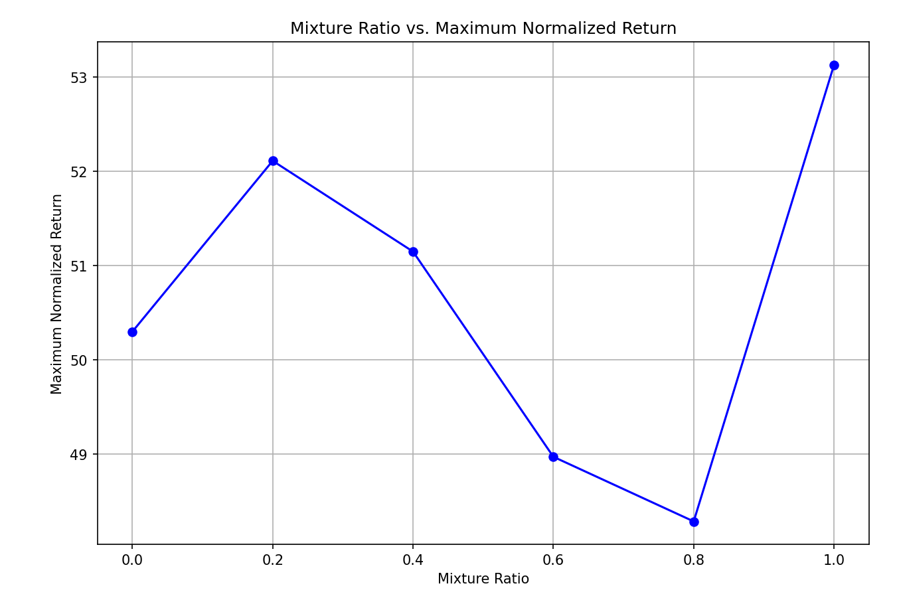
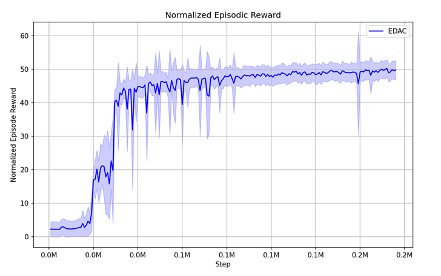
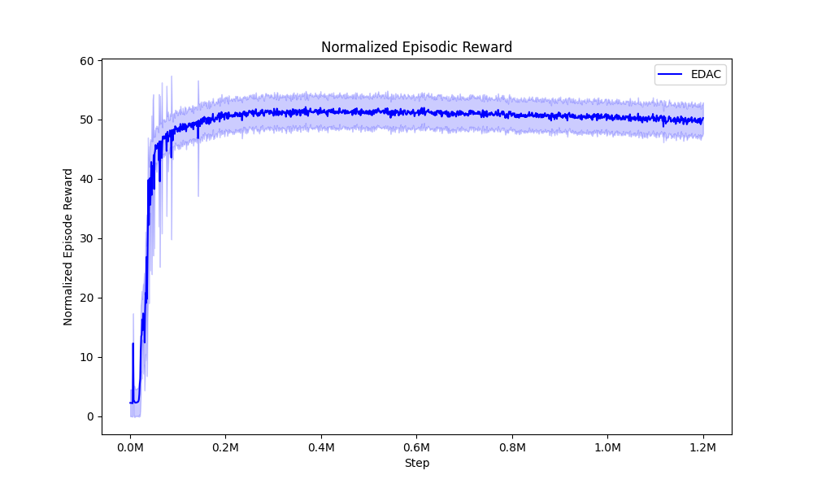
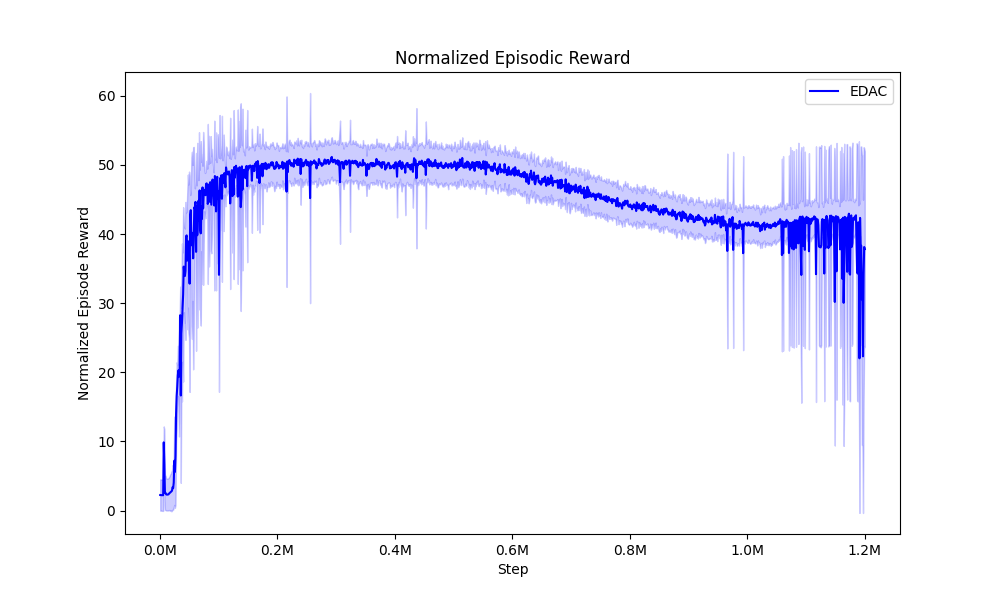
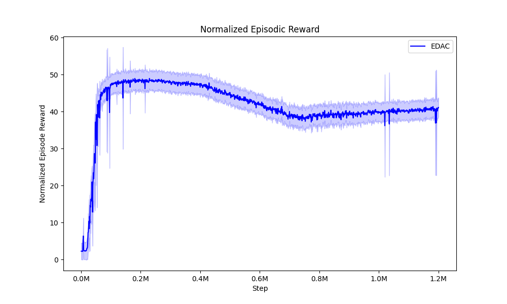
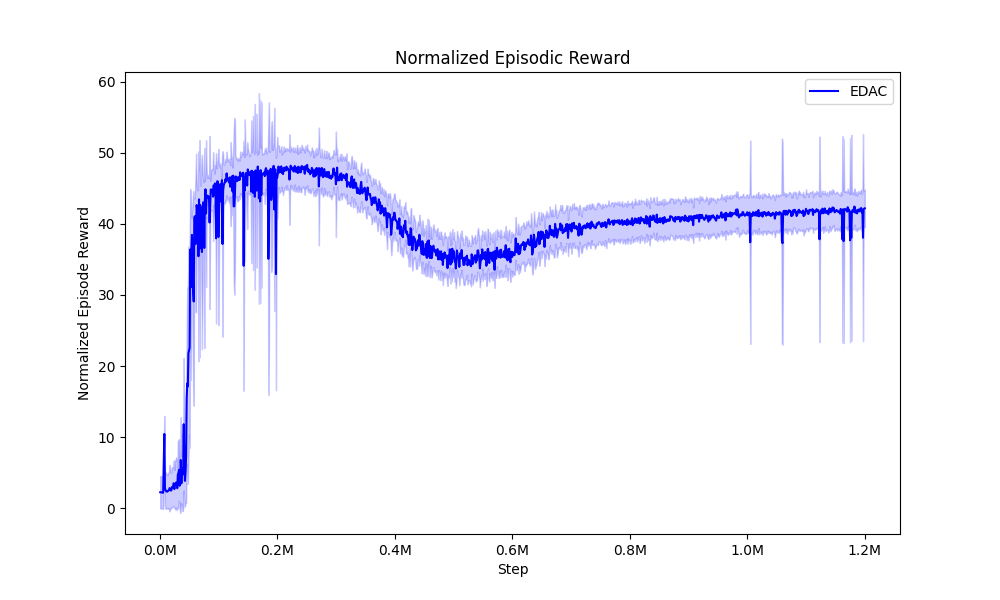
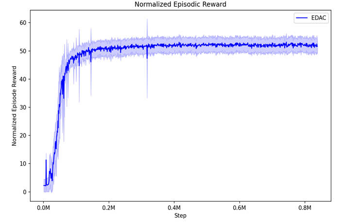

​	

mixture ratio	maximum normalized episodic return		terminal normalized return

​	0.0        50.3

​	0.2	52.11251273478703			50.3
​	0.4	51.14964126116913			37.8
​	0.6	48.97281590001943			41.1
​	0.8	48.28718077209817			42.2

​	1.0        53.13

Synthetic data/all=0.0

Synthetic data/all =0.2

Synthetic data/all=0.4

Synthetic data=0.6

Synthetic data=0.8

Synthetic data=1.0

