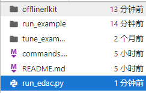

# Install mujoco environment using conda

### Follow the steps

https://gist.github.com/saratrajput/60b1310fe9d9df664f9983b38b50d5da


#### Things may be useful

```cmd
pip install 'cython<3.0.0' -i https://pypi.tuna.tsinghua.edu.cn/simple
```


```cmd
sudo apt-get install libosmesa6-dev libgl1-mesa-glx libglfw3 patchelf
```


1. Install Anaconda. Download it from this [link](https://repo.anaconda.com/archive/Anaconda3-2021.11-Linux-x86_64.sh).

```
cd Downloads/
sudo chmod +x Anaconda3-2021.11-Linux-x86_64.sh
./Anaconda3-2021.11-Linux-x86_64.sh
```

1. Install git.

```
sudo apt install git
```

1. Install the Mujoco library.

   - Download the Mujoco library from this [link](https://mujoco.org/download/mujoco210-linux-x86_64.tar.gz).

   - ##### Create a hidden folder :

   ```
   mkdir /root/.mujoco
   ```

   - Extract the library to the .mujoco folder.

   tar -xvf mujoco210-linux-x86_64.tar.gz -C ~/.mujoco/

   Upload mujoco210.zip to the hidden folder and then unzip it. 

   

   - Include these lines in .bashrc file.

     Replace user-name with your username

   ```
   echo -e 'export LD_LIBRARY_PATH=/root/.mujoco/mujoco210/bin 
   export LD_LIBRARY_PATH=$LD_LIBRARY_PATH:/usr/lib/nvidia 
   export PATH="$LD_LIBRARY_PATH:$PATH" 
   export LD_PRELOAD=/usr/lib/x86_64-linux-gnu/libGLEW.so' >> ~/.bashrc
   ```

   - Source bashrc.

   ```
   source ~/.bashrc
   ```

   - Test that the library is installed.

   ```
   cd ~/.mujoco/mujoco210/bin
   ./simulate ../model/humanoid.xml
   ```

2. ##### Install mujoco-py.

```
conda create --name mujoco_py python=3.8
```

you will see a series of outputs, press y to continue. 

```cmd
conda init bash
conda activate mujoco_py
```

and then you will go into the mujoco environment. 

(mojoco)…

##### then

```cmd
sudo apt update
sudo apt-get install patchelf
sudo apt-get install python3-dev build-essential libssl-dev libffi-dev libxml2-dev  
sudo apt-get install libxslt1-dev zlib1g-dev libglew1.5 libglew-dev python3-pip
```


##### Clone mujoco-py.

```cmd
cd ~/.mujoco
    git clone https://github.com/openai/mujoco-py
cd mujoco-py
pip install -r requirements.txt -i https://pypi.tuna.tsinghua.edu.cn/simple
pip install -r requirements.dev.txt -i https://pypi.tuna.tsinghua.edu.cn/simple
pip3 install -e . --no-cache -i https://pypi.tuna.tsinghua.edu.cn/simple
```

Reboot your machine.

sudo reboot

1. After reboot, run these commands to install additional packages.

```
conda activate mujoco_py
sudo apt install libosmesa6-dev libgl1-mesa-glx libglfw3
pip3 install -U 'mujoco-py<2.2,>=2.1'
```

We should use “sudo ln -s /usr/lib/x86_64-linux-gnu/libGL.so.1 /usr/lib/x86_64-linux-gnu/libGL.so” in the 3rd line in default, but if you get an error like: "ln: failed to create symbolic link '/usr/lib/x86_64-linux-gnu/libGL.so': File exists", it's okay to proceed as the third line. 

1. Check if mujoco-py is properly installed.

 

cd ~/.mujoco/mujoco-py/examples
python3 setting_state.py


##### Test your mujoco environment;

```cmd
python3
import mujoco_py
mujoco_py.__version__
```


### How to get into your mujoco environment after installation

#### First check the environments for conda

```cmd
conda info --envs
```

Output should be: 

base                  *  /root/miniconda3
mujoco_py                /root/miniconda3/envs/mujoco_py

#### And then:

```cmd
conda activate mujoco_py
```

#### First time activate you should add the env var

```cmd
export LD_LIBRARY_PATH=$LD_LIBRARY_PATH:/root/.mujoco/mujoco210/bin
```


## In your mujoco_py environment, Install d3rl py

```cmd
conda install -c conda-forge d3rlpy 
```

or use

```cmd
pip install d3rlpy==1.1.1 -i https://pypi.tuna.tsinghua.edu.cn/simple
```

git clone https://github.com/takuseno/d3rlpy.git
git checkout 1ac85b9


conda install -c conda-forge d3rlpy -i https://pypi.tuna.tsinghua.edu.cn/simple


Result: 

```cmd
import d3rlpy
d3rlpy.__version__
'2.5.0'
```


## In your mujoco_py environment, Install d4rl py

From the official docs  https://github.com/Farama-Foundation/D4RL

Run these commands in your (mujoco_py) environment: 

```cmd
git clone https://github.com/Farama-Foundation/D4RL.git
```

```cmd
cd D4RL
```

```cmd
pip install -e . -i https://pypi.tuna.tsinghua.edu.cn/simple
```

```cmd
cd ..
```

##### Then test your environment

```cmd
import d4rl
```


## Test

In your mojoco_py conda environment:

```cmd
python3
```

```python
import mujoco
import gym
import mujoco_py
mujoco_py.__version__
import d4rl
d4rl.__version__
import d3rlpy
d3rlpy.__version__
```


cd d3rlpy
python reproductions/offline/bcq.py --dataset='halfcheetah-medium-replay-v0' --gpu=0


##### When we run the Offline Kit module, there is a bug in 

```cmd
/root/miniconda3/envs/mujoco_py/lib/python3.8/site-packages/pybullet_envs/__init__.py
```

```cmd
 line 6, in register
    if id in registry.env_specs:
AttributeError: 'dict' object has no attribute 'env_specs
```

##### Solution: 

Replace this line “if … not in ….env_specs ”  with if … not in … 


Next if we see

```cmd
(mujoco_py) root@autodl-container-7ae1118e3c-97015623:~/autodl-fs/OfflineRL-Kit-main# python run_example/run_edac.py --num-critics 10 --eta 1.0
Warning: Flow failed to import. Set the environment variable D4RL_SUPPRESS_IMPORT_ERROR=1 to suppress this message.
No module named 'flow'
/root/miniconda3/envs/mujoco_py/lib/python3.8/site-packages/glfw/__init__.py:914: GLFWError: (65544) b'X11: The DISPLAY environment variable is missing'
  warnings.warn(message, GLFWError)
Warning: CARLA failed to import. Set the environment variable D4RL_SUPPRESS_IMPORT_ERROR=1 to suppress this message.
No module named 'carla'
pybullet build time: Nov 28 2023 23:51:11
Traceback (most recent call last):
  File "run_example/run_edac.py", line 10, in <module>
    from offlinerlkit.nets import MLP
ModuleNotFoundError: No module named 'offlinerlkit'
```

run this 

```cmd
export D4RL_SUPPRESS_IMPORT_ERROR=1
```

But still get

```cmd
Traceback (most recent call last):
  File "run_example/run_edac.py", line 10, in <module>
    from offlinerlkit.nets import MLP
ModuleNotFoundError: No module named 'offlinerlkit
```


So I moved the file to the parent directory




and change to this command

```cmd
python run_edac.py --num-critics 10 --eta 1.0
```


But then they tell me we don’t have this package

import tensorboard

So I have to 

```cmd
pip install tensorboard
```

and then run

```cmd
(mujoco_py) root@autodl-container-7ae1118e3c-97015623:~/autodl-fs/OfflineRL-Kit-main# python run_edac.py --num-critics 10 --eta 1.0
```

Then things worked out fine, but I have to download the hopper dataset. and wait …

But I got this error

```cmd
Traceback (most recent call last):
  File "run_edac.py", line 169, in <module>
    train()
  File "run_edac.py", line 66, in train
    dataset = qlearning_dataset(env)
  File "/root/autodl-fs/OfflineRL-Kit-main/offlinerlkit/utils/load_dataset.py", line 30, in qlearning_dataset
    dataset = env.get_dataset(**kwargs)
  File "/root/D4RL/d4rl/offline_env.py", line 87, in get_dataset
    with h5py.File(h5path, 'r') as dataset_file:
  File "/root/miniconda3/envs/mujoco_py/lib/python3.8/site-packages/h5py/_hl/files.py", line 562, in __init__
    fid = make_fid(name, mode, userblock_size, fapl, fcpl, swmr=swmr)
  File "/root/miniconda3/envs/mujoco_py/lib/python3.8/site-packages/h5py/_hl/files.py", line 235, in make_fid
    fid = h5f.open(name, flags, fapl=fapl)
  File "h5py/_objects.pyx", line 54, in h5py._objects.with_phil.wrapper
  File "h5py/_objects.pyx", line 55, in h5py._objects.with_phil.wrapper
  File "h5py/h5f.pyx", line 102, in h5py.h5f.open
OSError: Unable to synchronously open file (truncated file: eof = 21069824, sblock->base_addr = 0, stored_eof = 152756557)
```

Because I have stopped the download and there is crashed file. I need to remove that file, but I have not figured out where it is. 


Then I found that we only need to do halfcheetah, so I run

```cmd
(mujoco_py) root@autodl-container-7ae1118e3c-97015623:~/autodl-fs/OfflineRL-Kit-main# python run_edac.py --num-critics 10 --eta 1.0 --task halfcheetah-medium-v2
```

Notice that the environment weights are downloaded to

```cmd
Downloading dataset: http://rail.eecs.berkeley.edu/datasets/offline_rl/gym_mujoco_v2/halfcheetah_medium-v2.hdf5 to /root/.d4rl/datasets/halfcheetah_medium-v2.hdf5
```

But then I got this error:

```cmd
  File "run_edac.py", line 169, in <module>
    train()
  File "run_edac.py", line 81, in train
    env.seed(args.seed)
  File "/root/D4RL/d4rl/utils/wrappers.py", line 30, in seed
    return self._wrapped_env.seed(seed=seed)
AttributeError: 'OfflineHalfCheetahEnv' object has no attribute 'seed'
```


Bug fixes:


1. ## Permission denied

root@autodl-container-b30e11b252-9e540512:~/.mujoco/mujoco210/bin# ./simulate ../model/humanoid.xml
bash: ./simulate: Permission denied


``` bash
chmod +x ./simulate
```


source /etc/autodl-motd


2. ```
   cat ~/.bashrc
   ```


【环境配置】
git clone https://github.com/Farama-Foundation/D4RL.git
cd D4RL
pip install -e .
cd ..


### d3rlpy

```cmd
pip install d3rlpy==1.1.1
```

During installation I got this error:

```cmd
ERROR: pip's dependency resolver does not currently take into account all the packages that are installed. This behaviour is the source of the following dependency conflicts.
torchtext 0.13.1 requires torch==1.12.1, but you have torch 2.3.0 which is incompatible.
fairseq 0.12.2 requires hydra-core<1.1,>=1.0.7, but you have hydra-core 1.3.2 which is incompatible.
fairseq 0.12.2 requires omegaconf<2.1, but you have omegaconf 2.3.0 which is incompatible.
```

git clone https://github.com/takuseno/d3rlpy.git
git checkout 1ac85b9


#### Cython

pip install 'cython<3.0.0'

sudo apt-get install libosmesa6-dev libgl1-mesa-glx libglfw3 patchelf
###下载安装mujoco210，略


测试

cd d3rlpy
python reproductions/offline/bcq.py --dataset='halfcheetah-medium-replay-v0' --gpu=0


