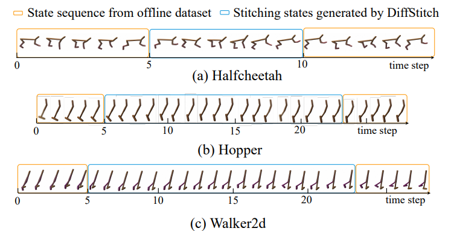

[toc]

Week 10 –> Week 11

> 1. Read codes: baselines, and trim/augment paper+ codes
>
> 2. Read papers about exploration & data augmentation
>
>   **curiosity ?**    **modify reward ?** 
>
> Relationship between exploration and diffusion model’s generation can we discover generalization in distributions?    $\text{[literature review search deeper ! !]}$  will generated data help generalize and exploration or exacerbates overfitting? how and why? 
>
> 3. Try out offline classical baselines, if someone works, share codes. 	
>
> ​	*<u>**Baseline:**</u>*   *<u>**3 envs**</u>*     *<u>**Q-DT +env**</u>*

Week 12 -> Week 14

**need another meeting.**

> Trim/AUg
>
> ​		 **data-clean/select**
>
>   	       **curiosity ?** 
>
> ​		 **modify reward ?**
>
> ​		 **diffusion generation**
>
> Re-implement modules, parallel. 
>
> * Tonghe:
>
> * Wei:
> * Yucheng:
> * Yulong:

Week 14-15  Try out new ideas (if we have time)

> 1. **Relationship between exploration and diffusion model’s generation** 
>
> **can we discover generalization in distributions?**    $\text{[literature must search]}$  
>
> 2. **Reward regularization to generate higher rewards**
>
> 3. **Dynamic model is it necessary and how to improve** 
>
> 4. Experiment: bonus penalization? (still generalize)
> 5. New data augmentation ideas

## Offline RL Literature

#### About

arXiv link: https://arxiv.org/abs/2402.02439

algorithm schematic:

**2024, Feb 2, SJTU, ICML in submission**

#### Intro

1. augmented data should reach the reward-dense states 

2. link reward-sparse with reward-dense

> Intuitively, if we augment the offline dataset by stitching together low reward trajectories with high-reward trajectories, the policy may learn the ability to transit from low-reward states to high-reward states and ultimately achieve a higher overall reward

DiffStitch is the first offline RL **augmentation method** that generates sub-trajectories to stitch any two trajectories. 

1. **randomly selects a low-reward trajectory and a high-reward trajectory**
2. **generates a sub-trajectory to stitch them together**.
3. Through our paradigm, one can easily **transfer the trajectories trapped in low rewards to the one with high reward**s, enhancing the learning of policy

#### Pipeline details

**Four modules**

1. The **step estimation module** estimates the number of time steps required for stitching two trajectories

> Given the states of two trajectory $\tau_s=\left(s_1, s_2 \ldots s_T\right)$ and $\tau_s^{\prime}=\left(s_1^{\prime}, s_2^{\prime}, \ldots, s_{T^{\prime}}^{\prime}\right)$, estimate the number of the step required for state $s_T$ to **transit naturally** to state $s_1^{\prime}$. Here, $s_T$ could be viewed as the start state and $s_1^{\prime}$​ could view as the target state for stitching. 
>
> $s_T \to \cdot \to \cdot \to \ldots \to x \to s_1^\prime$. 
>
> Suppose $s_T$ can reach state $x$ in exactly $i$ steps. s. The higher the similarity between $s^\prime_1$​ and x, the more probable it is for sT to reach s ′ 1 in exactly i steps as well.
>
> 1. Generate a length H trajectory **conditioned** on the first state being $s_T$:
>
> $$
> \begin{aligned}
> \tau_s^m & =\left(s_T, s_1^m, \ldots, s_{H-1}^m\right) \\
> & =\mathcal{G}_\theta\left(\left(s_T,[\mathrm{MASK}], \ldots,[\mathrm{MASK}]\right)\right)
> \end{aligned}
> $$
>
> 2. Measure the similarity of the each state of the generated Markov Chain with the terminal state $s_1^\prime$
>    $$
>    \Delta=\underset{i}{\arg \max } \operatorname{sim}\left(\boldsymbol{s}_i^m, \boldsymbol{s}_1^{\prime}\right)
>    $$
>    We implement $\text{sim}$​ with cosine similarity.
>
>  
>
> **Implementing the diffusion model $\mathcal{G}_{\theta}$**
>
> a. Training
>
> Pick length $H$ state trajectories $\tau_s=(s_1,s_2,\ldots, s_H)$ from the offline dataset.
>
> Reveal the initial state of each sample $s_i^1$ (make sure the Diffusion model is a conditional generator)
>
> Randomly mask some of the rest of the states, forming masked training data. We ensure the last state is masked,  so that we will be able to compare and select the best generated trajectory by measure the similarity score between the generated $s_i^m$ and $s_1^\prime$. 
> $$
> \tau_{s,m}=({\color{blue}{s_1}}, \ldots, s_i, [\text{MASK}],  [\text{MASK}], \ldots, s_{k}, s_{+1},  {\color{blue}{[\text{MASK}]}})
> $$
> Next, we randomly sample a noise $\epsilon \sim \mathcal{N}(0, \mathcal{I})$ and a diffusion timestep $k \sim \mathcal{U}\{1, \ldots, K\}$, and train $\mathcal{G}_\theta$ with:
> $$
> \mathcal{L}_\theta=\mathbb{E}_{k, \tau_s \in \mathcal{D}}\left\|\epsilon-\epsilon_\theta\left(\sqrt{\bar{\alpha}} \tau_s+\sqrt{1-\bar{\alpha}} \epsilon, \tau_{s, m}, k\right)\right\|^2 .
> $$
> ***We implement the noise prediction network $\epsilon_\theta$ with a U-net, because it excels at few-shot learning, since our offline dataset is assumed to be small.*** 
>
>  “U-Net is designed to **work well with very few training samples**. This is particularly advantageous in medical applications where annotated images can be scarce and expensive to obtain. ”
>
>  
>
> b. Inference
>
> Denoise for K steps. For noise-masked state sequence $\tau_{s, m}$, the diffusion model $\mathcal{G}_\theta$ reconstruct the sample with $K$ denoising steps :
> $$
> \begin{array}{r}
> \tau_{s, m}^{k-1}=\frac{1}{\sqrt{\alpha_k}}\left(\tau_{s, m}^k-\frac{1-\alpha_k}{\sqrt{\left(1-\overline{\alpha_k}\right)}} \epsilon_\theta\left(\tau_{s, m}^k, \tau_{s, m}, k\right)\right)+\sqrt{1-\alpha_k} \epsilon, \\
> \epsilon \sim \mathcal{N}(0, \mathbf{I}), \text { for } k=K, . ., 1,
> \end{array}
> $$
> where $\alpha_i$ is the cosine function of $k$ and $\bar{\alpha}_i=\prod_1^i \alpha_t . \mathcal{N}$  
>
> 

2. the estimated number of time steps is input into the **state stitching module**, which generates states consistent with the number of estimated steps. 

> Generate trajectory with length $\Delta$ so that the the augmented trajectory fragment reaches the nearest point to $s_1^\prime$. 
>
> Then append the generated trajectory with the first few states in the second trajectory $\tau^\prime$, forming a synthetic mixture trajectory of length $H$:
> $$
> \begin{aligned}
> \tau_s^s & =\mathcal{G}_\theta\left(\tau_{s, m}\right) \\
> & =(\boldsymbol{s}_T, \underbrace{\widetilde{s_1}, \ldots, \widetilde{s_{\Delta}}}_{\tilde{\tau}_s:  \ \Delta \text { stitching states }}, \boldsymbol{s}_1^{\prime}, \ldots, \boldsymbol{s}_{H-1-\Delta}^{\prime})
> \end{aligned}
> $$
>  

3. Next, **the trajectory wrap-up module** predicts the rewards and actions based on the generated states, to obtain full synthesized trajectories.

> a. First we train an inverse dynamic model $f_\psi$ on the offline dataset
> $$
> \mathcal{L}_\phi=\mathbb{E}_{\left(\boldsymbol{s}_t, \boldsymbol{a}_t, r_t, \boldsymbol{s}_{t+1}\right) \mathcal{D}}\left[\boldsymbol{a}_t-f_\phi\left(\boldsymbol{s}_t, \boldsymbol{s}_{t+1}\right)\right]
> $$
> $f_\psi$ is implemented as an MLP.
>
> Then we decode the actions in between the generated states: 
> $$
> \begin{equation}
> \begin{aligned}
> &\text{Input}\left(\hat{s_t}, \hat{s}_{t+1}\right) \in\left\{\left(\boldsymbol{s}_T, \widetilde{s_1}\right),\left(\widetilde{s_1}, \widetilde{s_2}\right), \ldots,\left(\widetilde{s_{\Delta}}, s_1^{\prime}\right)\right\}
> \\
> &\text{Output } \widetilde{\boldsymbol{a}_t}=f_\psi\left(\hat{\boldsymbol{s}}_t, \hat{\boldsymbol{s}}_{t+1}\right)
> \end{aligned}
> \end{equation}
> $$
> b. We also train a reward model on the offline data that predicts the reward function of the MDP:
> $$
> \mathcal{L}(\phi)=\mathbb{E}_{\left(\boldsymbol{s}_t, \boldsymbol{a}_t, r_t, \boldsymbol{s}_{t+1}\right) \sim \mathcal{D}}\left[r_t-f_\phi\left(\boldsymbol{s}_t, \boldsymbol{a}_t\right)\right]
> $$
> $f_\phi$ is also implemented by an MLP. 
>
> Based on the states and actions, we use a reward model $f_\phi$ to deduce the rewards obtained from  the generated trajectory.
> $$
> \widetilde{r_t}=f_\phi\left(\hat{\boldsymbol{s}}_t, \widetilde{\boldsymbol{a}_t}\right)
> $$
> c. Inserting the decoded actions and estimated rewards into the generated state trajectory, we form the generated full  trajectory:
> $$
> \tau_r=\left\{\left(\boldsymbol{s}_T, \widetilde{\boldsymbol{a}_T}, \widetilde{r_T}\right),\left(\widetilde{\boldsymbol{s}_1}, \widetilde{\boldsymbol{a}_1}, \widetilde{r_1}\right), \ldots,\left(\widetilde{\boldsymbol{s}_{\Delta}}, \widetilde{\boldsymbol{a}_{\Delta}}, \widetilde{r_{\Delta}}\right),\left(\boldsymbol{s}_1^{\prime}\right.\right.\left.\left.\boldsymbol{a}_1^{\prime}, r_1^{\prime}\right)\right\}
> $$
> We denote $\tau_r$ as the stitching trajectory.

4. Finally, the **qualification module** evaluates the quality of the new trajectory. If qualified, augments the dataset with the new trajectory.

> We assess the quality of generated trajectories, **filtering out low-quality data** while retaining high-quality data to **ensure** that the stitching trajectories **align with environmental dynamics**
>
>  
>
> Model-based method:
>
> First train a dynamics model $f_\omega:\mathcal{S\times S\to A}$ using the offline dataset​ that approximates $P(\cdot|s,a)$ of the MDP. The model is implemented by an MLP:
> $$
> \mathcal{L}(\omega)=\mathbb{\widehat{E}}_{s_t,a_t,s_{t+1}\sim \mathcal{D_{\text{offline}}}}\left[\left(s_{t+1}-f_{\omega}(s_t,a_t)\right)^2\right]
> $$
> then we evaluate the generated state according to whether it deviates significantly from the dynamic model’s estimate:
> $$
> \left\|\hat{s}_{t+1}-f_\omega\left(\hat{\boldsymbol{s}}_t, \hat{\boldsymbol{a}}_t\right)\right\|^2 \geq \delta
> $$
> $\color{red}{\text{Can we directly plug the dynamic estimator into the DDPM sampler to save time }}$
>
> $\color{red}{\text{Discarding bad generations wastes alot. Kind of making it self-supervised.}}$
>
> By employing the pipeline above, we can obtain a new augmented trajectory
>
> $\tau_{\text {gen }}=$ $\left\{\left(\boldsymbol{s}_1, \boldsymbol{a}_1, r_1\right), \ldots,\left(\boldsymbol{s}_T, \widetilde{\boldsymbol{a}_T}, \widetilde{r_T}\right),\left(\widetilde{\boldsymbol{s}_1}, \widetilde{\boldsymbol{a}_1}, \widetilde{r_1}\right), \ldots,\left(\widetilde{\boldsymbol{s}_{\Delta}}, \widetilde{\boldsymbol{a}_{\Delta}}\right.\right.$, $\left.\left.\widetilde{r_{\Delta}}\right),\left(\boldsymbol{s}_1^{\prime}, \boldsymbol{a}_1^{\prime}, r_1^{\prime}\right), \ldots,\left(\boldsymbol{s}_{T^{\prime}}^{\prime}, \boldsymbol{a}_{T^{\prime}}^{\prime}, r_{T^{\prime}}^{\prime}\right)\right\}$ to enhance the offline dataset. We put the augmented trajectories into the augmented dataset $\mathcal{D}_{\text {aug }}$.
>
>  
>
> **Mixing generated data with sampled data**
>
> In training offline RL algorithms, we sample data from $ D^∗ = D ∪ D_{\text{aug}}$ with a fixed ratio 
>
> $r$= (number of original data : number of augmented data)
>
> between the original data from D and the augmented data from $D_{\text{aug}}$ in each training batch. 

#### Evaluation

Methods:

1. **TD3+BC is a imitation learning method, which jointly learns the policy and value function**
2. **DT(Decision transformer**)  DT is a trajectory optimization method, which takes trajectory data as input and applies Transformer (Vaswani et al., 2017) to model the distribution of trajectories in the offline dataset. 

Data:

1. For Decision Transformer(DT), we train it for 5 × 104 gradient steps on MuJoCo-Gym tasks and 105 gradient steps on Adroit-pen tasks.

#### Ablation

#### Hyperparameters

Data ratio $r$​ (original/generated) is affected by training method. The lower the optimal $r$ is, the more scalable our data augmentation is. 

 

Qualification threshold $\delta$ determines whether we discard generated samples that deviates from the dynamics model’s prediction==discrepancy with the original data.  The higher $\delta$ is, the more robust our generation scheme. 

**In this sense, we gonna use Decision Transformer.**

